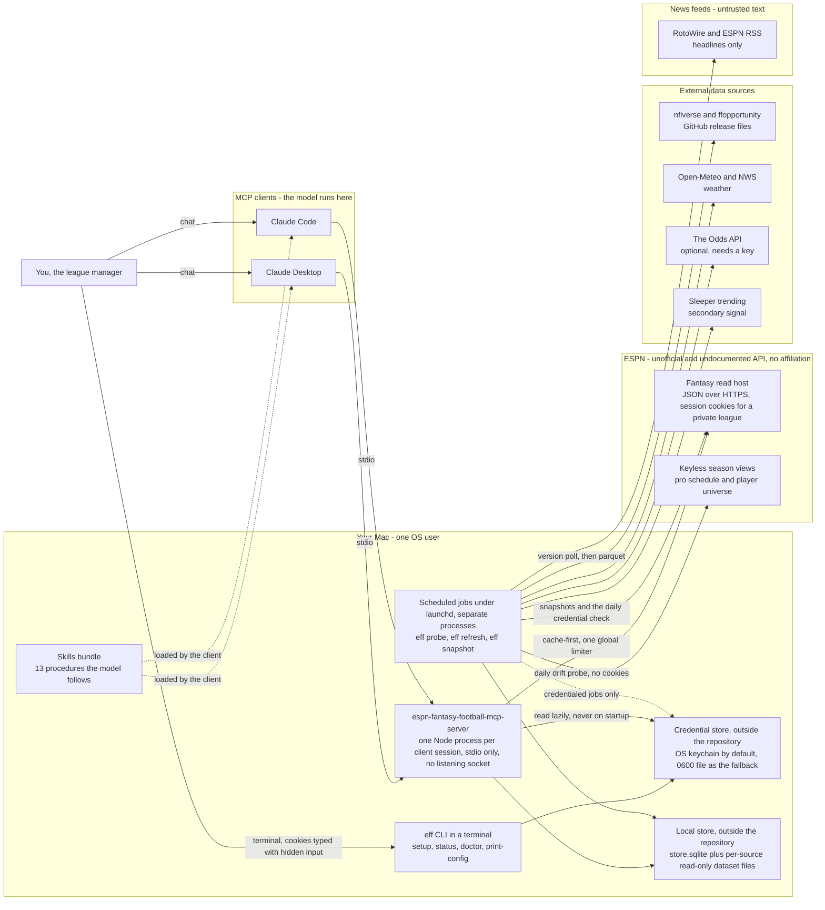
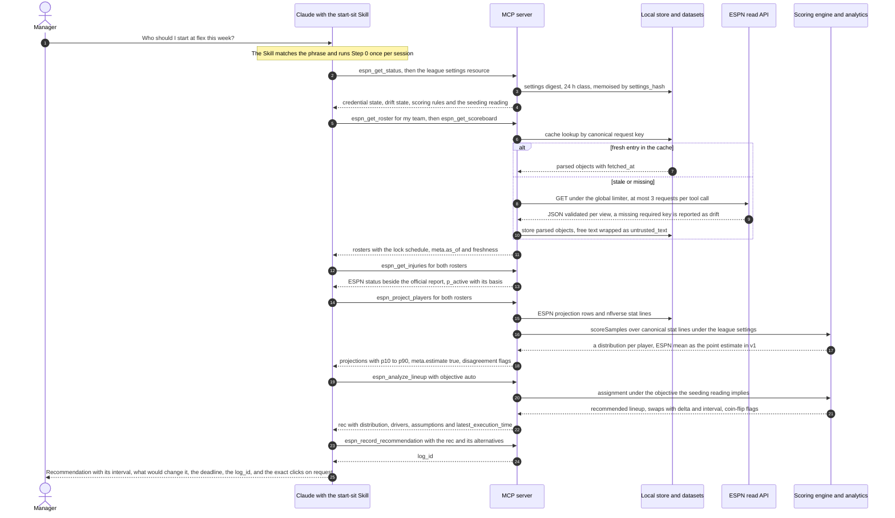
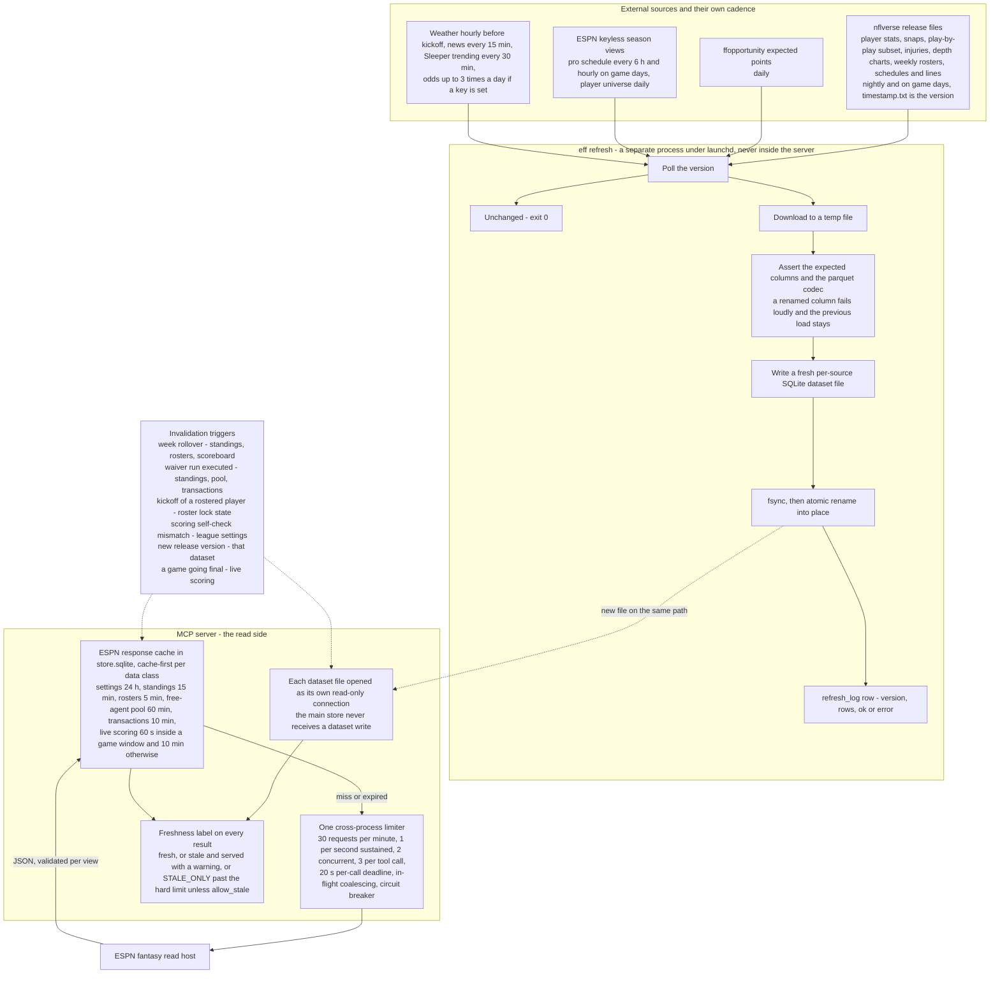
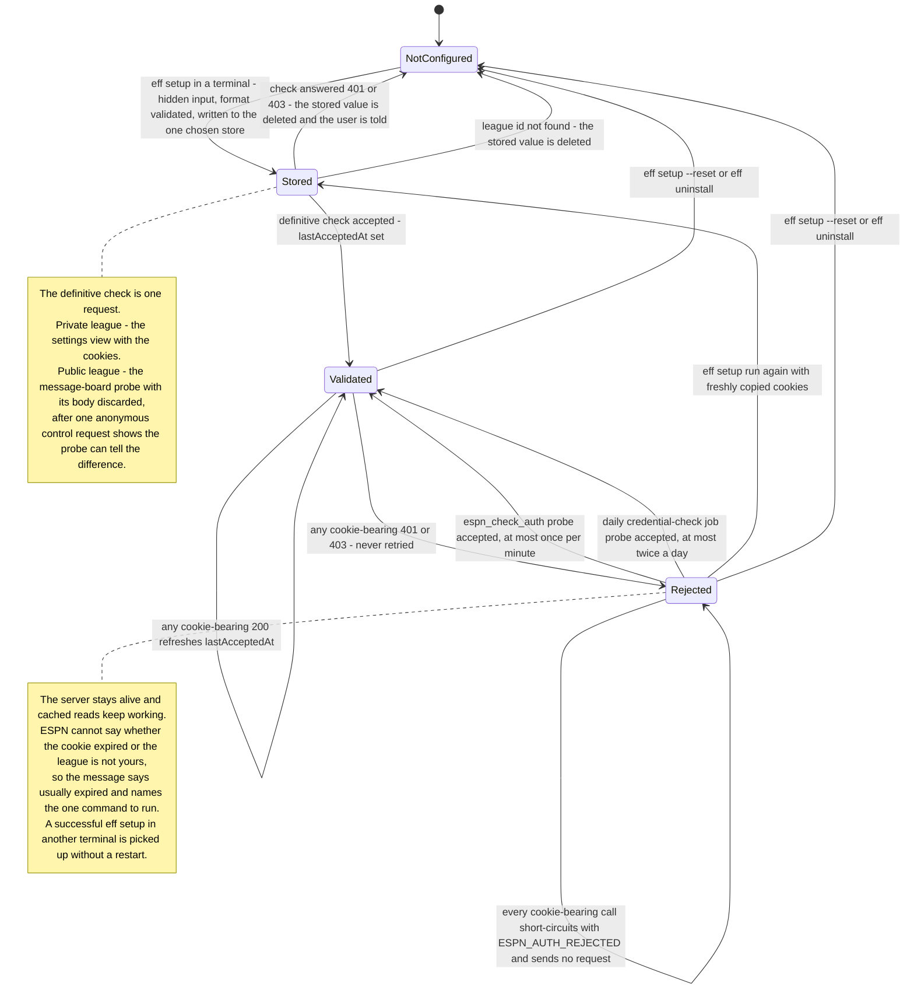
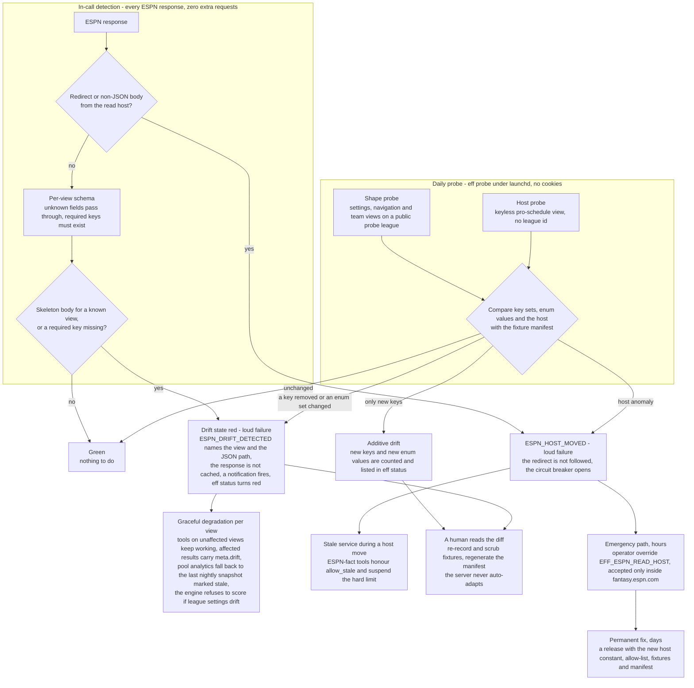
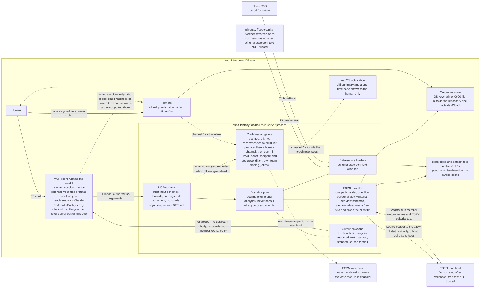
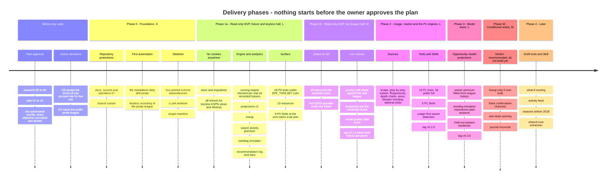

<h1 align="center">🏈 ESPN Fantasy Football MCP Server</h1>

<strong>Format-aware, deeply reasoned fantasy-football recommendations for Claude, under your league's real scoring, roster, waiver and playoff rules — read-only first, a human confirms every write, and news is data, never instructions.</strong>

  
  
  
  = 24.15" src="https://img.shields.io/badge/node-%3E%3D24.15-339933?logo=node.js&logoColor=white">
  
  

<em>Unofficial. Not affiliated with, endorsed by, or supported by ESPN or The Walt Disney Company.</em>

> **This is a plan, not a release.** Every feature on this page is **📋 planned**. No server code exists yet. The build starts **only after the owner has reviewed and approved the plan** in [`docs/plan/`](docs/plan/00-index.md) (owner decision, 2026-09-30, recorded in [`docs/HANDOFF.md`](docs/HANDOFF.md)). What exists today is the research, the plan, the record of its adversarial review, and these documents.

> **Not affiliated with ESPN — and read this before you use it.** This project is not affiliated with, endorsed by, or supported by ESPN or The Walt Disney Company. It is planned to use ESPN's **unofficial, undocumented** fantasy API, authenticated with **your own session cookies**. The Disney Terms of Use, as the research read them, prohibit automated access of this kind and let Disney suspend an account for it. The full, honest disclosure is in [Terms of use and account risk](#terms-of-use-and-account-risk); read it and decide for yourself. "ESPN" is used here only as a plain description of the service this tool reads.

**Status legend used throughout:** ✅ implemented · 🚧 in progress · 📋 planned

---

## What this is

A **planned** local [Model Context Protocol](https://modelcontextprotocol.io/) server, to be written in Node/TypeScript on the official MCP SDK, that gives Claude (Desktop or Code) a **complete, cached, read-only view of your ESPN Fantasy Football league** — settings, rosters, the free-agent pool, transactions, standings, the scoreboard, live scoring, and ESPN's own projections and ownership numbers — together with a set of **decision engines** that turn that view into recommendations you can act on. Every number is meant to be **format-aware**: the server reads *your* league's scoring, roster slots, waiver system and playoff rules from ESPN and re-scores everything through a settings-driven engine that is checked, stat by stat, against ESPN's own applied points — so a 10-team, half-PPR, 5-point-passing-touchdown league with move-to-last waiver priority and points-for seeding gets different answers than a standard one (waiver priority is priced as a scarce option, the lineup objective follows the league's seeding rule, quarterbacks are valued under the league's own touchdown and turnover points). Every recommendation is meant to be **deeply reasoned and honest about uncertainty**: a point estimate never ships without a distribution, the drivers behind it, the assumptions that would change it, the deadline by which it matters, and a log entry so that next week's retrospective can say whether the advice was right for the right reasons. ESPN's own projections are **labelled as ESPN's** and shown beside the server's numbers, never silently merged. The product is **read-only by default**: the write module (lineup changes first) is opt-in, off, and carries the plan's own verdict *"recommended: do not build yet"*; if it is ever built, **every roster change requires an explicit human confirmation that the model cannot forge** — a guarantee the plan states together with the session condition under which it holds. Third-party text — team and owner names written by other league members, ESPN's player outlooks, news headlines, even the model's own earlier recommendations read back from the log — is **data, never instructions**: wrapped, capped, source-tagged and declared non-instructional. Thirteen **Skills** are planned alongside the server so the model follows a tested procedure for each decision instead of improvising.

## Table of contents

- [Status](#status)
  - [Terms of use and account risk](#terms-of-use-and-account-risk)
- [Features](#features)
- [Architecture](#architecture)
- [Tool reference](#tool-reference)
- [Skills reference](#skills-reference)
- [Quickstart and installation (planned)](#quickstart-and-installation-planned)
- [Safe credential setup](#safe-credential-setup)
- [Configuration](#configuration)
- [Launch configuration for Claude Desktop and Claude Code](#launch-configuration-for-claude-desktop-and-claude-code)
- [Security model](#security-model)
- [Testing](#testing)
- [Contributing](#contributing)
- [Roadmap](#roadmap)
- [FAQ](#faq)
- [Acknowledgements](#acknowledgements)
- [License](#license)

---

## Status

**Planning. Nothing is implemented.** The research (`docs/research/00-*` … `06-*`), the refined plan (`docs/plan/01-*` … `10-*`), two rounds of adversarial review ([`adversarial-log.md`](docs/plan/adversarial-log.md)) and the [`changelog.md`](docs/plan/changelog.md) of what the review changed exist. **Development is gated on the owner's approval of that package** — approval, not the review, starts the build. The plan in reading order: **[`docs/plan/00-index.md`](docs/plan/00-index.md)**. The handoff document a fresh session reads first: [`docs/HANDOFF.md`](docs/HANDOFF.md).

| Area | State | Evidence |
|---|---|---|
| Research pack (00–06) | ✅ complete, verified by the orchestrator against load-bearing claims at source | [`docs/README.md`](docs/README.md) |
| Refined plan (01–10) | ✅ written and revised after adversarial review — **awaiting owner approval** | [`docs/plan/00-index.md`](docs/plan/00-index.md) |
| Adversarial review | ✅ round 1: 20 objections and 16 tensions, all conceded and landed · round 2: 6 new objections (1 significant, 5 marginal) and 10 nits, all conceded | [`adversarial-log.md`](docs/plan/adversarial-log.md), [`changelog.md`](docs/plan/changelog.md) |
| `LICENSE`, `SECURITY.md`, this README, the docs indexes | ✅ | repository root, [`docs/`](docs/README.md) |
| `.gitignore`, `.env.example` (names and placeholders only) | ✅ | repository root |
| GitHub secret scanning and push protection | ✅ on (a repository setting) | [`docs/HANDOFF.md`](docs/HANDOFF.md) |
| CI workflows (docs, secrets, identifiers, then `ci.yml`) | 📋 Phase 0 | [`docs/plan/04-repo-structure-and-ci.md` §4](docs/plan/04-repo-structure-and-ci.md) |
| Daily drift probe (the first automation to be built) | 📋 Phase 0 | [`docs/plan/06-automation-inventory.md` §1.2](docs/plan/06-automation-inventory.md) |
| Package skeleton, server, `eff` CLI, scoring engine, tools, Skills, tests | 📋 after plan approval | [Roadmap](#roadmap) |
| Write module | 📋 conditional — plan verdict **"recommended: do not build yet"** | [`docs/plan/10-phasing-and-acceptance.md` §3.W](docs/plan/10-phasing-and-acceptance.md) |

**What the research established** — six facts shape everything on this page, and the plan carries them openly:

1. **ESPN's fantasy API is unofficial, cookie-authenticated, and drifts silently.** There is no OAuth, no API key, no developer programme and no documentation. One host serves JSON for current seasons, and hosts have moved without notice before. An unknown view name returns HTTP 200 with a skeleton body, so drift **cannot be detected from status codes**: the plan validates every response against per-view schemas that hard-fail on a missing required key, and runs a daily probe against a fixture manifest ([`docs/research/03-espn-api.md` §A, §F](docs/research/03-espn-api.md)).
2. **The Disney Terms of Use, as written, cover what this project does.** See [the next section](#terms-of-use-and-account-risk). The plan's posture is personal, single-league, read-only, cached, hard-capped and honestly identified — and the risk is disclosed rather than argued away.
3. **The session cookie is a password-equivalent for the whole account.** `espn_s2` has an unknown lifetime and no verifiable revocation path, so it is planned to live in the OS keychain (or a `0600` file outside the repository), to be typed only into a terminal with hidden input, and to appear in no tool argument, no client configuration, no `.env` file and no log line ([Safe credential setup](#safe-credential-setup)).
4. **ESPN returns projections, ownership, draft ranks, injury status and outlook text natively.** That makes a useful read-only product possible from the first phase — and it puts member-written names and ESPN editorial text inside the same JSON objects as the facts, which is why free text is wrapped field by field. In v1 the projection point estimate is **ESPN's own mean** (`weight_espn = 1.0`); the server's nflverse-based line contributes the distribution shape and a disagreement flag, and the weight moves only if a backtest under the league's scoring shows a mixture beats ESPN alone.
5. **Read-only is the product.** Every planned Skill ends with the exact clicks to make on ESPN. The write module is specified in full so that it would be mechanical and safe if built, but the plan recommends not building it yet ([Roadmap](#roadmap)).
6. **The confirmation guarantee is a property of the session, not of the client.** "The model cannot forge a confirmation" holds only in a session where the model has no shell or filesystem reach as you. Claude Code with `Bash`, or any chat with a filesystem or shell MCP server configured beside this one, is not such a session, and writes are **unsupported** there ([Security model](#security-model)).

### Terms of use and account risk

This project uses ESPN's name only to describe what it reads. **It is not affiliated with, endorsed by, or supported by ESPN or The Walt Disney Company**, it uses an **unofficial, undocumented API**, and it authenticates with **your own session cookies**. Before you decide to use it, read what the project's own research and plan say — quoted here so you do not have to take a summary on trust.

The governing text is the **Disney Terms of Use (United States), last updated 2024-05-24**. The research ([`docs/research/03-espn-api.md` §D.1](docs/research/03-espn-api.md#d1-the-governing-text)) quotes the clauses verbatim; in short, §2.B.x bars accessing or extracting the services by script or other automated means — expressly including "for the purposes of creating or developing any AI Tool" — §2.A excludes use in connection with prompting an AI tool from the consumer licence, §2.B.viii bars commercial use whether or not for profit, and §1.H lets Disney terminate or suspend access for a violation.

From the research's risk assessment ([`docs/research/03-espn-api.md` §D.4](docs/research/03-espn-api.md#d4-risk-assessment-in-plain-language)):

> **What the text says:** the Disney Terms of Use, as updated May 24, 2024, prohibit automated access by script and use with AI tools, and let Disney suspend an account for it. This project is inside that text. Nothing in ESPN's fantasy fair-play rules addresses it, and the fantasy-specific legal pages could not be read.
>
> **What happens in practice:** in seven years of public wrappers, MCP servers and hosted cookie-based services, no verified account suspension or IP block for reading one's own league was found; every documented breakage was ESPN changing infrastructure (2019, 2020, 2024) with no notice. The read API host today serves anonymous scripted clients without challenge; ESPN's web pages and its news host do not.
>
> **The realistic risks, in order:** (1) silent breakage when ESPN moves a host or renames a field (§F); (2) leaking `espn_s2`, which is a password-equivalent for the whole ESPN/Disney account (§C.4); (3) a write mistake that changes a real lineup (§E); (4) an account action by ESPN — possible under §1.H, unobserved in the record.

And from the plan's threat model ([`docs/plan/02-security-architecture.md` §8, row 17](docs/plan/02-security-architecture.md#8-threat-model)) — threat, mitigation and residual risk, with the row's citations omitted:

> **Account action by ESPN under ToU §1.H** — the posture: own account, own league, read-only, cached, capped, honest UA, no scraping, no redistribution; `eff status` shows the day's request count — not removable by design; disclosed.

What that means for you, plainly:

- **Absence of evidence is not evidence of absence.** No enforcement case was found; the terms still give Disney the right. If you use this tool, you accept that risk on your own account. The plan treats the owner's explicit acceptance of it as a decision (**D0**) that gates every phase touching a real league.
- **The mitigations are the design, not a promise of safety:** personal use by the account owner on their own single league; read-only by default; aggressive caching and hard caps (≤ 30 requests a minute, tens of requests a day in normal use); a fixed, honest `User-Agent`; no web-page scraping; no redistribution; no model training on the data; no browser impersonation — if the API host ever starts blocking the honest `User-Agent`, the server is designed to stop and say so rather than disguise itself.
- **Never commercial with ESPN data.** The plan treats this as a hard stop ([`docs/research/04-data-sources.md` §E](docs/research/04-data-sources.md#e-licensing--tos-table-and-the-personal-vs-commercial-constraints)). The MIT licence on this repository covers this project's own code and text; it grants nothing over ESPN's data or services.
- **A hosted or shared install is a clean negative.** A remote server would have to hold other people's ESPN cookies; the plan rejects it ([FAQ](#can-i-run-it-remotely)).

---

## Features

Every row below is traceable to the tool catalog ([`docs/plan/07-tool-catalog.md`](docs/plan/07-tool-catalog.md)) and the phasing plan ([`docs/plan/10-phasing-and-acceptance.md`](docs/plan/10-phasing-and-acceptance.md)); analytics rows cite the section of [`docs/research/05-strategy-and-analytics.md`](docs/research/05-strategy-and-analytics.md) whose method they implement. **Priority:** **P0** = the read-only MVP (Phase 1) · **P1** = Phase 2 · **P2** = the model wave (Phase 3) · **later** = Phase 4 · **conditional** = the write module (Phase W, not recommended to build yet). The **18 P0 tools** are what the server would register by default (`EFF_TOOLSET=core`); `EFF_TOOLSET=full` adds the **16 P1 tools** (34 read tools in total). No tool takes a league id: the league is operator configuration, never a model-supplied argument.

### League and discovery

| Tool | What it does | ESPN source | Priority | Status |
|---|---|---|---|---|
| `espn_get_league` | The normalised settings digest: scoring items mapped to canonical stat names (with position overrides and bracket families), roster slots by class, waiver, trade and playoff rules, the league clock, the **seeding reading** in use and whether the operator has confirmed it, the scoring engine's self-check state, and the list of fields that could not be verified | `mSettings` + `mNav` | P0 | 📋 |
| `espn_get_standings` | Standings plus the per-team scalars the waiver and seeding engines depend on — **waiver order** (`waiver_rank`), acquisition counters, points for and against, ESPN's own playoff odds as a labelled comparator | `mTeam` + `mStandings` | P0 | 📋 |
| `espn_get_scoreboard` | The season schedule and results by matchup period; `meta.provisional` until a week is final, and a corrections-window flag for seven days after | `mMatchup` | P0 | 📋 |
| `espn_get_live_scoreboard` | ESPN's live totals, live projections and win probability for the current week, split into final, live and pending players — labelled ESPN's, never blended | `mMatchupScore` | P0 | 📋 |
| `espn_get_box_score` | Per-player actual and projected lines for a week, **with the scoring engine's recomputation and a `match` flag per stat** against ESPN's applied points — the product's integrity check, one call away | `mBoxscore` | P0 | 📋 |
| `espn_list_transactions` | Adds, drops, waiver claims **including losing claims**, and trades — ESPN's feed merged with the server's persisted history, with a `history_coverage` field that says when history is incomplete | `mTransactions2`, `mPendingTransactions` (cookies required on a private league) | P0 | 📋 |
| `espn_get_draft_results` | Draft picks (immutable once the draft is complete); ships with the draft tools | `mDraftDetail` | later | 📋 |

### Roster and lineup

| Tool | What it does | ESPN source | Priority | Status |
|---|---|---|---|---|
| `espn_get_roster` | A roster with slots, positions, eligibility, injury status, byes, ownership, ESPN's weekly projection per player, and the things every lineup decision needs computed **once**: the lock schedule (kickoff → lock time per player), empty starting slots, and **IR validity** — who is IR-eligible now, and whether a healthy player sitting in an IR slot is making the roster invalid and blocking every add | `mRoster` (requested alone) + the stored pro schedule | P0 | 📋 |
| `espn_get_player_stats` | Weekly, season and prior-season stat splits for up to 25 players, rostered or not, with the engine's recomputation — the path for backtests and regret on players nobody rostered | `kona_playercard` | P1 | 📋 |

### Players and market

| Tool | What it does | ESPN source | Priority | Status |
|---|---|---|---|---|
| `espn_search_players` | Resolve a name to a `player_id` — the **only** path from a name to an id on any write path — with league status, ownership and the state of the id crosswalk | local player index + `kona_player_info` | P0 | 📋 |
| `espn_list_players` | Browse a pool (free agents, players on waivers, both, rostered, all) with ownership, ownership change (named a **competition** signal, never a detection signal), ESPN's weekly and rest-of-season projections, each player's **waiver process date**, next opponent and kickoff; sorting by ownership change is the "trending" view. Pages are capped at 100 rows with a mandatory sort — ESPN's own paging is unbounded, so the cap is a server invariant | `kona_player_info` + filter | P0 | 📋 |
| `espn_get_projections` | ESPN's own weekly, rest-of-season and preseason projections, batched and **labelled ESPN's** (`meta.estimate: false`) | `kona_player_info` | P1 | 📋 |
| `espn_get_player_outlook` | ESPN's editorial outlook paragraphs — every word inside `untrusted_text` — with deterministic injection flags and a rules-based claim extract. Outlook text is served **only** by this tool, never on roster or pool rows, so the injection surface is opt-in per call | `kona_player_info` | P1 | 📋 |

### Stats and usage

| Tool | What it does | Source | Priority | Status |
|---|---|---|---|---|
| `espn_get_injuries` | ESPN's injury status (what the league enforces) beside the official practice report (why), with `ir_eligible` and a first-cut probability of playing with its basis; on game day availability comes from ESPN's status alone | ESPN rows · nflverse `injuries` | P0 | 📋 |
| `espn_get_schedule` | Kickoffs, byes, lock and final flags from ESPN, joined on the ESPN game id to betting lines (→ implied team totals), roof, surface, rest days and weather | ESPN keyless pro schedule · nflverse `schedules` · Open-Meteo / NWS · The Odds API (optional) | P0 | 📋 |
| `espn_get_player_usage` | Per-game opportunity and efficiency inputs, trailing-window summaries with change points, the expected-points gap; `routes_proxy` is named honestly because no free in-season route data exists | nflverse `stats_player_week`, `snap_counts`, play-by-play subset · ffopportunity | P1 | 📋 |
| `espn_get_depth_chart` | A team's depth chart with the snap-share cross-check beside it | nflverse `depth_charts` (keyed by ESPN ids) | P1 | 📋 |
| `espn_get_defense_profile` | Regressed opponent adjustments and pace/pressure profiles, with ESPN's own position-vs-opponent rating as a labelled comparator column — never a raw points-allowed table | nflverse team stats and play-by-play · ESPN `mPositionalRatings` | P1 | 📋 |
| `espn_get_news` | RSS headlines matched to players with a deterministic claim extract; all text wrapped as `untrusted_text`, URLs never rendered as links or fetched | RotoWire and ESPN RSS | P1 | 📋 |

### Analytics — the decision engines

Each engine implements a named method from the analytics research. Every result carries `data.rec` — the action, a point estimate, **a distribution with its `basis`**, the delta against the next-best option with an interval, the decision metric, ranked drivers, assumptions with revisit triggers, confidence and input freshness, and the latest time the action can still be executed — and `meta.estimate: true`. The three **format-specific** engines are marked ★.

| Tool | What it decides | Method implemented (research 05) | Priority | Status |
|---|---|---|---|---|
| `espn_project_players` | Floor / median / ceiling per player-week, scored per league through the engine. v1 (`v1-ensemble`): ESPN's mean is the point estimate (`weight_espn = 1.0`), the trailing nflverse line shapes the distribution (`basis: position_cv`) and raises a flag when the two disagree by more than 25 %. v2 (`v2-opportunity`) simulates stat lines (`basis: player_sim`) | §5 Projections; ★ §3.2 — quarterback variance and turnovers as Poisson draws under **5-point passing touchdowns and −2 turnovers** | P0 → P2 | 📋 |
| `espn_analyze_lineup` ★ | Start/sit as an **assignment under the objective the league's seeding reading implies**: win-probability-aware and points-for-aware when ESPN's rule seeds by record with points for as the tiebreak; pure expected points against the season cutoff when the league seeds by points alone. Thursday/Monday option value, conditional lineups for Questionable players, coin-flip flags, ESPN's projection as a labelled cross-check | ★ §2.2 **points-for seeding** (variance policy under both readings, blowout management); §3.3 (stacks, the position-neutral flex); §5 Start/sit | P0 | 📋 |
| `espn_analyze_matchup` | Head-to-head win probability (`pre`), live conditioning split final/live/pending (`live`), and the **seeding-scenario simulator under both readings** (`season`): playoff and bye probability, the seed distribution, and the marginal value of one more win or a block of points. The simulator itself is Phase 1 domain code (the lineup engine needs its exchange rate); the tool is P1 | ★ §2.4 (≥ 10 000 paths, the exact tiebreak chain); §5 H2H win probability | P1 | 📋 |
| `espn_analyze_replacement` | Replacement level by roster allocation under this format, value-over-replacement curves, tiers, streamability — including how far the last starting quarterback sits above replacement under this league's touchdown and turnover points, which is what decides "hold an elite quarterback or stream" | §4.1; ★ §3.2–3.3 **5-point passing-TD valuation** | P1 | 📋 |
| `espn_analyze_waivers` ★ | **Priority-cost-aware waiver targets.** In a move-to-last league a successful claim costs your position and a failed claim costs nothing, so priority is an option: claim if and only if the player's rest-of-season surplus over your drop candidate exceeds the **premium `Π(k, W)`** of holding position `k` with `W` weeks left. Returns the premium with a sensitivity band, a `claim` / `pass` / `marginal` verdict per candidate, the ordered claim list, the free-agent scramble list for after the run, and the drop (including the IR-move alternative). The K and D/ST streaming mode and the priority mode on ESPN's rest-of-season value are P0; usage-first detection and the FAAB bid curve are P1 | ★ §1.2 **waiver priority as an option** (the dynamic programme); §1.3 demand; §1.5 timing; §4.2–4.3; §5 K/D-ST | P0 / P1 | 📋 |
| `espn_analyze_trade` | Roster-contextual value change for both sides with intervals, **converted to a change in playoff and bye probability** under the recorded seeding reading; the implied drop in a 2-for-1; veto risk; the deadline stated from settings | §5 Trades; ★ §2.2 (who is buying at the deadline depends on the reading) | P1 | 📋 |
| `espn_analyze_injury_cascade` | Beneficiaries by role affinity with how likely each role holds, an honest evidence grade (`hypothesis_only` when nothing confirms), the IR consequence for your roster, and a claim/pass per beneficiary | §5 Injury cascade; §4.3 | P1 | 📋 |
| `espn_analyze_schedule` | Week-by-week roster stress test, the **cost** (not the count) of bye clusters, fixes, weighting by the probability of still being alive, the deliberately weak playoff-matchup term, the week-17 resting flag | §5 Bye/playoff planning; §2.3 | P1 | 📋 |
| `espn_analyze_roster` | Rest-of-season construction for a five-bench, two-IR roster: the *derived* bench template, handcuff and stash values per case, droppables, and **the IR section** — eligibility, validity, the forced drop, activation timing | §4.2–4.3; §5 ROS | P1 | 📋 |
| `espn_analyze_evidence` | News-vs-stats disagreement flags, including whether a **structured ESPN field contradicts the text**; until the source-reliability table has enough scored claims every result says the priors are hand-set | §6 news text as untrusted input | P1 (deterministic parts) / P2 (calibrated table) | 📋 |
| `espn_analyze_league_activity` | What rivals did, what it cost them in waiver priority, who needs what, who is blocked by an invalid IR slot | §1.3; §1.6 | P1 | 📋 |
| `espn_record_recommendation` | Writes the recommendation **the model actually presented**, and the alternatives it offered, to the local log — the enabling condition of the calibration loop. A local-store write, not an ESPN write | §8.1 #7 | P0 | 📋 |
| `espn_analyze_retrospective` | Scores last week's calls by regret and proper scoring rules against two baselines ("start by last week's points", "start by ESPN's projection") and ESPN's own probabilities, **leading with the metrics that reach a usable sample for one league** and labelling the rest "n too small" | §5 Calibration; §8.4 | P0 | 📋 |
| `espn_list_recommendations` | Browse the recommendation log (the tool twin of the `espn-ff://rec/…` resources) | — | P1 | 📋 |
| `espn_analyze_scoring` | What-if scoring of stat lines under this league's settings and named variants | §7 (the scoring-engine specification) | later | 📋 |
| `espn_analyze_draft` | Best available by value over baseline, tiers, gaps against ESPN's average draft position | §5 Draft | later | 📋 |

### Writes — opt-in, off, behind the prepare/commit gate

**None of these tools is registered unless all four gates hold:** `EFF_ENABLE_WRITES` is exactly `true`; the operator has typed an acknowledgement sentence in a terminal (`eff setup --enable-writes`); a validated credential is stored; and the server has resolved the operator's own team from the stored `SWID`. A model cannot call what it cannot see. Every write is then two tools plus a human step: `espn_prepare_*` computes a human-readable and structured diff from the *current* state and journals it; **a human confirms** through one of three channels the model does not author; `espn_commit_*` verifies the HMAC-bound ticket, re-reads the roster and compare-and-sets the precondition, performs exactly one request, and reads the roster back. Writes are pinned to the operator's own team (a commissioner's cookie *can* edit other teams at ESPN; this server will not), capped per day, frozen near kickoff, and never automatically retried. The plan's verdict on the whole module is **"recommended: do not build yet"** ([Roadmap](#roadmap)). Details: [Security model](#security-model), [`docs/plan/02-security-architecture.md` §3–§4](docs/plan/02-security-architecture.md).

| Tool | What it does | ESPN write | Priority | Status |
|---|---|---|---|---|
| `espn_prepare_lineup` / `espn_commit_lineup` | Slot moves for the current scoring period; refuses locked players, ineligible slots, no-op moves and IR moves for ineligible players at prepare time | one atomic request of lineup items, then a read-back | conditional (the first module, if any is built) | 📋 |
| `espn_prepare_transaction` / `espn_commit_transaction` | add · drop · add/drop · waiver claim · claim cancel | free-agent, waiver and cancel transactions | conditional (a later gate with its own acknowledgement) | 📋 |
| `espn_prepare_trade` / `espn_commit_trade` | propose · accept · decline · cancel — with no free-text note field | trade transactions | conditional (later, if ever) | 📋 |
| `espn_cancel_prepared` | Void a prepared write before commit | — (local) | conditional | 📋 |

### Ops — status, doctor, drift

| Feature | What it does | Priority / phase | Status |
|---|---|---|---|
| `espn_get_status` tool · `espn-ff://status` resources | Server and SDK versions, credential state (timestamps and booleans only — **never a value, a length or a fingerprint**), capabilities, **drift status** with the current manifest diff, limiter and breaker state, per-source freshness and licence, crosswalk coverage, store size, job results, and the checks the Skills route on (invalid IR, scoring mismatch, settings changed) | P0 | 📋 |
| `espn_check_auth` tool | The one explicit credential probe, rate-limited to once a minute; the way back from a rejected state without re-pasting when ESPN merely hiccupped | P0 | 📋 |
| `eff setup` | One-time cookie entry in a terminal with hidden input, format validation, one definitive check against your league, own-team resolution; `--reset`, `--storage`, `--seeding`; an optional one-shot local page (`--page`) | Phase 1b | 📋 |
| `eff doctor` | **Twenty-five checks**, offline by default: Node version, absolute launch paths, the runtime install outside any iCloud/file-provider directory, no cookie-shaped value in any client config, directory and file modes, exactly one credential store, store health, drift-probe age, dataset ages, launchd jobs, the write flag's session warning, a stale `dist/`, the client's own MCP log tail. `--online` adds clock skew, the host and shape probe, credential validity, league reachability, own-team resolution and source reachability. `--fix` repairs modes and directories after a prompt; it never modifies the credential store | Phase 1a / 1b | 📋 |
| `eff status` | The one-page dashboard the resource and the tool also serve | Phase 1a | 📋 |
| `eff probe` | **The drift probe** — a keyless host probe and a shape probe against a fixture manifest, daily under launchd; a removed key turns the state red, fires a notification and puts `meta.drift` on every affected result. The first automation the plan builds, as a standalone script before any server code exists | Phase 0 | 📋 |
| `eff refresh <source\|all>` | The **only** writer of dataset files: polls a version, downloads, asserts the schema and codec, publishes a fresh per-source SQLite file by atomic rename | Phase 1a | 📋 |
| `eff snapshot <roster\|pool>` | Nightly roster and free-agent pool snapshots with diffs, ESPN projection snapshots (the backtest corpus), the daily IR-validity and scoring checks | Phase 1b | 📋 |
| `eff print-config --client desktop\|code` | Emits the launch-config snippet with **resolved absolute paths** and no secret values; warns if the runtime sits in a file-provider directory | Phase 1a | 📋 |
| `eff install-launchd` / `eff uninstall` | Generates per-job launchd plists with absolute paths; removes what it created — including both possible credential stores — and prints what it will not touch | Phase 1a | 📋 |
| `eff smoke` | Live smoke against your real league — reads settings, one roster, one pool page, scores one completed week against ESPN's applied points per stat; run by you, never by CI | Phase 1b | 📋 |
| `eff confirm <id>` | The terminal confirmation channel for a prepared write | Phase W | 📋 |
| Zero-token automation | Dataset refreshes, snapshots, the transactions append, the daily credential check, the pre-kickoff check, weekly prune and backup — every job a CLI subcommand under launchd, sized to keep jobs at ≤ 40 ESPN requests a day ([`docs/plan/06-automation-inventory.md`](docs/plan/06-automation-inventory.md)) | Phase 1a → 2 | 📋 |
| Repository CI (Mermaid render, links, secret scan, identifier scan) | Protects the plan documents and the public repository | Phase 0 | 📋 |

---

## Architecture

Eight diagrams. Each was checked by hand against Mermaid's grammar when written and is rendered by the orchestrator in a browser with Mermaid 11; once the planned docs workflow exists, CI renders every block on each push. The full design is in [`docs/plan/01-system-architecture.md`](docs/plan/01-system-architecture.md); each caption names the plan sections the diagram summarises. **Everything drawn here is planned, not built.**

### 1. System context

*One Node process per client session, stdio only, no daemon and no listening socket; cookies and caches live outside the repository and outside any cloud-synced directory. The server talks only to allow-listed hosts, and dataset refreshes run in separate processes so the server only ever reads them — plan 01 D1, D6, D10, D12, §2, §6; plan 02 S12.*

### 2. End-to-end request flow

*A natural-language question becomes a Skill-ordered sequence of tool calls; ESPN reads are cache-first under one limiter, projections are scored per league through the pure engine, and the recommendation is logged before it is shown so next week's retrospective can score it — plan 09 §2, §3.3; plan 07 B1, D2, E1, E2, E12; plan 01 §5.3, §5.6.*

### 3. Data ingestion and caching pipeline

*External data is file-release ingestion, not API clients: a separate process polls a version stamp, asserts the schema, writes a whole per-source dataset file and publishes it by atomic rename, and the server opens each file as its own read-only connection. ESPN reads go through a parsed-response cache with per-class TTLs, hard limits and named invalidation triggers, behind one limiter shared by every process — plan 01 D6, D7, D9, D10, §5.2–§5.5, §6; plan 06 §1.3; adversarial log, round 2 defence (OBJ-22).*

### 4. ESPN authentication and session lifecycle

*There is no OAuth and no refresh token: two browser cookies are typed once into a terminal, stored in the keychain (or a `0600` file), checked with one definitive request, and from then on any 401/403 is a terminal `Rejected` state that is never retried per request — recovery is a rate-limited probe or a human re-running `eff setup`. The cookie's lifetime is unknown and the design does not depend on it — plan 02 §2.1–§2.2, S2, S3; plan 03 §2.1, §6; research 03 §C.*

### 5. API drift detection and resilience

*ESPN answers an unknown or renamed view with HTTP 200 and a skeleton body, so every response is validated for the presence of required keys and a keyless daily probe diffs the live shape against a fixture manifest. Drift fails loudly with the view and JSON path, degrades per view instead of taking the product down, and is never auto-adapted; a host move has an operator override for hours and a release for days — plan 01 D5, §4.3, §7; plan 03 §3, §5 #9 and #15; plan 06 §1.2.*

### 6. Security and trust boundaries

*Every entry point for untrusted input is named (T0–T4) and every free-text field — including names and outlooks that arrive inside otherwise-trusted ESPN objects — leaves the server only inside an `untrusted_text` wrapper. The cookie never crosses into the model channel. The gate's human channels are unforgeable by the model **only in a no-reach session**, which is why writes are off by default, unsupported wherever the model has file or shell reach, and not recommended to build yet — plan 02 §1, §2.3–§2.4, §3, §4, §6; plan 01 §4.4.*

### 7. Tool-and-Skill map

```mermaid
%% 7. Tool-and-Skill map - which Skills orchestrate which tools
flowchart LR
  subgraph P0S["Skills - P0, Phase 1"]
    ONB["onboard"]
    WK["weekly"]
    SS["start-sit<br/>includes the game-day branch"]
    KD["stream-kdef"]
    RT["retro"]
    AP["apply<br/>exact clicks at P0, the only Skill allowed to commit"]
    SC["session-check"]
    WV["waivers<br/>priority branch at P0, usage detection at P1"]
  end
  subgraph P1S["Skills - P1, Phase 2"]
    TR["trade"]
    IC["injury-cascade"]
    SP["schedule-plan"]
    RA["roster-audit"]
    NC["news-check"]
  end
  subgraph FACTS["ESPN facts and external reads"]
    T_STAT["espn_get_status"]
    T_AUTH["espn_check_auth"]
    T_LEAG["espn_get_league"]
    T_STND["espn_get_standings"]
    T_SCOR["espn_get_scoreboard"]
    T_LIVE["espn_get_live_scoreboard"]
    T_BOX["espn_get_box_score"]
    T_ROST["espn_get_roster"]
    T_TXN["espn_list_transactions"]
    T_PLAY["espn_list_players"]
    T_INJ["espn_get_injuries"]
    T_SCHED["espn_get_schedule"]
    T_USE["espn_get_player_usage, P1"]
    T_DEPTH["espn_get_depth_chart, P1"]
    T_DEF["espn_get_defense_profile, P1"]
    T_OUT["espn_get_player_outlook, P1"]
    T_NEWS["espn_get_news, P1"]
  end
  subgraph ENGINES["Analytics engines"]
    E_PROJ["espn_project_players"]
    E_LINE["espn_analyze_lineup"]
    E_WAIV["espn_analyze_waivers"]
    E_RETRO["espn_analyze_retrospective"]
    E_MATCH["espn_analyze_matchup, P1"]
    E_REPL["espn_analyze_replacement, P1"]
    E_TRADE["espn_analyze_trade, P1"]
    E_CASC["espn_analyze_injury_cascade, P1"]
    E_SCHED["espn_analyze_schedule, P1"]
    E_ROST["espn_analyze_roster, P1"]
    E_EVID["espn_analyze_evidence, P1"]
    E_ACT["espn_analyze_league_activity, P1"]
  end
  subgraph LOGW["Local write"]
    REC["espn_record_recommendation<br/>every Skill but session-check, before rendering"]
  end
  subgraph WRITES["Conditional writes, Phase W"]
    PREP["espn_prepare_lineup, _transaction, _trade"]
    COMMIT["espn_commit_lineup, _transaction, _trade"]
  end
  ONB --> T_STAT & T_LEAG & T_ROST & T_BOX
  WK --> T_SCOR & T_ROST & T_INJ & T_PLAY & T_SCHED & T_TXN & T_STND
  WK --> E_RETRO & E_PROJ & E_LINE & E_WAIV & E_SCHED & E_ACT
  SS --> T_ROST & T_SCOR & T_LIVE & T_INJ
  SS --> E_PROJ & E_LINE & E_MATCH
  KD --> T_ROST & T_SCHED & T_DEF & T_PLAY & E_WAIV
  RT --> T_SCOR & T_TXN & E_RETRO
  AP --> T_STAT & T_ROST & T_TXN & PREP & COMMIT
  SC --> T_STAT & T_AUTH
  WV --> T_ROST & T_PLAY & T_TXN & T_STND & T_USE & T_INJ & T_DEPTH
  WV --> E_REPL & E_WAIV
  TR --> T_ROST & T_STND & T_INJ
  TR --> E_PROJ & E_REPL & E_TRADE
  IC --> T_INJ & T_DEPTH & T_USE & T_SCHED & T_PLAY
  IC --> E_CASC & E_WAIV
  SP --> T_ROST & T_SCHED & T_STND
  SP --> E_PROJ & E_REPL & E_MATCH & E_SCHED
  RA --> T_ROST & T_INJ & T_PLAY & T_STND
  RA --> E_PROJ & E_REPL & E_ROST
  NC --> T_OUT & T_NEWS & T_INJ & T_USE & T_SCHED & E_EVID
  P0S -.-> REC
  P1S -.-> REC
```

*Skills are procedures and tools are the computational core: each Skill fixes the tool order, the questions to ask, the guardrails and the output template, and every one that produces a recommendation logs it before rendering. Only `apply` may ever reference a prepare or commit tool, and at P0 it renders the exact manual clicks instead. Not drawn per Skill: Step 0, in which every Skill reads `espn_get_status` and the league settings once per session; and the tools no Skill procedure names (`espn_search_players`, `espn_get_player_stats`, `espn_get_projections`, `espn_list_recommendations`) — plan 09 §1–§3, K1, K2, K4; plan 07 §3.*

### 8. Roadmap timeline

*Phase 1 is split so that everything that needs no cookie is built and accepted first on fixtures and public data, and the half that touches a real account waits for the owner's explicit acceptance of the terms-of-use risk. Writes are a conditional phase with a "do not build yet" verdict, not a numbered one — plan 10 §0 (Ph1–Ph9), §1, §3, §5 (D0, D2, D11).*

---

<!-- WIP-MARKER -->
*The remaining sections — tool reference, Skills reference, quickstart, credential setup, configuration, launch configuration, security model, testing, contributing, roadmap, FAQ, acknowledgements and licence — land in the next commit.*
