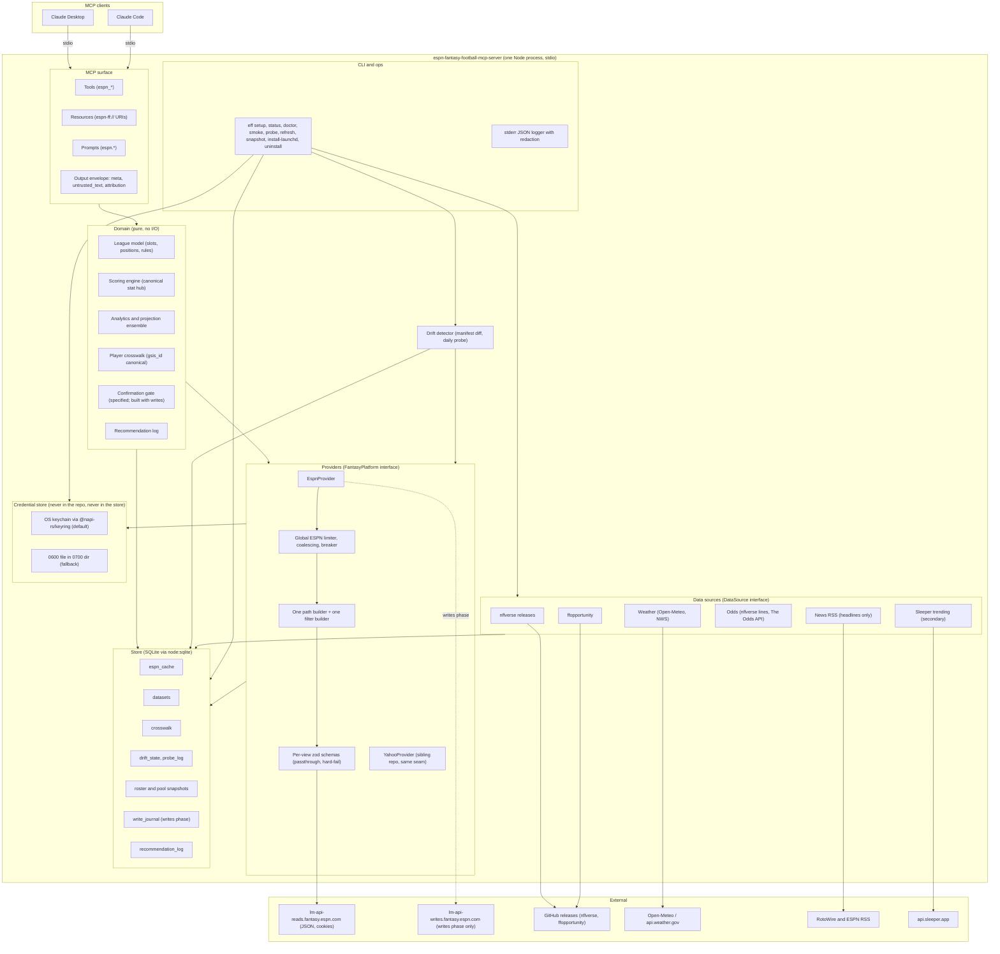

# 01 — System architecture

**Author:** `architecture-planner-core` · **Date:** 2026-09-30 · **Brief:** `docs/scratch/briefs/architecture-planner-core.md`
**Inputs (cited, not re-derived):** `docs/research/03-espn-api.md` (03); `02-prior-art-lessons.md` (02); `04-data-sources.md` (04); `01-repo-security-audit.md` (01); `00-tooling-inventory.md` (00); `docs/HANDOFF.md`; the sibling program's structural plan `yahoo-fantasy-football-mcp@f3a0a48 docs/plan/01-06` (cited as **[V-sib 0N §x]** — its verifications of the MCP specification 2026-07-28, the SDK docs and Node docs on 2026-09-29 are reused by citation, not repeated); the mcp-builder references (`mcp_best_practices.md`, `node_mcp_server.md`, `evaluation.md`, read 2026-09-30); the MCP specification sitemap (read 2026-09-30: published revisions 2024-11-05, 2025-03-26, 2025-06-18, 2025-11-25, **2026-07-28**, plus `draft` — 2026-07-28 is still the latest); the TypeScript SDK `docs/protocol-versions.md` on `main` (read 2026-09-30); the npm registry (read 2026-09-30); the Claude Code MCP documentation at code.claude.com (read 2026-09-30); three GitHub threads on tool namespacing (read 2026-09-30, §0.1).

## How to read this document

| Mark | Meaning |
|---|---|
| **[V-03 §x]** etc. | Verified in the cited research doc section. Cite, do not re-derive. |
| **[V-sib 0N §x]** | Verified by the sibling planner on 2026-09-29 and cited from `yahoo-fantasy-football-mcp@f3a0a48 docs/plan/0N`. |
| **[V-spec]** | MCP specification revision 2026-07-28 (via the sibling's reading unless marked "read 2026-09-30"). |
| **[V-sdk]** | TypeScript SDK `docs/protocol-versions.md` on `main`, read 2026-09-30. |
| **[V-npm]** | npm registry document, read 2026-09-30. |
| **[V-cc]** | Claude Code MCP documentation (code.claude.com/docs/en/mcp), read 2026-09-30. |
| **[V-session]** | Observed first-hand in the Claude Code session that wrote this plan (2026-09-30). |
| **[V-web]** | A GitHub issue or discussion read in full on 2026-09-30 — a dated **user report**, not vendor documentation; weakest verification that still counts. |
| **[A-n]** | Assumed. Listed by name in §13. The devil's advocate should attack these first. |
| **[U]** | Unverified, carried from a research doc's ledger. |

Every decision carries **decision · why · alternative considered · what would change it**. "Deferrable" means the seam is designed now and the component is built later without touching the seam. Where this plan matches the sibling's reasoning it says so and cites; where it deviates it says why.

---

## 0. Decisions at a glance

| # | Decision | Why | Alternative considered | What would change it |
|---|---|---|---|---|
| D1 | **Single Node process, single npm package, stdio transport only** in v1 | One user, one machine, one client at a time; every local-MCP failure Chad has hit (brief fact 12) is a local-process problem; the spec's stdio guidance says credentials come from the environment, not the authorization spec [V-sib 01 D1] | Streamable HTTP alongside stdio | A second user or a hosted install — §3.3 records why that is a clean negative today |
| D2 | **SDK = `@modelcontextprotocol/server` v2, exact-pinned at 2.2.0** (published 2026-09-28, `engines.node >=20`, deps `@modelcontextprotocol/core 2.2.0` + `zod ^4.2.0`, no install script [V-npm]); **Node ≥ 22.13** (`node:sqlite` unflagged [V-sib 01 D2]); this machine runs 22.23.2 via `fnm` [V-00] | v2 "serves both [eras] from the same entry points"; `serveStdio(factory)` pins the era per connection and only `legacy: 'reject'` refuses 2025-era openings [V-sdk] — so Claude Desktop's era (unknown, A-1) does not matter; v1 (`@modelcontextprotocol/sdk` 1.31.0) drags 17 runtime deps incl. `express`, `hono`, `jose` [V-npm] into a stdio server that uses none of them | v1 `@modelcontextprotocol/sdk` 1.31.0 (the API the house reference shows) | A v2 advisory or a Claude Desktop stdio regression in the Inspector/Desktop smoke (plan 05 §5) → fall back to v1 ≥ 1.31.0, never ≤ 1.25.3 [V-01 dependency audit] |
| **D3** | **Shared core: two servers, two repos, no shared package today — with a written contract that makes a shared package a directory move later, and a named trigger for doing it** (§0.1–§0.3) | The evidence in §0.1: tool collisions are avoided by *different client config keys*, not by different tool names, in both clients; one binary would have to expose two contracts under one name (ESPN has native projections, live scoring and ownership; Yahoo has none [V-04 §F]); both projects are pre-build, so a shared package now is an abstraction with zero implementations behind it; Chad's rule is "do not couple without recommending" | (a) one binary, platform per league by config; (b) shared npm package from day one | The extraction trigger in §0.3 fires (both engines pass their golden tests **and** a shared module needs the same fix in both repos) → publish `fantasy-core` and both servers depend on it |
| **D4** | **Tool prefix `espn_`; server name `espn-fantasy-football-mcp-server`; npm package `espn-fantasy-football-mcp`; bin `eff`; env prefix `EFF_` (as `.env.example`); resources `espn-ff://…`; prompts `espn.<workflow>`; recommended client config key `espn-fantasy-football`** — verb/resource suffixes identical to the sibling's (`espn_get_roster` ↔ `ff_get_roster`) so a name is a mechanical rewrite (§0.4) | The house rule is a *service* prefix so a server can sit "alongside other MCP servers" [mcp_best_practices]; the sibling chose `ff_` *because* it expected this project to be the same binary [V-sib 01 D9] — D3 rejects that binary, so the premise is gone; with both servers installed the model sees both tool sets and must pick a league — a name that says `espn_` is the strongest disambiguator available in either client (§0.1 rows 1–3); the Disney ToS posture (personal, single-league, ESPN-labelled [V-03 §D.4]) is served by every tool saying which platform it touches | `ff_*` identical to the sibling (portable Skill text; but a Skill already fully qualifies tools by server key [V-sib 09 convention], so portability is nominal); `nfl_*` for nflverse-backed tools + `espn_*` for platform facts (two prefixes in one server; and `nfl_*` would exist identically in both servers — the one case where the model truly cannot tell them apart) | Chad wanting one Skills bundle to drive both servers verbatim (then `ff_*` here and a `platform` field in every result — the crosswalk in §0.4 makes the rename mechanical either way) |
| D5 | **ESPN JSON is validated per view by zod schemas that pass unknown fields through and hard-fail on missing required fields; skeleton responses are drift; a key-based drift detector runs a daily probe against a fixture manifest** | Unknown views return 200 with a skeleton [V-03 §A.2 P28]; status codes cannot detect drift (brief fact 2); one breaking host move every 2–5 years, unannounced [V-03 §F.1] | Status-code checks; auto-adapting schemas | Nothing — this is the failure mode the project is sized for |
| D6 | **Store = SQLite through `node:sqlite`** in `~/.cache/espn-fantasy-football-mcp/`; credentials never in it | No native addon, no install script; one file, transactional, WAL for the refresh process [V-sib 01 D4] | `better-sqlite3`; JSON files | `node:sqlite` regressing in a Node line we need |
| D7 | **Every ESPN read is cache-first behind one global limiter with 03 §D.3's constants** — token bucket ≤ 30 req/min, ≤ 1 req/s sustained, ≤ 2 concurrent, **≤ 3 upstream requests per tool call**, in-flight coalescing, view composition into one request, backoff with jitter on 429/5xx only, circuit breaker after 3 consecutive failures, 1 drift probe/day | No rate-limit headers exist, paging is unbounded, the wrappers' default bootstrap is 3.2 MB [V-03 §A.3, §D.3]; the ToS posture depends on "tens of requests per day" [V-03 §D.4] | Per-tool ad-hoc caching (prior art: none [V-02 §1]) | ESPN publishing limits → real constants; a 429 ever observed → the breaker's numbers get evidence |
| D8 | **Every result carries `meta.{source, as_of, fetched_at, age_s, freshness, attribution, estimate, untrusted_fields}`; every free-text field — including fields *inside* otherwise-trusted ESPN objects — is emitted only as `untrusted_text`** | Stale-data rule (brief); team/owner names and outlooks arrive in the same JSON as facts [V-03 §B.5]; nobody in prior art labels them [V-02 §1] | Freshness in prose; wrap only news | Nothing — this is the output contract |
| D9 | **External data is file-release ingestion (`timestamp.txt` → parquet via `hyparquet` 1.31.2 [V-npm] → schema assertion → SQLite), not API clients** | [V-sib 01 D7]; nflverse `depth_charts` is ESPN-keyed and `schedules.espn` matches all 272 ESPN game ids [V-04 §B.1.6, §B.2] — a direct join | CSV twins; a Python sidecar | Parquet schemas differing from CSV twins (04 §G #15 carries this) |
| D10 | **Refreshes run in a separate CLI process (`eff refresh`) scheduled by launchd; the server only reads datasets** | `node:sqlite` is synchronous; a 30 MB load would stall the stdio loop [V-sib 01 D8] | In-process timers | An async `node:sqlite` |
| D11 | **No remote error reporting, no telemetry** | One user; every sink is a trust boundary; the one prior-art server with sinks fanned roster data to four vendors [V-02 §7] | Sentry with scrubbing (00 lists it as "maybe") | Distribution to other users |
| D12 | **Credentials (`espn_s2` + `SWID`) live in the OS keychain by default via `@napi-rs/keyring` 2.1.0 — a prebuilt native addon with no install script [V-npm] whose source the security auditor did not review (doc 01 carries no verdict) — behind a `CredentialStore` seam with a `0600` file fallback and a macOS `security`-CLI variant; never env, never client config, never a tool argument, never logged; any 401 → `ESPN_AUTH_REJECTED`, never retried** | `espn_s2` is a password-equivalent for a Disney account with no rotation path and an unknown lifetime [V-03 §C.2, §C.6]; at-rest protection is worth a native addon here where it was not for hourly-rotating Yahoo tokens [V-sib 02 S10]; plan 02 §7 carries the review checklist that must pass before the pin | File-only (portable, plaintext at rest); `security` CLI only (macOS-only, secret in argv on write [V-03 §C.4]) | The review checklist failing → `security` CLI on macOS, file elsewhere; keyring prompting on every server launch (03 §G.1 #14) → same |
| D13 | **Writes are not built in v1.** The `FantasyPlatform` seam declares them, plan 02 specifies the gate and the opt-in module, and they are a conditional phase: `EFF_ENABLE_WRITES=true` + recorded acknowledgement, lineup-only first, own-team-pinned, `prepare_*`/`commit_*`, read-back verification | [V-03 §E.4]; a commissioner's cookie edits other teams [V-03 §E.3]; the account-risk delta is "competitive-integrity incident with a human audience" [V-03 §E.4] | Ship writes off-by-default in v1 | Chad deciding to build them (HANDOFF item 4) → plan 02 §4 is the spec |
| D14 | **The confirmation gate is a domain service, not a tool-handler convention** — specified in plan 02, built with D13 | [V-sib 01 D11]; every prior-art gate but one is a model-set boolean [V-02 §4 #3] | Client approval prompts | Nothing |
| D15 | **ESPN's native projection is a first-class, labelled input to an ensemble, never the sole basis of a number we call ours — and the ensemble's weight is earned by backtest, not assumed**: v1 ships `weight_espn = 1.0` (ESPN's mean is the point estimate; our trailing nflverse line contributes the distribution shape and the disagreement flag — plan 07 E1) | Mid-pack accuracy, best at TE, worst at QB [V-04 §B.1.1]; FFA's 63 % result is about averaging *expert* sources and is not evidence for equal-weighting an expert with a trailing-window baseline (ADV OBJ-02) | Use ESPN's number as-is with no distribution (what every prior-art server does [V-02 §1]); equal weights (the first draft of plan 07 E1) | A backtest under this league's scoring (plan 10 A11a on the recorded fixture weeks; B14 prospectively) showing the mixture beats ESPN alone on MAE/CRPS → `weight_espn` below 1, the label unchanged |
| D16 | **The server reads no `.env`**: non-secret settings come from the client's `env` block or `~/.config/espn-fantasy-football-mcp/config.json`; `.env.example` documents the *names* and is left as it is | `.env` relative to the launch cwd is prior art's second most common failure [V-02 §4 #2]; the repo directory is iCloud-managed [V-00, V-03 §C.4] | `dotenv` at startup | Nothing |

### 0.1 The shared-core question — evidence

The brief names five things to check. Each row says what was found and what it implies.

| # | Question | Finding | Implication |
|---|---|---|---|
| 1 | How does **Claude Code** namespace tools from two servers? | Tools are exposed to the model as `mcp__<server>__<tool>`, where `<server>` is the config key; the docs say to "use this full name when referencing the tool in permission rules, a skill's `allowed-tools` list, a subagent's `tools` field, or a hook matcher" [V-cc]. Observed in this session: `mcp__strava__strava_get_activity`, `mcp__Claude_Browser__navigate` [V-session]. A user report confirms the transform (`agentbridge-read_file` → `mcp__agentbridge__read_file`) and its side effect: server-authored instructions that name tools by their bare names confuse the model [V-web anthropics/claude-code#67600, 2026-06-11, closed]. | Two servers with identical tool names **cannot collide** in Claude Code. But the only thing that distinguishes `…__ff_get_roster` from `…__ff_get_roster` is the config key, and Skill text must name the fully qualified form. |
| 2 | How does **Claude Desktop** namespace them? | A reproduced user report on Desktop 1.3109.0: "Namespace key for stdio servers is the config key in `claude_desktop_config.json`. For Remote Connectors it is the connector name configured on claude.ai. The MCP `serverInfo.name` field is ignored for namespacing." and "Namespace merge happens iff these two keys are identical. Different keys → separate namespaces (safe, works fine)." When keys *and* tool names both collide, `tools/call` hangs silently [V-web anthropics/claude-code#50319, opened 2026-04-18, closed `invalid`/`stale` — Desktop has no public tracker, so this is the best available evidence]. The spec itself leaves it open: "The behaviour for this is currently unspecified. Clients should likely … Rename the tools from one server by prefixing them with a unique server-id" [V-web modelcontextprotocol discussion #1198, dsp-ant, 2025-01-17]. | Two servers are safe in Desktop **if their config keys differ** — hence the recommended key `espn-fantasy-football` (the sibling uses `fantasy-football`). How Desktop presents two same-named tools to the model is **[A-2]**; a distinct prefix removes the question. |
| 3 | `tools/list` size and prompt-cache cost of one server exposing both platforms | The sibling's catalog is 51 `ff_*` names (34 read tools in v1) [V-sib 07 C3]. One binary exposing both platforms either doubles the platform-fact tools or gives each a `platform` argument and a description covering two waiver systems, two id spaces and two projection stories. Claude Code loads MCP tool schemas on demand ("deferred") [V-session; V-cc discovery cache], so list size is cheap there; whether Claude Desktop injects every schema into the prompt is **[A-3]**. Prompt caching depends on the list being *stable*, which both designs satisfy [V-sib 01 §3.1 deterministic ordering]. | Size is not the deciding cost; **description ambiguity** is: a tool whose contract differs by platform is two tools wearing one name. |
| 4 | Skill-trigger ambiguity across leagues | The sibling's Skills fully qualify every tool as `fantasy-football-mcp-server:ff_<tool>` and derive prompts from `SKILL.md` [V-sib 09 convention, C7]. "Set my lineup" with two same-named tool sets installed resolves only through the server key. | With `espn_*` names the Skill text itself says which league; the ESPN Skills bundle is its own (plan 09 here), sharing structure and guardrails with the sibling's, not tool names. |
| 5 | Release coupling and maturity | Both projects are pre-build (sibling plans landed 2026-09-29; this one today). The Yahoo build is gated on Yahoo write provisioning [V-sib 10 Ph3]; ESPN has no OAuth, no provisioning and a ToS exposure of its own [V-03 §D]. A shared package published now would have **zero implementations behind it** on either side. | Coupling two unbuilt projects is the "second system" mistake; coupling them *after* both engines pass golden tests is a refactor with tests on both sides. |
| 6 | What differs and must not be unified | ESPN has native weekly/ROS projections, ownership, ADP, ranks, injury enum, outlook text, live in-game totals [V-03 §B.5, V-04 §F]; Yahoo has none of the first group and a different waiver system (Yahoo FAAB/waiver priority vs this league's move-to-last [V-03 §B.1]); ESPN ids are two spaces (position ≠ slot) [V-03 §B.2]; ESPN writes are one atomic POST with `TRAN_*` 409s [V-03 §E]; Yahoo writes are XML PUTs [V-sib 01 §8]. | The seam (§8) must carry these as *capabilities and platform-owned shapes*, not as a lowest common denominator. |

**Verdict.** (a) is rejected: it would put two contracts under one name, two credential systems in one process, and the slower project's gates on both. (b) as a day-one package is rejected: nothing exists to share yet, and a package with no consumers is a promise, not code. **(c) now, with the contract below, becoming (b) on a named trigger** — "independent repos with conventions aligned by hand" is only acceptable because the alignment is *written down and testable*: the same module boundaries (§1.1), the same canonical stat hub (sibling plan 08 E2 designed it so "ESPN later maps to the same hub" [V-sib 08 E2]), the same envelope and error-shape, the same `DataSource` interface, the same freshness classifier, and the mechanical name crosswalk (§0.4). *Recommendation to Chad (HANDOFF item 7):* approve (c→b); the two projects proceed today without blocking each other; the extraction is a later, tested refactor, not a design decision deferred.

### 0.2 What is built here now

Everything in §1, in one package, but with the sibling's directory boundaries so that the extraction is a `git mv`: `src/domain/scoring` (canonical stat hub + engine — the product planner's plan 08 fills the ESPN stat-id → canonical table [V-03 §B.2 stat ids]), `src/domain/analytics`, `src/domain/crosswalk` (canonical `gsis_id`; ESPN id is the entry point [V-04 §C]), `src/domain/gate` (specified, built with D13), `src/sources/*` (nflverse, ffopportunity, weather, odds, news RSS, Sleeper-trending-as-secondary), `src/mcp/envelope.ts`, `src/config/freshness.ts`, `src/cli/log.ts` (redaction core), `src/store/` (migration runner). The ESPN-only parts: `src/providers/espn/*`, `src/auth/*` (cookie store), `src/drift/*`, the tool registry, the Skills bundle.

### 0.3 What moves to a shared package later, what never moves

| Moves to `fantasy-core` (trigger: both engines pass their golden tests **and** one of these needs the same fix in both repos) | Never moves (platform-owned) | Never unified (the seam carries them as platform shapes) |
|---|---|---|
| canonical stat names + scoring engine (`score`, `scoreSamples`, `explain`) | `providers/espn`, `providers/yahoo` (path builders, parsers, limiter constants, error classifiers) | player ids (`PlayerRef = { platform, id }`; only `gsis_id` crosses) |
| analytics that take canonical stat lines and `LeagueRules` | credential stores (cookie keychain vs OAuth token file) and setup CLIs | stat ids (numeric ESPN `statId` vs Yahoo `stat_id`) |
| crosswalk matcher + override loader | drift detector (an ESPN need; Yahoo's XML is a documented contract [V-sib 01 D3]) | scoring-settings shape (ESPN `pointsOverrides` by position id [V-03 §B.1] vs Yahoo modifiers) |
| `DataSource` interface + nflverse/ffopportunity/weather/odds/RSS loaders and schema assertions | tool registries, tool names, resources, prompts | waiver systems (`WAIVERS_CONTINUOUS`+FAAB / move-to-last [V-03 §B.1, values partly U]) |
| envelope, `untrusted_text` wrapper, freshness classifier, redaction core, migration runner | Skills bundles (platform vocabulary differs) | projections (ESPN native; Yahoo none), live scoring (ESPN only), ownership/ADP (ESPN native) |
| confirmation-gate core (ticket, precondition hash, journal states) | write payload builders and read-back verification | commissioner semantics (ESPN: session confers authority [V-03 §E.3]) |

The package would be published from its own repository under Chad's scope, exact-pinned by both servers, with the same supply-chain gates as plan 04 §4. Until then, a *drift check* keeps the two repos honest: plan 06 lists a manual quarterly diff of the shared-candidate directories against the sibling (zero tokens).

### 0.4 Naming crosswalk rule (for the skills researcher and the product planner)

`ff_<verb>_<resource>` (sibling) ↔ `espn_<verb>_<resource>` (here); `ff://<path>` ↔ `espn-ff://<path>`; `ff.<workflow>` ↔ `espn.<workflow>`; `fantasy-football-mcp-server:` ↔ `espn-fantasy-football-mcp-server:` in Skill text; `FF_*` env ↔ `EFF_*`; bin `ff` ↔ `eff`. Verbs are the sibling's (`get`, `list`, `search`, `analyze`, `project`, `compare`, `prepare`, `commit`, `cancel`, `record`) [V-sib 01 §4.1, 07]. Tools that exist only here carry the same grammar (`espn_get_live_scoreboard`, `espn_get_player_outlook`). Error codes are shared names where the meaning is shared (`VALIDATION`, `NOT_FOUND`, `UPSTREAM_UNAVAILABLE`, `STALE_ONLY`, the gate codes) and platform-prefixed where it is not (`ESPN_AUTH_REJECTED`, `ESPN_DRIFT_DETECTED`, `ESPN_UPSTREAM_UNAVAILABLE` is the upstream code's ESPN alias — §4.3).

---

## 1. Component diagram



Reading the arrows: the **domain never imports a wire type** (no `playerPoolEntry`, no `statSourceId`, no nflverse column names); the provider translates ESPN JSON into domain types at its boundary, and the `untrusted_text` wrapping happens *there*, field by field (§4.4). The **MCP surface never touches the store, the credential store or the network**. The **store is a leaf**. The **credential store is reachable only from the provider's transport and the CLI** — the domain and the MCP surface have no import path to it (plan 04 §3 makes this a lint rule). The drift detector is its own module because it runs in two contexts: inside the server (schema failures at call time) and as a daily CLI job (the probe).

### 1.1 Module map (what lives where)

| Layer | Directory | Owns | Must not import |
|---|---|---|---|
| MCP surface | `src/mcp/` | tool/resource/prompt registration (`registry.ts`, one ordered list), zod input schemas, `define.ts` (forces annotations, output schema, `.strict()`, envelope), `envelope.ts`, `errors.ts`, `bounds.ts`, pagination, truncation | `src/store`, `src/providers/espn/wire`, `src/auth`, `node:fs`, `fetch` |
| Domain | `src/domain/` | league model, scoring engine (canonical hub), analytics and the projection ensemble, crosswalk matcher, recommendation log, the confirmation gate core (specified now, built with D13) — pure functions over injected repositories | `@modelcontextprotocol/*`, provider wire types, `fetch`, `src/auth` |
| Providers | `src/providers/espn/` | `FantasyPlatform` implementation: `path.ts` (one path builder), `filter.ts` (one `X-Fantasy-Filter` builder), `views/*.schema.ts` (one zod schema per view), `normalize.ts` (wire → domain, wraps untrusted fields), `limiter.ts`, `cache.ts` (policy per data class), `errors.ts` (classifier), `ids.ts` (the **two** id maps: slot ids and position ids [V-03 §B.2]), `stat_map.ts` (ESPN `statId` → canonical name) | `src/mcp` |
| Drift | `src/drift/` | manifest loader, key-set diff, skeleton detection, probe runner, `drift_state` writer | `src/mcp` |
| Data sources | `src/sources/<name>/` | `DataSource` implementation: version poll, fetch, schema assertion, transactional load | `src/mcp`, `src/providers` |
| Store | `src/store/` | schema, migrations, repositories | everything else |
| Auth | `src/auth/` | `CredentialStore` interface; `keychain.ts`, `file.ts`; format validation; the Cookie-header scrubber's known-value registration; `credential_state` (in memory + `status` snapshot) | `src/mcp`, `src/domain` |
| HTTP | `src/http/` | one `fetch` wrapper: host allow-list **per mode** (read host always; write host only when the write module is enabled), timeouts, limiter hook, `User-Agent`, redaction before logging | `src/mcp`, `src/domain` |
| CLI/ops | `src/cli/` | `eff` subcommands, logger, doctor checks, launchd plist generator | — (may import anything; nothing imports it) |

*Why a separate `src/drift/` rather than folding it into the provider:* the daily probe must run **without cookies and without the server**, and the schema failure path must run **inside** every call; one module with two entry points keeps the manifest and the diff logic in one place. *Alternative:* provider-internal. *What would change it:* nothing.

---

## 2. Process model

Identical to the sibling's [V-sib 01 §2], restated in ESPN terms because the failure modes are Chad's (brief fact 12):

- **One process per client session**, spawned by the client with `command` + absolute `args` (plan 03 §4). No daemon. Two clients open at once → two processes sharing the SQLite file (WAL) and the credential store (the keychain is a system service; the file store is read-only after setup, so there is no rotation race to serialise — the ESPN design has **no token refresh** at all, which removes the sibling's lockfile problem entirely [V-03 §C.6: "rotation" is a manual re-paste]).
- **Refresh, probe and snapshot jobs are a different process** (`eff refresh|probe|snapshot`, D10).
- **Protocol on stdout, everything else on stderr** [V-spec stdio via V-sib 01 §2]; `no-console` outside `src/cli/` (plan 04 §3).
- **Shutdown** on stdin EOF / SIGTERM / SIGINT / EPIPE / parent death: flush, checkpoint WAL, close DB, exit 0 (plan 03 §1).
- **Nothing on the startup path touches the network** — not even the keychain read: credentials are loaded lazily on the first tool call that needs them, so a keychain "allow access" dialog (03 §G.1 #14) never blocks the client's startup handshake **[A-4: clients time out slow startups]**.

---

## 3. Transport

### 3.1 stdio (primary, only transport in v1)

- `serveStdio(...)` from `@modelcontextprotocol/server/stdio` in its default per-connection era pinning [V-sdk]; `legacy: 'reject'` is **not** set. *Why:* Claude Desktop's era is unknown [A-1]; Claude Code speaks 2026-07-28 [V-sib 02 S6]. *Alternative:* pin one era. *What would change it:* the SDK dropping legacy serving [A-5].
- The 2026-07-28 revision is stateless (no `initialize`, `server/discover`, `_meta` on every request) [V-sib 01 §3.1]. **No per-connection state, ever**: anything that must survive between two tool calls (a pagination position, a prepared write) is a server-minted handle in SQLite.
- Logging is deprecated as a protocol feature; stderr is the log [V-sib 01 §3.1].
- `tools/list`, `prompts/list`, `resources/list`, `resources/read` results carry `ttlMs` and `cacheScope: "private"` [V-sib 01 §3.1]; list TTL 300 000 ms (the tool set changes only when the write module is toggled — a restart).
- Tool ordering in `tools/list` is deterministic (one `registry.ts` list) for prompt-cache hit rates [V-sib 01 §3.1].

### 3.2 Streamable HTTP — not offered in v1

Same decision and the same table of what would have to change as the sibling [V-sib 01 §3.2]: the server would become an OAuth 2.1 resource server, bind `127.0.0.1` only, validate `Origin`, and carry the `MCP-Protocol-Version`/`Mcp-Method`/`Mcp-Name` headers. One ESPN-specific addition: a hosted variant would hold **other users' ESPN cookies** — the exact "cloud-hosted install path for a cookie-authenticated tool" the audit rejects [V-02 §4 #12] — and would be "enabl[ing] third parties" under Disney ToU §2.B.viii [V-03 §D.1]. So the transport question is closed harder here than for Yahoo.

### 3.3 Remote install from claude.ai — a clean negative

Not achievable under the verified constraints, for the sibling's reasons [V-sib 01 §3.3] plus §3.2's: there is no ESPN OAuth to delegate to, so a remote server could only work by collecting cookies through a web form — the darkonda pattern [V-01 #23]. The honest alternative is what this plan builds: a local stdio server per machine, `eff setup` once in a terminal, credentials in the local keychain. What would change it: ESPN publishing an API with delegated authorization (nothing suggests it will [V-03 §D.1 "no developer program"]).

---

## 4. MCP surface conventions

These bind every tool the product planner defines (plans 07–10). They are enforced by `defineTool()` in `src/mcp/define.ts`: a tool cannot be registered without annotations, an output schema, `.strict()` input, and the envelope.

### 4.1 Naming (D4) and families

- Server name `espn-fantasy-football-mcp-server`, version from `package.json`.
- Tool names `espn_<verb>_<resource>`, snake_case, ASCII letters/digits/underscore, ≤ 40 characters (spec allows 128 [V-sib 01 §4.1]). Verbs as §0.4.
- Families, so a reader can tell an ESPN fact from our estimate:

| Family | Example | Source of truth | Annotations |
|---|---|---|---|
| ESPN facts | `espn_get_roster`, `espn_list_free_agents`, `espn_get_live_scoreboard` | provider (ESPN) | `readOnlyHint: true`, `idempotentHint: true`, `openWorldHint: true` |
| ESPN-native estimates, labelled | `espn_get_projections` (ESPN's own numbers, `meta.estimate: false`, `meta.source: ["espn:projection"]`) | provider; the label says whose number it is | as above |
| Our analytics | `espn_project_players`, `espn_analyze_lineup` | domain; `meta.estimate: true`; `data.inputs[]` lists ESPN's projection as one input (D15) | `readOnlyHint: true`, `idempotentHint: false`, `openWorldHint: false` |
| External text | `espn_get_news`, `espn_get_player_outlook` | RSS / ESPN editorial; all text `untrusted_text` | `readOnlyHint: true`, `openWorldHint: true` |
| Write — prepare (writes phase) | `espn_prepare_lineup` | domain gate; **no ESPN write** | `readOnlyHint: true`, `destructiveHint: false` |
| Write — commit (writes phase) | `espn_commit_lineup` | provider write | `readOnlyHint: false`, `destructiveHint: true`, `idempotentHint: true`, `openWorldHint: true` |
| Ops | `espn_get_status` | store + auth state + drift state | `readOnlyHint: true`, `openWorldHint: false` |

Annotations are hints to the client UI, not our security boundary (plan 02 is) [V-sib 01 §4.1].

- Resources: `espn-ff://league` (the configured league identity — operator-set, never model-set), `espn-ff://league/settings`, `espn-ff://status`, `espn-ff://docs/tool-outputs`. Custom scheme per RFC 3986 [V-sib 01 §4.1]. The product planner may add more under `espn-ff://`.
- Prompts: `espn.<workflow>`; they must state the untrusted-text rule (plan 02 §6.3).
- Every tool description carries, verbatim, the sentence in plan 02 §6.3 and one more that is ESPN-specific: **"ESPN's own projections and rankings are labelled as ESPN's; numbers with `meta.estimate: true` are this server's."**

### 4.2 Output contract

Every tool returns **both** `structuredContent` (validated against `outputSchema`) and one `text` block with the same JSON [V-sib 01 §4.2]. No Markdown mode (one format halves the test surface; the sibling's product plan adds a `detail: compact | full` field selector instead [V-sib 07 C2] — adopted here for the same reason).

The envelope (`src/mcp/envelope.ts`, zod-typed, versioned):

```jsonc
{
  "data": { /* tool-specific */ },
  "meta": {
    "schema_version": 1,
    "source": ["espn:mRoster", "espn:projection", "nflverse:injuries"],
    "as_of": "2026-09-30T03:30:19Z",      // newest input timestamp: ESPN x-fantasy-server-time, ownership.date, release updated_at
    "fetched_at": "2026-09-30T04:13:50Z", // when WE last fetched the oldest contributing item
    "age_s": 812,
    "freshness": "fresh",                 // fresh | stale | provisional (rule in §5.4)
    "provisional": false,                 // any game in the scoring period has statsOfficial=false (04 §B.1.6)
    "corrections_window_open": false,     // < 7 days since the week's last game (04 §B.1.7)
    "attribution": [
      { "source": "ESPN Fantasy Football", "text": "League data and ESPN projections from ESPN Fantasy (unofficial API); not affiliated with ESPN or Disney", "url": "https://fantasy.espn.com/" },
      { "source": "nflverse", "license": "CC-BY-4.0", "url": "https://github.com/nflverse/nflverse-data" }
    ],
    "untrusted_fields": ["data.teams[].name", "data.players[].outlook"],
    "estimate": false,                    // true for every number that is ours (D15)
    "drift": null                         // or { "views": ["mRoster"], "since": "…", "detail": "espn_get_status" } when the detector is red
  },
  "page": { "limit": 25, "offset": 0, "count": 25, "total": 196, "has_more": true, "next_offset": 25 },
  "truncated": false,
  "partial": false,                       // true when the per-call ESPN budget (§5.6) was hit
  "warnings": []
}
```

- **Attribution:** ESPN publishes no attribution requirement for the unofficial API (none found [V-03]); the line above exists for honesty ("whose number is this") and for the ToS posture (no claim of affiliation). nflverse CC-BY and FTN/ffopportunity CC-BY-SA attribution is mandatory [V-04 §E]. The `DataSource.attribution` field feeds this array.
- **`page.total`** comes free from `x-fantasy-filter-player-count` [V-03 §A.3] for pool tools; for tools over cached lists it is the list length.
- **Size budget:** 20 000 characters of serialised JSON per result (headroom under the reference's 25 000) [V-sib 01 §4.2]; over budget → list halved, `truncated: true`, warning says how to page. Non-list results over budget are a bug (plan 05).
- **Pagination — bounded by us, not by ESPN:** `limit` default 25, max **100**; `offset` 0–5 000. The provider translates to an `X-Fantasy-Filter` with `limit ≤ 100` **and a mandatory sort** (a limit without a sort is a 400 [V-03 §A.3]); ESPN's own paging is unbounded (5 000 returned the whole 5.7 MB pool [V-03 §A.3]) so the cap is a server invariant enforced in `filter.ts` and tested (plan 05).

### 4.3 Error contract

Tool errors are results with `isError: true` [V-sib 01 §4.3]. Shape:

```jsonc
{ "error": { "code": "ESPN_AUTH_REJECTED",
             "message": "ESPN did not accept the stored session cookies for this league (HTTP 401).",
             "hint": "In a terminal run: eff setup — then retry here. This usually means espn_s2 expired; the server will not retry until setup succeeds.",
             "retryable": false, "upstream_status": 401, "upstream_type": "AUTH_LEAGUE_NOT_VISIBLE", "request_id": "r-8f2c" } }
```

| Code | Meaning | Retryable | Source of the rule |
|---|---|---|---|
| `ESPN_AUTH_REJECTED` | a cookie-bearing request got 401/403; credential state → `rejected`; every further cookie-bearing call short-circuits with this code until `eff setup` succeeds, `espn_check_auth` (one probe, ≤ 1/min) succeeds, or the daily `credential check` job's probe (≤ 2/day, plan 06 §1.4 — ADV OBJ-04) succeeds | no | [V-03 §C.3]; brief fact 7 |
| `ESPN_REQUIRES_COOKIES` | the tool needs private data (transactions, pending claims, activity feed, live scoring detail) and no credential is stored | no (run `eff setup`) | [V-03 §F.2 degradation table] |
| `ESPN_DRIFT_DETECTED` | a required key was missing from a view, or a skeleton came back for a known view; names the JSON path and the view | no (a human reads the diff) | [V-03 §F.2]; D5 |
| `ESPN_UPSTREAM_UNAVAILABLE` | 5xx / timeout / non-JSON body / breaker open after backoff; stale cache within the hard limit is returned as data with this code in `warnings` instead of failing | yes | §5.7 |
| `ESPN_LEAGUE_NOT_FOUND` | 404 `GENERAL_NOT_FOUND` — the league id does not exist for that season | no | [V-03 §A.4] |
| `ESPN_HOST_MOVED` | the read host answered 3xx or a non-JSON body to a well-formed request | no (a human updates config) | [V-03 §A.1 P02]; D5 |
| `RATE_LIMITED` | our own limiter would exceed the cap, or ESPN ever returns 429; carries `retry_after_s` | yes | [V-03 §D.3] |
| `STALE_ONLY` | only data older than the hard limit exists and `allow_stale` was not set | yes | §5.4 |
| `VALIDATION` | zod failure (field, reason); includes filter-builder refusals (e.g. `limit` without sort — a bug in us, never sent) | no | plan 02 §5 |
| `NOT_FOUND` | the requested team/player/week is not in the league | no | — |
| `WRITES_DISABLED` | a write tool name was called while the module is off (only possible in the writes phase with a stale client list) | no | plan 02 §3 |
| `CONFIRMATION_REQUIRED` / `CONFIRMATION_EXPIRED` / `PRECONDITION_CHANGED` / `CONFIRMATION_DENIED` / `ESPN_TRANSACTION_REJECTED` (carries the verbatim `TRAN_*` type [V-03 §E.4 #6]) | gate and write states (writes phase) | see plan 02 §4 | plan 02 |
| `INTERNAL` | anything else; `request_id` links to the stderr line | no | — |

Rules: **no upstream body ever appears in a tool result**; the only upstream strings that may appear are `details[].type` values matched against an allow-list of known typed codes (`GENERAL_NOT_FOUND`, `FILTER_LIMIT_MISSING_SORT`, `AUTH_*`, `TRAN_*`, `HTTP_METHOD_NOT_SUPPORTED` [V-03 §A.4, §E]) — an unknown type is logged and surfaced as `upstream_type: "UNKNOWN"`. Error `message`s are fixed strings from a table. The 401 message **never says "expired"** as a fact — the read host cannot distinguish expired from not-your-league [V-03 §C.3]; it says "usually".

### 4.4 `untrusted_text` applied field-by-field inside ESPN responses

The problem is specific to ESPN: free text arrives *inside* objects that are otherwise facts [V-03 §B.5]. The mechanism:

1. **The wire schemas** (`views/*.schema.ts`) type these fields as `z.string()` — they are wire.
2. **The normaliser** (`normalize.ts`) is the only code that builds domain objects, and the domain types declare `UntrustedText` (not `string`) at every free-text position, so a bare string does not type-check. `wrap(path, value, cap)` produces `{ "untrusted_text": { "value", "source": "espn.team.name", "chars", "truncated" } }` after HTML/entity stripping, control/zero-width/bidi removal and NFC (plan 02 §6.2).
3. **The envelope** lists every wrapped path in `meta.untrusted_fields`; a test walks every tool's `outputSchema` and fails if a `string` sits at a position the field list says is untrusted (plan 05 §2).

| ESPN field (03 §B.5) | Controlled by | Source tag | Cap |
|---|---|---|---|
| `teams[].name`, `abbrev`, `location`, `nickname` | other league members | `espn.team.name` etc. | 64 / 8 / 32 / 32 |
| `teams[].logo` (URL) | members | `espn.team.logo_url` (never fetched, never clickable) | 256 |
| `members[].displayName`, `firstName`, `lastName` | members | `espn.member.name` | 32 |
| `settings.name`, `divisions[].name` | commissioner | `espn.league.name` | 64 / 32 |
| `teams[].tradeBlock`, `draftStrategy` | members | `espn.team.trade_block` | 500 (or dropped — product planner) |
| `player.seasonOutlook`, `outlooks.outlooksByWeek[*]` | ESPN editorial | `espn.player.outlook` | 1 200 (median 697 chars [V-04 §B.1.5]) |
| `player.fullName`, `firstName`, `lastName` | ESPN (public figures; still third-party) | `espn.player.name` | 64 |
| `topics[]` (activity feed / message board) | members | `espn.board.text` | 500 — **not in v1** (§5.2) |
| `transactions[]` free text (if any) | members | `espn.transaction.note` | 200 |

Ids, numbers, enums and timestamps are facts (typed, coerced); everything in the table is data, never instructions (plan 02 §6).

---

## 5. Data ingestion, caching, freshness

### 5.1 Storage decision (D6, expanded)

SQLite, one file `~/.cache/espn-fantasy-football-mcp/store.sqlite` (`EFF_CACHE_DIR` override — the name already in `.env.example`), WAL, `synchronous=NORMAL`, `foreign_keys=ON`, `schema_version` with forward-only migrations (plan 03 §7). Contents: the ESPN response cache, datasets, crosswalk, drift state and probe log, roster/pool snapshots, the write journal (writes phase), the recommendation log, refresh bookkeeping, limiter state. **Credentials never** (D12). Both `~/.cache` and `~/.config` are outside the iCloud-managed `~/Documents` [V-03 §C.4]; the startup check that the directory carries no file-provider xattr is plan 03 §5.

### 5.2 Data classes

Cadences and sizes are from 03/04; TTLs and hard limits are ours (assumed numbers marked). "When down" is what a tool call sees while the source is unreachable. `L` = the league path [V-03 capability matrix].

| Data class | Source (view / file) | Source cadence | Our fetch trigger | TTL (fresh) | Hard limit (then `STALE_ONLY`) | Invalidation trigger | Storage | Size | When source down |
|---|---|---|---|---|---|---|---|---|---|
| League settings (scoring, slots, waivers, playoffs, draft) | `L?view=mSettings` [V-03 §B.1] | rarely | on demand, cache-first; the daily probe (§7) | 24 h **[A-6]** | 7 d | `status.standingsUpdateDate` / `waiverLastExecutionDate` change [V-03 §D.3]; a scoring golden mismatch (plan 05) | `espn_cache` + parsed `league_settings` (hash-keyed) | 9 KB | serve cached; > 7 d → `STALE_ONLY` |
| Teams, records, standings, **waiver order** (`waiverRank`), projected ranks | `mTeam` + `mStandings` (+ `mNav` for commissioner flags) [V-03 §A.2] | live | on demand | 15 min in-week, 6 h off-season **[A-7]** | 24 h | week rollover; waiver execution (`waiverLastExecutionDate`) | `espn_cache` | ~15 KB | serve stale with warning |
| Rosters (all teams, per week) | `mRoster&scoringPeriodId=N` [V-03 §A.2] — **requested alone**, never with `mMatchup`/`mTeam` (the wrappers' 3.2 MB bootstrap [V-03 P05]) | live | on demand | 5 min in-week, 60 min off-season [V-03 §D.3] | 24 h | a successful `commit_*` (writes phase); kickoff of any rostered player's game (lock state changes) | `espn_cache` (parsed slim entries; raw body only in fixture recording mode) | ~2 MB raw / ~50 KB parsed **[A-8]** | serve stale with warning |
| Season schedule and results | `mMatchup` [V-03 §B.4] | live | on demand | 15 min in-week | 24 h | week rollover | `espn_cache`; rows are **immutable 7 days after the week's last game** (stat corrections [V-04 §B.1.7]) | ~30 KB | serve stale |
| Live matchup totals, win probability, per-player actuals | `mMatchupScore&scoringPeriodId=N` (213 KB), `mBoxscore` (325 KB) [V-03 §A.2, §B.7] | "as they are received" [V-04 §B.1.7] | on demand | **60 s inside a game window**, 10 min otherwise; window = any game with `validForLocking && !statsOfficial && now ≥ date` from `proTeamSchedules_wl` [V-04 §B.1.6] | 24 h | `statsOfficial` flip | `espn_cache` | 213–325 KB per poll — the only large in-session payload; never polled by a job | serve stale, `warnings` says "live totals unavailable" |
| Free-agent pool, player search, **ESPN projections, ownership, ADP, ranks, injury enum, outlook text** | `kona_player_info&scoringPeriodId=N` + filter, **page ≤ 100 with a sort** [V-03 §A.3] | ESPN `max-age=5`, but static on a quiet night [V-04 §B.1.8]; ownership snapshot every ~2 h [V-04 §B.1.2] | on demand per page; nightly snapshot job (plan 06) | 60 min; **cache by event, not by clock** — a page is re-fetched early only when the nightly snapshot or a `lastNewsDate`/`ownership.date` newer than the cache shows up in another response [V-04 §B.1.8] | 24 h | kickoff windows (lineupLocked flips [U]); a `commit_*` | `espn_cache` (per filter key); nightly `pool_snapshot` for diffs | 67 KB per 5 players on the league path [V-03 P09]; **11.6 MB per 300 on the default-league path** [V-04 P11] — so page 25 by default | serve stale with warning |
| Player card / weekly actuals / prior-season splits | `kona_playercard` + `filterIds` + `filterStatsForTopScoringPeriodIds` [V-03 §B.5] | live | on demand, ≤ 25 ids per call | 6 h; **immutable** for weeks past the 7-day correction window | never for final weeks | correction window close | `player_week_stats` (parsed) | 13 KB per player | serve cached |
| Transactions, pending claims, FAAB bids | `mTransactions2&scoringPeriodId=N` + `transactions.filterType`; `mPendingTransactions` [V-03 §B.6] | live | on demand (cookies required on a private league [V-03 §F.2]); nightly append (plan 06) | 10 min | 24 h | `waiverNextExecutionDate` passing; a `commit_*` | `espn_cache` + `transactions_seen` (append-only) | ~1 KB/txn | serve stale; `ESPN_REQUIRES_COOKIES` if none stored |
| Draft results | `mDraftDetail` [V-03 §A.2] | once | on demand | **immutable once `draftDetail.drafted`** | — | — | `espn_cache` | 42 KB | serve cached |
| Position-vs-opponent ratings | `mPositionalRatings&scoringPeriodId=N` (also embedded in every `kona_player_info` [V-03 §A.2]) | weekly | on demand; taken from the pool response when present | 24 h | 7 d | week rollover | `espn_cache` | 9 KB | serve stale |
| NFL schedule, byes, kickoff times, **lock and final flags** | `…/seasons/{season}?view=proTeamSchedules_wl` — no league id, no cookie, `max-age=300` [V-03 §A.2, V-04 §B.1.6] | every 5 min | `eff refresh espn:schedule` every 6 h, hourly on game days (plan 06); also on demand | 6 h; game-day 1 h **[A-9]** | 7 d | `statsOfficial`/`validForLocking` counts change | `ds_pro_schedule` (parsed) — **the join key to nflverse `games.csv.espn`** [V-04 §B.1.6] | 109 KB | keep last load; kickoff-window logic keeps working |
| Player universe (ids, positions, team, % owned) | `…/seasons/{season}/players?view=players_wl` + root-level `filterActive` [V-03 §A.2] | `max-age=300`; data weekly | `eff refresh espn:players` daily | 24 h | 7 d | daily job | `ds_players` → feeds the crosswalk | 664 KB | keep last |
| Activity feed / message board | `L/communication/?view=kona_league_communication` [V-03 §A.1] | `polling-interval: 10` | **not in v1** (cookies required; all text; `AUTH_COMMUNICATION_NOT_VISIBLE` anonymously) | (10 min) | (24 h) | — | — | — | deferrable (§12) |
| Seasons ≤ 2017 | `leagueHistory` array route [V-03 §A.1] | — | **not in v1**; tools refuse seasons < 2018 [V-03 §F.2] | — | — | — | — | — | deferrable |
| Weekly player stats, usage, EPA | nflverse `stats_player_week` parquet [V-04 §A #1, §B.2] | nightly + game days | `eff refresh nflverse:stats` (plan 06) polls `timestamp.txt` | until next release | 3 d in season **[A-10]** | `timestamp.txt` changed | `ds_stats_player_week` | 1.5 MB/season | serve last load, age in `meta` |
| Play-by-play subset | nflverse `play_by_play` parquet [V-04 §A #5] | ~15 min after games | same job | same | 3 d | same | `ds_pbp` (projected columns) | ~10 MB/season **[A-11]** | same |
| Snap counts | nflverse `snap_counts` [V-04 §A #2] | 4×/day | same job | same | 3 d | same | `ds_snap_counts` | ~0.5 MB | same |
| Injuries + practice participation | nflverse `injuries` [V-04 §A #6] | daily ~07:00 UTC | `eff refresh nflverse:daily` + Wed–Sat afternoons | 12 h | 36 h | `timestamp.txt` | `ds_injuries` | 83 KB | serve last; **ESPN `injuryStatus` is the authoritative "what the league enforces" view regardless** [V-04 §B.1.4] |
| Depth charts | nflverse `depth_charts` — **ESPN-keyed** [V-04 §A #7] | daily | daily job | 24 h | 4 d | `timestamp.txt` | `ds_depth_charts` (joins on `espn_id` directly) | ~1 MB | serve last |
| Weekly rosters + ids (**the crosswalk source**) | nflverse `roster_weekly` [V-04 §C] | daily | daily job → crosswalk rebuild | 24 h | 7 d | `timestamp.txt` | `ds_roster_weekly` → `crosswalk(espn_id, gsis_id, method, confidence, first_seen, last_seen)` | 0.45 MB | serve last; persisted pairs never expire |
| Expected fantasy points | ffopportunity `ep_weekly` (CC-BY-SA) [V-04 §B.3] | daily ~11:35 UTC | daily job | 24 h | 4 d | release `updated_at` | `ds_ep_weekly` | ~1 MB | serve last |
| Lines, roof, surface, rest, actual weather | nflverse `schedules` `games.csv` — joined on the ESPN game id [V-04 §B.1.6] | every ~5 min in season | `eff refresh nflverse:schedules` every 30 min on game days, 6 h otherwise **[A-12]** | 30 min | 24 h (lines); 7 d (schedule) | `timestamp.txt` | `ds_schedules` | 2.2 MB | lines stale-labelled |
| Odds (optional, secondary) | The Odds API [V-04 §B.6] | live | ≤ 3×/day if `ODDS_API_KEY` set | 8 h | 24 h | job | `ds_odds` | small | omit driver, say so |
| Weather | Open-Meteo (non-commercial) / NWS [V-04 §B.7] | hourly | hourly Wed→kickoff, outdoor games only | 1 h | 12 h | job | `ds_weather` | small | omit driver, `assumptions[]` |
| News headlines | RotoWire RSS, ESPN RSS [V-04 §B.10] — **headlines only; per-player outlook is ESPN-native** (row above) | continuous | every 15 min in season | 15 min | 24 h | job | `ds_news` (append, dedup, 30-day retention) | ~5 MB/season | serve stored items with age |
| Trending adds/drops | Sleeper `trending` — **secondary**; ESPN `ownership.percentChange` is primary [V-04 §A #13] | CDN 600 s | every 30 min in season | 30 min | 6 h | job | `ds_trending` | small | omit signal |

Not ingested, by decision: DynastyProcess ids (adds 0 pairs; GPL-3.0 [V-04 §B.4, §E]); Sleeper `players/nfl` for ESPN ids (25 % coverage [V-04 §B.5]); `site.api.espn.com` news (403 [V-03 §A.1]); the `allon` view (4 MB [V-03 §A.2]); ESPN core/site APIs for weather/odds (a second unofficial host for nothing nflverse + Open-Meteo do not provide [V-04 §B.8]).

### 5.3 The ESPN cache

- **Key** = canonical request after the path builder and the filter builder: `{season, leagueId, sorted views, scoringPeriodId, canonical filter JSON}` — two spellings of one request hit one entry.
- **Value** = parsed domain object + `fetched_at` + `x-fantasy-server-time` + weak `ETag` + HTTP status. The **raw body is kept only in fixture-recording mode** (plan 05 §3): raw ESPN bodies contain member GUIDs, names and an IP [V-03 §B.3, §B.6], so persisting them by default would make the cache a PII store [V-02 §3 #9]. The parsed object has those fields wrapped or dropped (§4.4; `clientAddress` is never stored).
- **Policy** per data class (§5.2). **Reads are cache-first**: a tool call never hits ESPN when a fresh entry exists. `force_refresh: true` is an argument on every ESPN-fact tool, rate-limited to once per 60 s per key.
- **Coalescing:** an in-process `Map<key, Promise>`; two concurrent calls for one key make one request.
- **View composition:** a tool that needs `mTeam` and `mStandings` requests them in one URL (they compose additively [V-03 §A.2]); a tool never composes `mRoster` with anything (size).
- **Conditional requests:** `If-None-Match` with the stored weak ETag is sent; whether ESPN answers 304 is [U] (03 §G.1 #10) — the benefit is measured in `eff status` (`etag_304_count`) and nothing depends on it.

### 5.4 Freshness policy table

| Class | `fresh` while age ≤ | `stale` while age ≤ (served, warned) | beyond → `STALE_ONLY` unless `allow_stale` |
|---|---|---|---|
| ESPN live (live totals in a game window) | 60 s | 24 h | error |
| ESPN in-week (roster 5 min, pool 60 min, standings 15 min, transactions 10 min) | per §5.2 | 24 h | error |
| ESPN settings | 24 h | 7 d | error |
| ESPN immutable (draft; final weeks past the correction window) | always | — | — |
| ESPN season-level (`proTeamSchedules_wl`, `players_wl`) | 6 h / 24 h | 7 d | error |
| nflverse in-season datasets | until next release | 3 d | error |
| Injuries | 12 h | 36 h | error |
| Lines / weather | 30 min / 1 h | 24 h / 12 h | omitted driver (not an error) |
| News | 15 min | 24 h | omitted |

**Stale-data labelling rule:** every result says how old its oldest contributing input is (`meta.age_s`, `meta.fetched_at`) and classifies it (`meta.freshness`); analytics results list each input's age in `data.inputs[]`. A result with any `stale` input carries a `warnings[]` line naming the source. **Provisional rule (ESPN):** `meta.provisional: true` while any game of the requested scoring period has `statsOfficial: false` [V-04 §B.1.6]; `meta.corrections_window_open: true` until 7 days after the period's last game [V-04 §B.1.7]; the scoring engine's `complete: false` is surfaced as-is.

### 5.5 Refresh execution model

`eff refresh <source|all>` is the only writer of `ds_*` tables: version poll (`timestamp.txt`, release `updated_at`, or `proTeamSchedules_wl`'s `statsOfficial` count) → skip if unchanged → download to a temp file → `hyparquet` → **assert the expected column set** (missing/renamed → job fails loudly, previous load stays) → staging table → swap in one transaction → `refresh_log` row [V-sib 01 §5.5]. The server reads `ds_*` and `refresh_log`; it never downloads. ESPN season-level views (`proTeamSchedules_wl`, `players_wl`) are refreshed by the same job model because they are keyless and cacheable — the server may still fetch them on demand if the store is empty, under the limiter.

### 5.6 The ESPN request budget per tool call (D7)

| Tool (examples; the product planner fixes the list) | Upstream requests when cache is cold | Views |
|---|---|---|
| `espn_get_league` / settings resource | 1 | `mSettings` (+`mNav` composed) |
| `espn_get_standings`, `espn_list_teams` | 1 | `mTeam&mStandings` |
| `espn_get_roster` (one team or all) | 1 | `mRoster&scoringPeriodId=N` |
| `espn_get_scoreboard` / matchups | 1 | `mMatchup` (season) or `mMatchupScore&scoringPeriodId=N` (week) |
| `espn_get_live_scoreboard` | 1 (+0: pro schedule from the store) | `mMatchupScore` |
| `espn_get_box_score` | 1 | `mBoxscore&scoringPeriodId=N` |
| `espn_list_free_agents` / `espn_search_players` | 1 per page (≤ 100 rows, sorted) | `kona_player_info` + filter |
| `espn_get_player` (card, weekly actuals) | 1 per ≤ 25 ids | `kona_playercard` + `filterIds` |
| `espn_list_transactions` / pending | 1 | `mTransactions2` / `mPendingTransactions` |
| `espn_analyze_lineup` and other analytics | **≤ 3** (roster; pool page for replacements; live/box if in a game window) — the rest from the store | — |
| `espn_get_status` | 0 | — |

A tool that would need a 4th request returns what it has with `partial: true` and a warning naming the missing input [V-03 §D.3]; the Skill (plan 09) then asks a narrower question. Analytics never page the pool inside a call; they read the nightly `pool_snapshot` and at most one fresh page.

### 5.7 When a source is down

Serve the last good data with `freshness: "stale"` and a warning; escalate to `STALE_ONLY` past the hard limit. Never fabricate; never silently omit a driver — analytics list omitted inputs in `assumptions[]`. `eff status` shows per source: last success, last error, age, consecutive failures. Refresh jobs retry 3× with jitter inside one run, then stop and report (plan 06). ESPN specifically: the breaker (§6) opens for 5 minutes after 3 consecutive 5xx/timeouts so a dead host costs 3 requests, not a request per tool call.

### 5.8 Sizes

Store stays **< 150 MB** for a season: pbp subset ~10 MB [A-11], nflverse rest < 5 MB each, news ≤ 5 MB, ESPN parsed cache < 20 MB with pruning of rows past their hard limit, pool snapshots ~1 MB/night × 30-day retention. `eff doctor` warns above 500 MB. No raw ESPN bodies (§5.3) is what keeps the ESPN cache small: a raw `mRoster` is ~2 MB per fetch.

---

## 6. Rate-limit handling

- **ESPN — one global limiter, shared by every tool and every process** (D7): token bucket **≤ 30 requests/min, ≤ 1 request/s sustained, ≤ 2 concurrent** [V-03 §D.3 — proposals calibrated to observed sizes and `max-age`s; no ESPN numbers exist]. Because two client processes may run at once (§2), the bucket is **cross-process**: each request inserts a row into `espn_requests(ts)` inside a short `BEGIN IMMEDIATE`, and the count of rows in the last 60 s is checked before sending; rows older than 10 min are pruned. This replaces the sibling's in-memory bucket + shared last-failure timestamp [V-sib 01 §6, A-11] with something SQLite makes cheap. *Alternative:* per-process buckets (two clients → 60/min). *What would change it:* nothing — the cap is the ToS posture.
- **Backoff:** on 429 (never observed [V-03 §A.4]) and 5xx: exponential 1 s, 2 s, 4 s, 8 s with ±25 % full jitter, **max 3 attempts**, honour `Retry-After` if it ever appears; on 400/401/403/404: **never retry** [V-03 §D.3]. A **circuit breaker** opens for 5 min after 3 consecutive 5xx/429/timeouts; while open every ESPN-fact tool returns stale data or `ESPN_UPSTREAM_UNAVAILABLE` without a request.
- **Cache-first reads** (§5.3) mean the limiter is a ceiling, not a rate the server runs at: the expected steady state is tens of requests per day [V-03 §D.4].
- **Identification:** `User-Agent: espn-fantasy-football-mcp/<version> (+<repo URL>)`, fixed and honest; the API host does not gate on UA [V-03 §A.1 P30]; if it ever does, the server stops and reports rather than impersonate a browser (that would be ToU §2.B.ix [V-03 §D.3]).
- **Per-source limiters** (each `DataSource` owns one; numbers from 04 via the sibling [V-sib 01 §6]): GitHub releases — poll `timestamp.txt` at most every 15 min per release, never the GitHub API in the hot path (60/h unauthenticated [V-04 §B.2]); Sleeper ≤ 10/min; Open-Meteo/NWS ≤ 1 per venue per hour with `User-Agent`; RSS every 15 min; The Odds API ≤ 3/day.
- All HTTP goes through one `httpClient` (built-in `fetch`, `AbortSignal.timeout(15_000)` for ESPN, 60 s for release downloads) with a **host allow-list per mode**: `lm-api-reads.fantasy.espn.com` always; `lm-api-writes.fantasy.espn.com` only when the write module is enabled (plan 02 §3); the data-source hosts; nothing else. Redirects off-list are refused before they are followed (the old host 302s to `www.espn.com` [V-03 P02] — following it with cookies would be the leak the audit warns about [V-01 #5 caution]).

---

## 7. Drift detector (D5)

**Placement:** `src/drift/` with two entry points — `checkResponse(view, body)` called by the provider on **every** parse, and `eff probe` run daily by launchd (plan 06) and by `eff doctor --online`.

**The manifest** (`fixtures/espn/manifest.json`, generated *after* anonymisation from the committed fixtures [V-03 §F.3 step 4]): per view, the top-level key set, per-entity key sets (`team`, `rosterEntry`, `player`, `stats[]`, `scheduleItem`, `settings.*`, `status`), observed enum values, array-length ranges, and the host. Required-key sets are a *subset* of the manifest's observed keys, and a contract test enforces that (plan 05 §3).

**In-call detection** (every tool call, zero extra requests):

| Signal | Detection | Result |
|---|---|---|
| Missing required key | zod schema hard-fails, naming the JSON path and view [V-03 §F.2] | `ESPN_DRIFT_DETECTED` error; `drift_state` row written; the cache entry is **not** written |
| Skeleton for a known view | the response lacks the keys the requested views should add (e.g. `mRoster` without `teams[].roster`) [V-03 §A.2 P28] | same — this is how a renamed view is caught, since ESPN returns 200 |
| Unknown enum value | accepted, counted, logged once per value; **except** `statSourceId`/`statSplitTypeId` (meaning-changing) which fail the stat entry [V-03 §F.2] | `warnings[]`; `eff status` lists new values |
| New top-level or entity keys | passthrough; counted | `eff status` "additive drift" list; the manifest is updated by a human |
| Host answered 3xx / non-JSON | transport classifier | `ESPN_HOST_MOVED`; `drift_state.host_moved_at`; breaker opens |

**The daily probe** (`eff probe`): **two requests, no cookies**. (1) **Host probe:** `…/seasons/{season}?view=proTeamSchedules_wl` — needs no league id, so the public repo carries no identifier; checks the host still answers JSON with the manifest's key set. (2) **Shape probe:** `mSettings&mNav&mTeam` on `EFF_PROBE_LEAGUE_ID` if the operator configured a public league (a documented public example id, never committed — HANDOFF rule), else on the user's own league **with cookies** — in which case the same request is also the daily credential-validity check (plan 06 merges them: one request, two facts). Diff against the manifest; any removed key, changed enum set, or host anomaly → `drift_state` red, a macOS notification, `eff status` red, and `meta.drift` on every result from an affected view. **It never auto-adapts**; a human reads the diff, re-records fixtures (plan 05 §3), regenerates the manifest.

**What degrades gracefully** [V-03 §F.2 table, restated as tool behaviour]:

| If this view drifts or is missing | Tools that still work | Tools that stop, and what they say |
|---|---|---|
| `kona_playercard` | everything except weekly actuals per player | `espn_get_player` returns season splits only, warning "weekly actuals unavailable" |
| `mBoxscore` | live totals from `mMatchupScore` | per-player live lines unavailable |
| `mMatchupScore` | schedule/results from `mMatchup` | live totals and win probability unavailable |
| `mTransactions2` / `mPendingTransactions` | everything else | transaction tools return `ESPN_DRIFT_DETECTED`; the nightly append pauses |
| `kona_player_info` | rosters, standings, settings, schedule | free agents, projections, ownership, outlooks unavailable — the largest loss; analytics fall back to the last `pool_snapshot` with `stale` |
| `mRoster` | standings, settings, pool | roster tools and every lineup analytic stop |
| `mSettings` | nothing that scores | the server refuses to score (the engine's golden gate) and every tool carries `meta.drift` |
| `proTeamSchedules_wl` | everything, with the last stored schedule | kickoff-window logic runs on stale times; `warnings` says so |

---

## 8. Observability

- **stderr JSON lines**: `ts, level, request_id, tool, event, ms, upstream_status, upstream_type, cache (hit|miss|stale|coalesced|breaker), view, msg`. Level from `EFF_LOG_LEVEL` (`.env.example` name). ~60 lines in `src/cli/log.ts`, no third-party logger [V-sib 01 §7].
- **Redaction rules** (applied by the logger and by the error constructor; tested with adversarial strings in plan 05): `Cookie` and `Set-Cookie` headers wholesale; the stored `espn_s2` value (the logger is given it at load and replaces it with `[redacted:espn_s2]`) and anything matching `espn_s2=[^;\s]+`; **every brace-GUID** (`{8-4-4-4-12}`) → `{guid:<6 hex of sha256>}` — this covers the user's SWID and every other member's [V-02 §3 #9]; IPv4/IPv6 literals → `[ip]` (`lastUpdateInfo.clientAddress` [V-03 §A.2]); the configured league id → `[league]` in URLs and messages (a league id is an identifier the public repo and its logs must not carry [HANDOFF]); member/team names are never logged (ids only); upstream bodies truncated to 500 chars **after** the above; `X-Fantasy-Filter` logged (no secrets in it) truncated to 200. A log line is never built from an unredacted object.
- **`eff status` snapshot** (also `espn-ff://status` and `espn_get_status`): server/SDK/node versions; protocol eras served; credential state (`present`, `store: keychain|file`, `storedAt`, `ageDays`, `lastAcceptedAt`, `lastRejectedAt`, and while rejected `rejectedSince` and `nextProbeAt` — the daily probe's next run, ADV OBJ-04 — **never a value or a fingerprint**); ESPN host in use; drift: last probe time/status, manifest hash, current diff if any, additive-drift list; limiter: requests in the last minute, breaker state, `etag_304_count`; per source: last success/error/age/rows; store: path, size, schema version, snapshot counts, pending journal rows (writes phase); launchd jobs: last run/exit per plist; the read-only/writes-off flag.
- **No remote error reporting** (D11). 00 lists Sentry as "maybe"; the answer is no: one user, one machine, and a stderr line plus `eff status` reach the only person who would read a Sentry event — while every remote sink is a boundary the threat model would then have to carry (plan 02 §8).

---

## 9. Provider seam (`FantasyPlatform`) and `DataSource`

```ts
// src/providers/platform.ts — the seam. Shape-compatible with the sibling's [V-sib 01 §8]; ESPN implements it here.
export interface FantasyPlatform {
  readonly id: "espn" | "yahoo";
  capabilities(): Promise<PlatformCapabilities>;
  // { read: true, nativeProjections: boolean, nativeOwnership: boolean, liveScoring: boolean,
  //   waiverSystem: "faab" | "priority_move_to_last" | "continuous" | "unknown",
  //   write: { lineup: boolean, addDrop: boolean, waiver: boolean, trade: boolean }, discoveredAt }
  getLeague(ref: LeagueRef): Promise<League>;                     // identity, season, current/latest scoring period, status flags
  getScoringSettings(ref: LeagueRef): Promise<ScoringSettings>;   // canonical hub + platform ids (plan 08)
  getRosterSlots(ref: LeagueRef): Promise<RosterSlots>;
  getLeagueRules(ref: LeagueRef): Promise<LeagueRules>;           // waiver/FAAB/trade/playoff rules as the platform's own enums + predicates
  getRoster(team: TeamRef, week: Week): Promise<Roster>;
  listPlayers(ref: LeagueRef, q: PlayerQuery, page: Page): Promise<PageOf<PlatformPlayer>>;
  getPlayerWeekStats(ref: LeagueRef, players: PlayerRef[], week: Week): Promise<StatLine[]>;
  getMatchups(ref: LeagueRef, week: Week): Promise<Matchup[]>;
  getLiveMatchups?(ref: LeagueRef, week: Week): Promise<LiveMatchup[]>;   // present only when capabilities().liveScoring
  getNativeProjections?(ref: LeagueRef, players: PlayerRef[], week: Week | "ros"): Promise<Projection[]>; // present only when nativeProjections
  getStandings(ref: LeagueRef): Promise<Standing[]>;
  listTransactions(ref: LeagueRef, q: TxnQuery): Promise<Transaction[]>;
  // writes — present only when capabilities().write.* is true; every one takes a CommitTicket from the gate (plan 02 §4)
  setLineup?(team: TeamRef, week: Week, moves: SlotMove[], ticket: CommitTicket): Promise<WriteReceipt>;
  addDrop?(ref: LeagueRef, txn: AddDropRequest, ticket: CommitTicket): Promise<WriteReceipt>;
}
```

**What the interface abstracts:** league identity and clock (`currentScoringPeriod`, `latestScoringPeriod`, `finalScoringPeriod`, `transactionScoringPeriod` [V-03 §A.4] map to `League.clock`); a normalised `ScoringSettings` (canonical names + platform ids; `pointsOverrides` by position id become per-position rules [V-03 §B.1]); roster slots as `{ name, class, count, eligible: PositionSet }` with `class ∈ {starter, flex, bench, ir, other}` and the platform's literal (`FLEX`, `BE`, `IR` for ESPN [V-03 §B.2]); `PlatformPlayer` with `platformId` + crosswalk fields (name, team abbr, position, jersey) + **the ESPN-native extras as optional typed fields** (`ownership`, `injuryStatus`, `outlook: UntrustedText`, `nativeProjection`); transactions as a common event shape; writes as intents with a `CommitTicket`.

**What it must not pretend to unify** (the seam carries these as platform shapes, §0.3):

- **Ids.** `PlayerRef = { platform: "espn", id: number }`; the only cross-platform identity is `gsis_id` through the crosswalk [V-04 §C]. ESPN additionally has **two id spaces** — `defaultPositionId` and lineup-slot ids are different numberings with a known wrapper bug [V-03 §B.2] — both live in `providers/espn/ids.ts` and never leak as bare integers into the domain (branded types `SlotId`, `PositionId`).
- **Stat ids.** ESPN `statId` (numeric; 103/104 disputed [V-03 §B.2]) → canonical names in `stat_map.ts`, unmapped ids surfaced as warnings; the engine scores canonical lines (plan 08). ESPN's `appliedTotal` under the league's own scoring is the golden reference [V-03 §B.5].
- **Waiver systems.** `LeagueRules.waiver = { type: acquisitionType (string, partly [U]), usesBudget: isUsingAcquisitionBudget, waiverHours, processDays[], processHour, orderReset: waiverOrderReset ([U]) }` [V-03 §B.1] with predicates `hasFaab()`, `isMoveToLast()`; the domain treats unknown enum values conservatively.
- **Projections and live scoring.** Optional methods, present only when the capability is true: the ESPN provider implements them; a Yahoo provider would not. Analytics ask `capabilities()` and list "ESPN projection" as an input only when it exists (D15).
- **Write semantics.** ESPN: one atomic POST of `items[]` for the current period only, no dry-run, `TRAN_*` 409s, authority from the session [V-03 §E]; the seam takes *moves* and the provider decides the wire form and the preconditions (plan 02 §4).
- **Error taxonomy.** Providers map to §4.3; `ESPN_AUTH_REJECTED`'s "cannot distinguish expired from not-your-league" lives in the ESPN classifier, not in the seam.

```ts
// src/sources/source.ts — every external dataset; identical to the sibling's [V-sib 01 §8]
export interface DataSource<T> {
  readonly id: string;                       // "nflverse:stats_player_week", "espn:pro_schedule"
  readonly license: "CC-BY-4.0" | "CC-BY-SA-4.0" | "public-domain" | "non-commercial" | "api-terms" | "espn-unofficial";
  readonly attribution: Attribution;
  version(): Promise<string | null>;
  fetch(version: string, into: TempFile): Promise<void>;
  assertSchema(file: TempFile): Promise<SchemaReport>;
  load(file: TempFile, tx: StoreTx): Promise<{ rows: number }>;
  freshness: { ttlSeconds: number; hardLimitSeconds: number };
  limiter: RateLimit;
}
```

The `license` field is what keeps 04 §E's "separable layers" visible in the running system: `eff status` lists every `espn-unofficial` source apart from the CC-BY ones, so the commercial hard stop (Disney ToU §2.B.viii [V-04 §E]) is a fact the code carries, not a paragraph in a README.

### 9.1 Scoring engine placement, caching, golden fixtures

- Placement: `src/domain/scoring/` — pure `score(statLine, settings) → { points, complete, unmapped[] }` (the product planner's plan 08 owns the internals; this section fixes where it sits and how it is fed).
- Input: `ScoringSettings` normalised by the provider from `settings.scoringSettings.scoringItems[]` (`statId`, `points`, `pointsOverrides{positionId}`, `isReverseItem`) [V-03 §B.1] into canonical rules with per-position overrides.
- Caching: normalised settings memoised by a content hash; projections stored canonically and scored per league on demand.
- **Golden-test fixture path:** `fixtures/espn/mSettings.json` (anonymised) + `fixtures/espn/mBoxscore-week-N.json` (per-player `appliedStats`/`appliedTotal` for a completed week) → `tests/domain/scoring/golden.test.ts` asserts equality within 0.01 against `appliedTotal` [V-03 §B.5]. ESPN's `appliedStats{statId: pts}` per stat makes the golden test **per stat**, not just per total — stronger than the Yahoo equivalent.

### 9.2 Journal, snapshots, recommendation log

Store tables owned by the domain: `write_journal` (writes phase; states in plan 02 §4), `roster_snapshot` and `pool_snapshot` (nightly diffs, plan 06), `recommendation_log` (product planner). Named here so migration 1 has them.

---

## 10. Auth (placement only — plan 02 has the design)

`src/auth/` holds the `CredentialStore` interface with `keychain.ts` (`@napi-rs/keyring`, service `espn-fantasy-football-mcp`, accounts `espn_s2` and `SWID`) and `file.ts` (`EFF_CREDENTIAL_FILE`, `0600` in a `0700` dir, atomic write, mode and iCloud-xattr checks on every read), format validation (`SWID` braced GUID; `espn_s2` `^[A-Za-z0-9%+/=._-]{100,}$`, kept URL-encoded [V-03 §C.1]), and the in-memory `credential_state` (`not_configured | stored | validated | rejected`). The provider asks `auth.getCookieHeader()` and gets either a header value or a typed failure; the domain and the MCP surface have no import path to it. Setup is `eff setup` in a terminal with hidden input and the `mSettings` check (plan 03 §2).

---

## 11. CLI and ops (placement only — plan 03 has the design)

`eff` (bin; package `espn-fantasy-football-mcp`): `serve` (the client's command), `setup` (`--storage keychain|file`, `--page` for the one-shot local page), `status`, `doctor` (`--online`, `--fix`, `--json`), `smoke`, `probe` (the drift probe), `refresh <source|all>`, `snapshot <roster|pool>`, `print-config --client desktop|code`, `install-launchd`, `uninstall`, and — writes phase only — `confirm <id>`.

---

## 12. Deferrable components

| Component | Seam exists now | Build when |
|---|---|---|
| Write module + gate | `FantasyPlatform.setLineup?`, plan 02 §3–4 | Chad decides (HANDOFF item 4) and the conditional phase opens |
| Shared `fantasy-core` package | §0.2 directory boundaries, §0.3 table | the §0.3 trigger fires |
| Activity feed / message board tools | `espn.board.text` wrapper, cookies path | a Skill needs league chatter (all of it untrusted) |
| Seasons ≤ 2017 (`leagueHistory` array route) | tools refuse `< 2018` | a user with a pre-2018 league; the array shape is [U] |
| Streamable HTTP | §3.2 table | a second user (a clean negative today, §3.3) |
| `If-None-Match` benefit | sent already; counter in `eff status` | a 304 is ever observed |
| The Odds API secondary lines | `DataSource` | free key requested |
| Full pbp column set | `ds_pbp` projection list | an analytics need names a column |
| Cross-repo shared cache dir (two servers, one nflverse store) | `EFF_CACHE_DIR` | both servers installed and the duplicate ~30 MB matters |

---

## 13. What this plan does not decide

The tool set, prompts, Skills, phasing and the engine's internals (plans 07–10); security details — credential lifecycle, the gate, injection defences, supply chain, threat model (plan 02); process lifecycle, ports, launch config, doctor, migrations (plan 03); repo layout and CI (plan 04); tests (plan 05); zero-token jobs (plan 06).

---

## 14. Assumptions and unverified items, by name

| # | Assumption | How to verify / what if wrong |
|---|---|---|
| A-1 | Claude Desktop's current MCP protocol era on stdio | Inspector smoke + a manual Desktop connect; per-connection era pinning [V-sdk] makes either fine |
| A-2 | How Claude Desktop presents two same-named tools from two differently-keyed servers to the model | moot under D4 (`espn_` prefix); verify only if `ff_` is ever reconsidered |
| A-3 | Claude Desktop injects every MCP tool schema into the prompt (no deferred loading) | Desktop release notes; affects only the size argument in §0.1 row 3, not the decision |
| A-4 | Clients impose a startup timeout on stdio servers | keep startup network- and keychain-free regardless (§2) |
| A-5 | SDK v2 keeps serving the legacy era for the life of this project | re-read `docs/protocol-versions.md` on every SDK bump (plan 04 release checklist) |
| A-6 – A-12 | The TTLs and hard limits in §5.2 not taken from 03 §D.3 (settings 24 h; standings 15 min/6 h; parsed roster ~50 KB; pro-schedule 6 h/1 h; nflverse 3 d; pbp ~10 MB; schedules 30 min) | constants in `src/config/freshness.ts` with tests asserting the *shape* (fresh < stale < hard), not the values |
| U (03 §G.1 #1) | the private-league 401 body | first `eff setup` against the real league; the classifier is a table with fixtures |
| U (03 §G.1 #2) | `espn_s2` lifetime | the design does not depend on it (D12; plan 02 §2) |
| U (03 §G.1 #10, #11) | `If-None-Match` → 304; when `lineupLocked` flips; `statsOfficial`/`validForLocking` semantics (04 §B.1.6 infers them by count) | counters in `eff status`; the first in-season week |
| U (03 §G.1 #5) | what `mLiveScoring` adds with cookies; whether anonymous callers ever see a public league's transactions | first cookie-bearing smoke; the probe league |
| U (03 §G.1 #14) | Keychain partition behaviour between the setup CLI and the server binary (same node + same addon here, which should mean one ACL entry) | `eff doctor` performs one keychain read and reports whether a prompt appeared |
| U (04 §G #15) | parquet schemas equal the CSV twins | the loader's schema assertion on first `eff refresh` |
