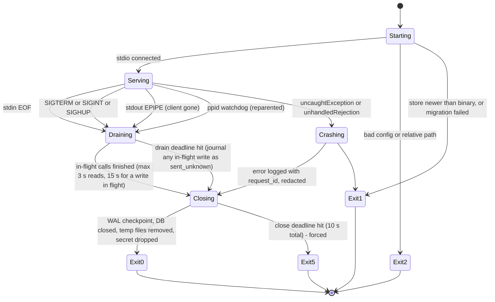

# 03 — Lifecycle and operations

**Author:** `architecture-planner-core` · **Date:** 2026-09-30 · **Brief:** `docs/scratch/briefs/architecture-planner-core.md`
**Inputs:** plan 01 (process model §2, store §5.1, drift §7, status §8), plan 02 (credential lifecycle §2, opt-in module §3, gate §4); `docs/research/03-espn-api.md` §A.4 (headers), §C.3–C.4 (expiry behaviour, setup procedures), §F.2 (`health`); `00-tooling-inventory.md` (Node 22.23.2 via `fnm` today — below the ≥ 24.15 floor, doctor #1; the path with spaces; iCloud); `02-prior-art-lessons.md` §4 #2, #6; the sibling's lifecycle plan `yahoo-fantasy-football-mcp@f3a0a48 docs/plan/03` (**[V-sib 03 §x]** — its spec/Node citations and its shutdown design are reused; the port and token-refresh sections do not transfer and are replaced with reasons); the Claude Code MCP documentation (read 2026-09-30, **[V-cc]**).

Legend as in plan 01.

This plan exists because of the four failures Chad has hit with local MCP servers (brief fact 12): **stdio disconnects without a clean process exit; port conflicts for auth/setup UIs; relative or unquoted paths in launch config; session expiry mid-session with no recovery path.** Each has a section, a mechanism, and a test in plan 05. The ESPN version of the fourth is worse than Yahoo's — there is no refresh token, so "recovery" means a human re-paste — and the design has to keep the chat useful while that happens.

---

## 0. Decisions at a glance

| # | Decision | Why | Alternative considered | What would change it |
|---|---|---|---|---|
| L1 | **stdin EOF is the primary shutdown signal; SIGTERM/SIGINT/SIGHUP and stdout EPIPE are equivalent; a `ppid` watchdog catches the rest** | the spec: servers "SHOULD exit promptly when their standard input is closed … the primary graceful-shutdown signal and the only portable one" [V-sib 03 L1]; clients escalate to SIGKILL if we linger | signals only | Nothing |
| L2 | **`serve` mode opens no listening socket, ever** | a stdio server has no reason to listen; every port conflict Chad hit came from a setup UI; the only listener is `eff setup --page`, a separate short-lived process | in-process setup page | Streamable HTTP (plan 01 §3.2 — not offered) |
| L3 | **The optional setup page uses a fixed default port, a fallback range, and an explicit override; it reports the URL it actually bound** | unlike Yahoo's OAuth callback [V-sib 03 L3], an ESPN setup page has **no registered callback to match** — the CLI prints the URL, so any free port is correct; the port-conflict failure mode is therefore solved by *falling back and telling the user*, not by refusing | fixed port, no fallback (the sibling's rule — right for OAuth, wrong here) | Nothing |
| L4 | **Launch config always uses absolute, quoted paths generated by `eff print-config`** from `process.execPath` and the resolved `dist/` path; only non-secret env keys; the client config **never** holds a cookie | GUI clients start with launchd's minimal `PATH` **[A-1]**; relative paths resolve against the client's cwd [V-02 §4 #2]; the repo path contains spaces [V-00]; `claude_desktop_config.json` is not a secret store [V-03 §C.4 (c)] | `npx`/global bin in config | Nothing |
| L5 | **`eff doctor` runs offline by default and online with `--online`; it never modifies the stored secret or its setup metadata; `--online` records its probe observation in `store.sqlite` exactly as `espn_check_auth` does** | a diagnostic must not change the credential; the online checks are read-only GETs under the limiter, and their observation is recorded where every credential observation lives (plan 02 §2.1) | doctor re-validates and rewrites `meta` | Nothing |
| L6 | **Cookie rejection mid-session is detected once, surfaced through the tool result with the exact command, and the server stays alive; cached reads keep working; the next successful `eff setup` in another terminal is picked up without a restart** | brief fact 12 #4; [V-03 §C.3]; no refresh path exists, so the recovery *is* the human — the server's job is to make that one action obvious and non-repetitive | "restart Claude" | Nothing |
| L7 | **Forward-only, numbered SQLite migrations with an automatic pre-migration backup (`VACUUM INTO` under the process lock); a newer store refuses an older binary; the credential `meta` carries a `format_version` for in-memory upgrade; per-source dataset files carry their own `ds_schema` and are replaced whole by `eff refresh`, never migrated in place** (plan 01 §5.5 — ADV OBJ-09(a)) | snapshots, the recommendation log and (later) the journal are not rebuildable; the cache and the dataset files are | ORM migrations | Nothing |
| L8 | **`eff uninstall` removes what we created — including the keychain items — and prints what it will not touch** (client config entries, the ESPN session itself) | the client config is the user's file; the ESPN session can only be invalidated by logging out at ESPN (whether that works is [U], 03 §C.6) | delete everything | Nothing |

---

## 1. Process lifecycle

### 1.1 Startup (`eff serve`, the client's `command`)

**Nothing on the startup path touches the network or the keychain** — clients time out slow servers [A-2], and a macOS keychain prompt during the handshake would look exactly like a hang.

1. Parse args (`node:util.parseArgs`), read env (`EFF_*`, `ESPN_LEAGUE_ID`, `ESPN_SEASON`, `ESPN_TEAM_ID`), resolve paths (`EFF_CONFIG_DIR`, `EFF_CACHE_DIR`, `EFF_CREDENTIAL_FILE`, `~`; `$XDG_*` is not read — one shared location for every entry point, plan 01 D16). Fail fast with exit 2 and one stderr line if `ESPN_LEAGUE_ID` is missing/non-numeric or a path is relative.
2. Install the shutdown handlers (§1.3) before anything can be half-open.
3. Open the store (`DatabaseSync`, `busy_timeout=5000`, WAL), run migrations (§7) under `BEGIN IMMEDIATE`; a store from a newer version → exit 1 with the message. Dataset files are **not** attached at startup: each per-source file named in `refresh_log` is opened lazily as its own read-only connection on first use and re-opened on a version change; a missing file means that source is absent — never a startup error (plan 01 §5.5 — ADV OBJ-09(a), OBJ-22).
4. Derive the credential state **without touching the credential store**: the state with its observations (`lastAcceptedAt`, `lastRejectedAt`, `rejected_since`, `next_probe_at`) comes from the `credential_state` row of the store opened in step 3 (plan 02 §2.1) — `eff setup` writes that row whenever it stores a value, with `stored_at`, a copy of the setup metadata's `storedAt` (plan 02 §2.1), so `espn_get_status` reports the age without a credential-store read — and `--reset`, `eff uninstall` and a setup that deletes the value remove it. With no row the state is `not_configured`, except that for the file store a `stat` of `session.json` (no read) that finds the file gives `stored`. The keychain is never read here: the `meta` item — its existence and the `storedAt` the reload check compares (plan 02 §2.1) — is read with the secret on the first cookie-bearing call (plan 02 §2.2), which corrects the label: items without a row (a wiped cache) → `stored`, a row without items → `not_configured` **[A-3]**; a row it recreates carries the `storedAt` it has just read as `stored_at`.
5. Learn `settings.isPublic` from the cached `mSettings` if present (no network) — decides whether anonymous reads are possible while `rejected` (plan 02 §2.1).
6. Register tools from one fixed list (plan 01 §1.1 `registry.ts`) filtered by capability: write tools only if all four plan 02 §3.2 registration gates hold (in v1: never), evaluated here from persisted evidence with no network and no keychain read — Env = `EFF_ENABLE_WRITES`; Acknowledgement = the typed acknowledgement recorded in `config.json`; Credential = the `credential_state` row in `store.sqlite` says `validated`; Own team = `ESPN_TEAM_ID` recorded in `config.json` by `eff setup` (§2.1 step 6). The tool set changes only at process start: no late registration, no `list_changed`. Register resources and prompts.
7. `serveStdio(...)` (SDK v2). Log one `info` line: version, node, store path, credential state (label only), drift state, tools registered.
8. Start the parent watchdog (§1.3), `setInterval(…, 5000).unref()`.

Startup target: **< 300 ms** warm; a test asserts < 1 s with the network and keychain stubbed to throw.

### 1.2 Steady state

- Every tool call: `request_id`, `debug` start line, zod validation, domain call, envelope, `info` end line with `ms`, cache outcome, upstream count. Long calls send `notifications/progress` only if the request carried a `progressToken` [V-sib 03 §1.2].
- The event loop never blocks longer than one SQLite statement **or one ≤ 20 ms CPU batch**: dataset loads are the refresh process's job (plan 01 D10), and the analytics samplers (`scoreSamples`, E1's sampler, the seeding simulator) run as **cooperative batches** that yield to the loop via `setImmediate` every ≤ 20 ms of CPU — so progress notifications, shutdown handling and the ppid watchdog keep running through a 3–5 s simulation (the total CPU is unchanged; the stall is bounded). The process test measures the main-loop stall with a heartbeat timer and asserts **≤ 50 ms during any analytics call** (plan 10 A16a). If batching cannot hold 50 ms, a `worker_threads` pool (size 1–2) is the named fallback — the domain is pure, so it is a seam, not a redesign (ADV OBJ-07). A guard test asserts no `eff refresh` code path is reachable from `src/mcp`.
- Two server processes (Desktop + Code) may coexist: they share the store (WAL) and the cross-process limiter table (plan 01 §6); the credential store is read-only after setup, so there is nothing to serialise.
- The credential value, once read, lives in the provider's transport closure for the life of the process; `rejected` drops it (§6).

### 1.3 Shutdown



| Trigger | Detection | Notes |
|---|---|---|
| stdin EOF | `process.stdin.on("end")` and `on("close")`; the SDK transport's `onclose` — all wired to one `shutdown("stdin")` | the spec's primary signal [V-sib 03 §1.3] |
| SIGTERM / SIGINT / SIGHUP | `process.on(sig, …)` | the client's escalation after closing stdin |
| stdout EPIPE | `process.stdout.on("error", e => e.code === "EPIPE" && shutdown("epipe"))` | writing to a dead client must not throw out of the transport |
| Parent death without EOF | watchdog every 5 s: `process.ppid !== initialPpid` → `shutdown("orphaned")` | covers a SIGKILLed client whose pipe is inherited **[A-4]**; `.unref()`'d |
| Crash | `uncaughtException` / `unhandledRejection` → redacted log with stack → `shutdown("crash")`, exit 1 | never `process.exit` inside a handler without the close sequence |

Shutdown is idempotent and single-flight (re-entry returns the same promise; a second SIGINT during draining forces the close deadline to now). Sequence: transport `close()`, wait for in-flight calls (reads ≤ 3 s; a write already sent to ESPN waits ≤ 15 s — past that its journal row becomes `sent_unknown`, plan 02 §4.4), `PRAGMA wal_checkpoint(TRUNCATE)`, `db.close()`, delete this process's `*.tmp` files, overwrite the in-memory cookie string reference with `null` (JavaScript cannot zero it; stated honestly), flush stderr, `process.exit(code)`. Hard ceiling 10 s → exit 5.

**Exit codes** (shared with the CLI): `0` clean · `1` error · `2` usage/config · `3` credentials not configured or rejected · `4` drift detected (`probe`/`doctor` only) · `5` forced shutdown after deadline.

### 1.4 No orphaned listeners

`serve` opens none (L2). `eff setup --page` owns exactly one `http.Server` on `127.0.0.1` with `server.close()` on success, on timeout (120 s [V-03 §C.4]), on `SIGINT`, and in a `finally`; `keepAliveTimeout` 1 s; the process exits after the one accepted POST. A test starts it, SIGINTs it, and asserts the port is free within 1 s.

---

## 2. Setup: the CLI flow and the optional one-shot page

### 2.1 `eff setup` (default) — terminal, hidden input, no listener

The procedure is 03 §C.4's, made concrete:

1. Print the three DevTools steps (Application → Cookies → `espn.com` / `fantasy.espn.com`; copy `SWID` **with braces**; copy `espn_s2` as shown, URL-encoded) and the one warning: *these are full account credentials; never paste them into chat.*
2. Prompt `SWID` (echoed — it is an identifier); validate the braced-GUID regex (plan 02 §2.1); on failure say which part is wrong (missing braces is the common one [V-03 §C.1]).
3. Prompt `espn_s2` with **echo off** (a muted `readline` output stream — no dependency); validate the character class; **refuse < 40 chars; warn at 40–99** ("shorter than expected; the ESPN check will decide") and proceed (ADV OBJ-15); warn on whitespace or quotes (the `%`-mangling pitfall [V-03 §C.1]); never print the value or its length beyond "ok (N chars)".
4. On a fresh install, run the **launchd-context test** first (plan 06 §2 — ADV OBJ-05, OBJ-25): `eff setup` first prints one sentence — "a Keychain prompt may appear during this test; ignoring it selects the file store" (R3 nit (e)) — then writes a **throwaway keychain item** through the same addon (service `espn-fantasy-football-mcp-selftest`, a random value — never a credential; nothing else exists to read on a fresh install), a one-shot launchd agent reads it under a **10 s timeout**, and the outcome is one of `ok` / `timeout` (a Keychain prompt or a hang — a headless agent cannot see a dialog, only a read that blocks) / `error`. Anything but `ok` records `EFF_CREDENTIAL_STORE=file` in `config.json` for the whole install, with the reason printed; the throwaway item is deleted either way; the outcome is recorded in `config.json` and shown by `doctor` #7. Then store per `EFF_CREDENTIAL_STORE` (plan 02 §2.2); the file store runs the mode and iCloud-xattr checks first and records its resolved absolute path as `EFF_CREDENTIAL_FILE` in `config.json` (§3). Exactly one store ever holds a value.
5. **The definitive check:** one probe under the limiter — `GET L?view=mSettings` with the Cookie header on a private league; on a public league (`settings.isPublic` from the anonymous read) the `/communication/` board probe with `topics.limit: 1`, body discarded, because `mSettings` is 200 there with or without cookies (plan 02 §2.1 — ADV OBJ-14), preceded by one **anonymous control request** to the same probe, cached with the league settings: if the anonymous answer is 401 the probe discriminates; if it is anything else (a board-less league may answer 404 to anyone) the probe cannot test the cookie on this league — setup keeps the value, prints "stored; this league's board answers the same to anyone, so validity cannot be tested here" and leaves the state `stored` (`accepted: null`) (ADV OBJ-26). `200` (or `404` from an informative board probe) → set `lastAcceptedAt`, print `stored: SWID ok (38 chars), espn_s2 ok (N chars), league [league] check ok (private: yes/no; probe: settings|board), age 0d`. `401/403` → **delete what was stored**, print "ESPN did not accept these cookies for that league — copy them again from a logged-in browser tab and re-run `eff setup`". `404` from `mSettings` → delete, print "league id not found for season YYYY — check `ESPN_LEAGUE_ID`". Anything else → keep the value, print the classified error, exit 1.
6. Resolve the user's team: the team whose `owners[]` contains the SWID (from `mTeam`, one more request) → print it and write `ESPN_TEAM_ID` into `config.json` if unambiguous; zero or many matches → print why and leave it unset (this also gates the write module, plan 02 §3.2).
7. Print the re-paste recommendation: "cookie lifetime is unknown; re-run `eff setup` if `eff status` shows rejected, and consider doing so every 30 days" [V-03 §C.2].
8. Timeout: each prompt waits 10 minutes, then exits 1 with "run `eff setup` again"; nothing partial is left stored (a failed step deletes what the earlier step wrote).

`--reset` deletes the stored items and clears `lastAcceptedAt`/`lastRejectedAt`; `--storage keychain|file` overrides `EFF_CREDENTIAL_STORE` for this run and records the choice in `config.json` for the whole install — `--storage keychain` first runs the step 4 launchd-context test and is refused unless its outcome is `ok`, because a keychain the jobs cannot read would split the install; switching store deletes the other store's items first, so exactly one store ever holds a value (ADV OBJ-05); `--seeding espn_rule|points_only` records the operator's seeding reading (`EFF_SEEDING_MODE`, `seeding_confirmed_at` — plan 07 C12, ADV OBJ-13); `--enable-writes` is the acknowledgement flow of plan 02 §3.2 (writes phase). `--service-name <name>` is **test-only**: it changes the keychain service name so the macOS integration test (plan 05 T10, §4.2) never touches the real item, and it is refused unless the name starts with `eff-test-`; the step 4 throwaway item follows it (`<name>-selftest`), and it skips step 5 — and with it the step 6 request — printing that it did: a throwaway test item holding a fake value is never sent to ESPN, so a test-only setup makes no network call. No other command takes it (plan 05 §4.2 verifies and cleans up with the `security` CLI).

**Non-TTY stdin (writes phase):** from plan 10 §3.W prerequisite (c) on, `eff setup`, like `eff confirm`, refuses to run when stdin is not a TTY and exits 2 with "run `eff setup` in a terminal" — a hurdle a pty defeats, not a proof (plan 02 §4.2). No flag exempts a run, `--service-name` included (an exemption would be one more way around the refusal), so the macOS keychain round trip drives setup through a pty (plan 05 §4.2; plan 04 §4.5).

### 2.2 `eff setup --page` (opt-in) — one-shot local page

| Step | Behaviour |
|---|---|
| Port | `EFF_SETUP_PORT` if set (explicit override; no fallback when explicit — a wrong explicit port is a user statement); else default **8790 [A-5]**, then the fallback range **8790–8799** in order; the first port that binds wins |
| Conflict | `EADDRINUSE` on the default → try the next in range; on the explicit port → run `lsof -nP -iTCP:<port> -sTCP:LISTEN` (present on macOS; skipped if absent) and print `Port <n> is in use by <command> (pid <n>). Set EFF_SETUP_PORT to a free port or run 'eff setup' (no page needed).`, exit 2. The whole range busy → the same message, exit 2 |
| Bind | `127.0.0.1` only (never `0.0.0.0`, never `::` — a single family keeps the `Host` check exact **[A-6]**) |
| URL | printed exactly as bound: `http://127.0.0.1:<port>/setup/<32-byte-hex-token>` — plain `http` is acceptable on loopback: nothing leaves the host, and a self-signed cert would only add a browser warning [V-03 §C.4] |
| Form | POST-only; the token in the path **and** a hidden field; accepted only when `Host` is exactly `127.0.0.1:<port>`, `Origin`/`Referer` match it, the token matches, and it is the **first** submission; responses carry `Cache-Control: no-store`; nothing is logged; the page has the DevTools instructions and two fields |
| After POST | the same validate → store → definitive check → team resolution as §2.1, results printed in the **terminal** (the browser tab gets a "done, you can close this tab" page with no values) |
| Timeout | 120 s, then close + exit 1 with "run again" |
| One callback | the first valid POST is processed; every other path returns 404; the server closes after handling it |

**Which one to recommend:** `eff setup` (no page), in the README and in the CLI's own text. The page is for people who want the instructions and paste fields in one place; it costs a socket, a browser tab and the clipboard holding the secret [V-03 §C.4].

---

## 3. Config precedence

`env` > `<config>/config.json` (no secrets allowed in it — `doctor` fails if it finds a key that looks like a cookie value or `espn_s2`/`swid` keys) > defaults. **No `.env` is read by the server** (plan 01 D16). **Two exceptions to that order — `EFF_CREDENTIAL_STORE` and `EFF_CREDENTIAL_FILE`:** the store `eff setup` records in `config.json`, and for the file store the resolved absolute `session.json` path it records beside it, are authoritative for every process (one store per install, ADV OBJ-05); an env value that disagrees with either is not used, and `doctor` #6 fails naming both, so no client `env` block can send the server and the jobs to different stores or different files (the plists never carry either key — plan 06 §2). Every key the code reads, grouped by scope. **Server** (the runtime keys): `ESPN_LEAGUE_ID` (required), `ESPN_SEASON`, `ESPN_TEAM_ID` (discovered), `EFF_CREDENTIAL_STORE`, `EFF_CREDENTIAL_FILE`, `EFF_CONFIG_DIR`, `EFF_CACHE_DIR`, `EFF_LOG_LEVEL`, `EFF_ENABLE_WRITES`, `EFF_SETUP_PORT`, `EFF_PROBE_LEAGUE_ID` (optional public league for the drift probe), `EFF_TOOLSET` (`core` | `full`; default `core` — plan 07 C3; T-03), `EFF_SEEDING_MODE` (`espn_rule` | `points_only`; default `espn_rule`; set by `eff setup --seeding`, which also records `seeding_confirmed_at` — plan 07 C12; T-03, ADV OBJ-13), `EFF_ESPN_READ_HOST` (**the emergency path for a host move**, ADV OBJ-06: accepted only if it matches `^[a-z0-9-]+\.fantasy\.espn\.com$`, so a cookie can never be sent outside `*.fantasy.espn.com`; the `httpClient` allow-list is derived from it; `doctor` #15 re-baselines the manifest against it; it covers only a move within `*.fantasy.espn.com` — anything else is the release path; the permanent fix is a release — plan 01 §7), `ODDS_API_KEY` (optional), `WEATHER_API_KEY` (unused by Open-Meteo/NWS; reserved), `EFF_WEATHER_SOURCE` (`open-meteo` | `nws`). **Launcher:** `EFF_NODE` (an absolute Node path), read only by `scripts/eff-launch.sh` (plan 09 §4). **Test:** `EFF_FIXTURE_DIR` (fixture mode — plan 05 §3.1), `EFF_FIXTURE_RECORD` (raw-body recording — plan 05 §2), `EFF_TEST_STUBS` (the startup test's network and keychain stubs — plan 05 §4.2). Every key is declared once in `src/config/schema.ts` (zod) with a `scope` field (`server` | `launcher` | `test`): the README Configuration table is generated from the server and launcher keys, the test keys are generated into the README Testing section, and `.env.example` lists the server and launcher keys only; the docs-current check covers all three scopes (plan 04 §6). The `.env.example` names are honoured verbatim.

---

## 4. Launch configuration (absolute, quoted paths; no secrets)

### 4.1 `eff print-config --client desktop`

Emits a JSON snippet with **resolved absolute paths** — `command` = `process.execPath` (the exact `node` binary that ran `eff`; under `fnm` this is a versioned path such as `<home>/.fnm/node-versions/v24.x.y/installation/bin/node` (the layout observed on this machine, 2026-09-30, at v22.23.2 — below the Node ≥ 24.15 floor, so the quickstart's first step is `fnm install 24 && fnm default 24`; T-15(a)) [V-00: the existing `strava-mcp` entry uses the absolute `fnm` node path]), `args[0]` = the absolute path of `dist/cli.js` resolved from `import.meta.url` — and only non-secret env keys. **Where the runtime install lives (ADV OBJ-10):** the `dist/cli.js` and `node_modules` that this snippet and every launchd plist point at must sit **outside any file-provider directory** — a clone under a non-synced path (e.g. `~/src/espn-fantasy-football-mcp`) or `npm install -g` from the release tarball (§4.3); the research/plan checkout under the iCloud-managed `~/Documents` may stay where it is (it holds no runtime). iCloud's eviction and sync churn of a `node_modules` tree breaks launches in the client's MCP log, where nobody looks. `eff print-config` **warns** when the resolved `dist/cli.js` sits under a directory carrying `com.apple.file-provider-domain-id`/`com.apple.icloud.*`; where the runtime install lives is Chad's decision (HANDOFF item 2):

```json
{
  "mcpServers": {
    "espn-fantasy-football": {
      "command": "/Users/<you>/.fnm/node-versions/v24.15.0/installation/bin/node",
      "args": ["/Users/<you>/src/espn-fantasy-football-mcp/dist/cli.js", "serve"],
      "env": {
        "ESPN_LEAGUE_ID": "<your league id>",
        "ESPN_SEASON": "2026",
        "EFF_LOG_LEVEL": "info"
      }
    }
  }
}
```

- **One shared location (plan 09 §4):** every entry point — the server launched by the plugin or by this config, the `eff` CLI and the launchd jobs — uses the same config and cache directories: the defaults `~/.config/espn-fantasy-football-mcp` and `~/.cache/espn-fantasy-football-mcp`, or the same explicit `EFF_CONFIG_DIR`/`EFF_CACHE_DIR` values when the user overrides them, which `eff print-config` writes into this snippet's `env` (and the §4.2 command's `--env`) and `eff install-launchd` into every plist (plan 06 §2).
- The config key is **`espn-fantasy-football`** — distinct from the sibling's `fantasy-football`, which is what keeps the two servers in separate namespaces in Claude Desktop (plan 01 §0.1 row 2).
- JSON quoting handles the spaces in the path; `print-config` also emits the shell-quoted form for the Claude Code command (§4.2) so the user never hand-types a path with spaces.
- Paste target: `~/Library/Application Support/Claude/claude_desktop_config.json` (macOS; mode `0600` on this machine [V-03 §C.4]) **[A-7: the path is from general knowledge; verify at build time]**.
- `eff doctor` reads that file if present and checks: `command` and `args[0]` are absolute and exist; `command` is a Node ≥ 24.15 **and matches `process.execPath`** (ADV OBJ-11); `args[0]` sits outside any file-provider directory (ADV OBJ-10); `args` contains `serve`; **no `env` value matches a cookie shape** (plan 02 §2.3 patterns) — if one does, doctor prints the removal instruction and exits 2.

### 4.2 `eff print-config --client code`

Emits, with the same absolute paths and shell quoting:

```
claude mcp add --scope user --transport stdio \
  --env ESPN_LEAGUE_ID=<your league id> --env ESPN_SEASON=2026 --env EFF_LOG_LEVEL=info \
  espn-fantasy-football -- "/Users/<you>/…/fnm/…/bin/node" "/Users/<you>/src/espn-fantasy-football-mcp/dist/cli.js" serve
```

`--scope user` stores the entry in `~/.claude.json`, so no user-specific entry lands in the repo's `.mcp.json` — which exists (plan 09 §4, K8) and carries **no secrets and no absolute user paths**: `${CLAUDE_PLUGIN_ROOT}` variables and the `scripts/eff-launch.sh` shim launched by `/bin/sh` only (T-01; ADV OBJ-12, OBJ-23); "the `--` (double dash) separates Claude's own options … from the command and arguments that run the server" [V-cc]. `doctor` parses `~/.claude.json`'s `mcpServers` if found, with the §4.1 checks. In Claude Code the tools appear as `mcp__espn-fantasy-football__espn_<tool>` [V-cc; V-session] — the README says so; Skill *frontmatter* (`disallowed-tools`) lists the qualified forms for both install paths, while Skill bodies use bare `espn_*` names validated against `tools/list` (plan 09 convention; T-02) [V-cc].

### 4.3 Global install variant

`npm install -g` puts `eff` on `PATH`; the config still uses the absolute `dist/cli.js` path printed by `eff print-config` — GUI clients do not have the user's shell `PATH` [A-1]. The global install (from the release tarball) is the recommended runtime location when the checkout is iCloud-managed (ADV OBJ-10); the quickstart's first step is `fnm install 24 && fnm default 24` (T-15(a)).

---

## 5. `eff doctor`

Offline checks always; `--online` adds the network ones (all read-only GETs under the limiter); `--fix` repairs mode bits and creates missing directories after a y/N prompt; `--json` for scripts (plan 06). Exit code = worst finding (0 ok, 1 fail, 2 config, 3 credentials, 4 drift).

| # | Check | Pass condition | Fix / message |
|---|---|---|---|
| 1 | Node version | ≥ 24.15.0 (`node:sqlite` unflagged and without the v22 line's `ExperimentalWarning` on every launch — T-15(a)); reports the running binary's path | `fnm install 24 && fnm default 24`, then `eff print-config` and `eff install-launchd`; the config's `command` must point at it |
| 2 | Launch config paths | `command` and `args[0]` absolute, exist, executable; `command` is Node ≥ 24.15; `args` contains `serve`; the config key is `espn-fantasy-football` (warn if the sibling's `fantasy-football` key also exists — fine, just says both are installed); **`args[0]`'s directory and its `node_modules` carry no file-provider xattr and are not dataless placeholders** — reads `dist/cli.js` and one `node_modules` entry, asserting non-zero on-disk size (ADV OBJ-10); **`command` matches `process.execPath`** — a version mismatch warns "config uses v<a>; you are running v<b> — re-run `eff print-config` and `eff install-launchd`" (ADV OBJ-11); for the plugin path, runs the launch shim's resolution — `scripts/eff-launch.sh` (`EFF_NODE` → `fnm`/`nvm` default → `/opt/homebrew/bin` → `command -v node`) and reports the node it would pick (ADV OBJ-12) | prints the corrected snippet from `print-config`; a file-provider directory or a placeholder is a hard fail naming the directory and the fix (a clone outside iCloud or `npm install -g`) |
| 3 | Client config secrecy | no `env` value in either client config matches a cookie shape; no `ESPN_S2`/`SWID`-named key at all | removal instruction; exit 2 |
| 4 | Config dir | exists, mode `0700`, owned by the user, **no iCloud/file-provider xattr** [V-03 §C.4] | `--fix` chmods; an iCloud-managed dir is a hard fail with the reason |
| 5 | Cache dir + store | writable; free space ≥ 1 GB; `PRAGMA quick_check` ok; schema version = binary's; size (warn > 500 MB); no file-provider xattr | `--fix` creates; `eff refresh` |
| 6 | Credential store presence + mode bits | keychain: the `meta` item exists; file: `session.json` exists, `0600`, in a `0700` dir; **exactly one store exists — fails when both the keychain `meta` item and `session.json` are present** (one store per install, ADV OBJ-05); fails when an env `EFF_CREDENTIAL_STORE` or `EFF_CREDENTIAL_FILE` disagrees with the value recorded in `config.json` (§3); reports `storedAt` and `ageDays` (from the store's setup metadata) and, from the `credential_state` table in `store.sqlite` (plan 02 §2.1), `lastAcceptedAt`, `lastRejectedAt`, and while rejected `rejectedSince`/`nextProbeAt` (ADV OBJ-04) — **booleans and timestamps only, never a value, length or fingerprint** | "run `eff setup`" (exit 3); two stores → "run `eff setup --reset` then `eff setup`" (exit 1); a disagreeing env value → "remove `EFF_CREDENTIAL_STORE`/`EFF_CREDENTIAL_FILE` from the client config" (exit 1) |
| 7 | Credential readability | one keychain/file read succeeds (the secret is read into memory and discarded — the only offline check that touches it; nothing is written to the credential store — L5); reports whether a keychain prompt was needed [A-3]; shows the recorded outcome of the setup launchd-context test — `ok` / `timeout` / `error` (ADV OBJ-25) | if a prompt appears on every run → recommend `--storage file` or the `security`-CLI variant (plan 02 §7.2) |
| 8 | Credential format | the stored values pass the plan 02 §2.1 regexes | "re-run `eff setup`" |
| 9 | Drift probe age | `probe_log` last success ≤ 36 h; `drift_state` not red | "run `eff probe`"; exit 4 if red, with the diff summary |
| 10 | Datasets | each `ds_*` last load age vs its hard limit (plan 01 §5.4) | `eff refresh <source>` |
| 11 | launchd jobs | plists present in `~/Library/LaunchAgents/`, loaded (`launchctl print gui/$UID/<label>`), last exit status from `refresh_log`; warns when `waiverProcessHour` (interpreted as ET) and `status.waiverNextExecutionDate` disagree (ADV OBJ-16) | `eff install-launchd` |
| 12 | `.npmrc` | `ignore-scripts=true`, `save-exact=true` when run from a checkout | — |
| 13 | Write flag | `EFF_ENABLE_WRITES=true` only with all four registration gates holding from persisted evidence (plan 02 §3.2) — Env (`EFF_ENABLE_WRITES`), Acknowledgement (the typed acknowledgement recorded in `config.json`), Credential (the `credential_state` row in `store.sqlite` says `validated`) and Own team (`ESPN_TEAM_ID` recorded in `config.json` by `eff setup`); says "writes: off" otherwise; **warns when writes are enabled and (a) the launch is Claude Code (`CLAUDECODE=1`) or (b) the client config holds other `mcpServers` entries** — another server may give the model shell or filesystem reach as the user, and the confirmation channels are unforgeable only in a session without such reach (ADV OBJ-09(c); T-09) | the warning names the session condition and the offered `permissions.deny` set — enumerated once in plan 10 §3.W prerequisite (a) (plan 10 A-8 until checked against the client's permission-rule syntax) |
| 14 | *(online)* Clock skew | local time vs `Date`/`x-fantasy-server-time` from a **keyless** `GET …/seasons/{season}?view=proTeamSchedules_wl` (no cookie, no league id; the header is on every read-host 200 [V-03 §A.4]); warn > 60 s, fail > 300 s (kickoff-window math and the gate's TTL depend on it) | fix the system clock |
| 15 | *(online)* API host / shape probe | the same request's keys vs the manifest (plan 01 §7); a 3xx or non-JSON body → `ESPN_HOST_MOVED`; with `EFF_ESPN_READ_HOST` set (§3), probes the override and **re-baselines the manifest against it** (ADV OBJ-06) | exit 4 with the diff; on `host_moved` prints the override instruction and "the permanent fix is a release" |
| 16 | *(online)* Credential validity (boolean) | the plan 02 §2.1 definitive probe with cookies (`mSettings` on a private league; the `/communication/` board probe with `topics.limit: 1` on a public league, body discarded — ADV OBJ-14) → `accepted: true\|false` — or `null` when the board probe does not discriminate on this league (the anonymous control, ADV OBJ-26) — and `probe: settings\|board`; **never** interpreted as "expired" (the 401 cannot say [V-03 §C.3]); records its probe observation (`lastAcceptedAt`/`lastRejectedAt`) in the `store.sqlite` `credential_state` table exactly as `espn_check_auth` does — never in the credential store (L5) | exit 3 with "run `eff setup`" |
| 17 | *(online)* League reachability | from the anonymous `mSettings` read (no cookies): 200 (public), 401 (private — cookies needed; whether they are accepted is #16), 404 (wrong id/season) | the exact message per case |
| 18 | *(online)* Own team | the SWID resolves to exactly one team | prints the team; warns on 0 or 2+ |
| 19 | *(online)* Sources | `HEAD`/`GET timestamp.txt` for each nflverse release, RSS heads — reachability only | — |
| 20 | *(page only)* `EFF_SETUP_PORT` free, or the range has a free port | — | see §2.2 |
| 21 | Scoring golden, nightly (T-08) | `league_settings`/`refresh_log`: the just-finalised week's `scoring_mismatch` check (written by `snapshot roster`, plan 06 §1.4) has `share ≤ 10 %`; names the players otherwise | "run `onboard`" (plan 08 §6 step 3d) |
| 22 | Settings changed (T-08) | `refresh_log`: no `settings_changed` row since the last acknowledged `settings_hash` | prints the commissioner-change note; `onboard` explains it |
| 23 | IR validity, daily (T-08) | `roster_snapshot` diff: no `ir_invalid` check row for the user's team (a healthy player in slot 21 blocks every add — 05 §4.3) | names the player and the forced drop |
| 24 | Stale `dist/` (ADV OBJ-10) | in a checkout install, `dist/cli.js` is newer than every file under `src/` and `package.json` | "run `npm run build`" |
| 25 | Client MCP-log tail (ADV OBJ-10) | reads the last 40 lines of the client's MCP log for this server, redacted (`--client-log <path>`; default the Desktop log path `~/Library/Logs/Claude/mcp-server-espn-fantasy-football.log` **[A-9: verify at build time]**) — "what happened last time" | prints them; a launch failure there is the failure the user is asking about |

---

## 6. Cookie rejection mid-session (recovery without restart, without a loop)

| Moment | Behaviour | What the user sees |
|---|---|---|
| A cookie-bearing request gets 401/403 | `credential_state = rejected` (`lastRejectedAt`), recorded in the `store.sqlite` `credential_state` table (plan 02 §2.1); the in-memory value is dropped; the tool returns **cached data if within the hard limit** with `freshness: "stale"` and a warning, else `ESPN_AUTH_REJECTED` | `"ESPN did not accept the stored session cookies for league [league] (HTTP 401). This usually means espn_s2 expired. In a terminal run: eff setup — then retry here; this chat can continue and cached data is still available."` |
| Any later cookie-bearing call while `rejected` | short-circuits **without a request** with the same error (or stale cache); anonymous-capable reads on a **public** league continue without cookies | the same message, once per call, never a retry storm |
| The user runs `eff setup` in another terminal | the CLI writes the new value and `storedAt`; the running server notices on the next cookie-bearing call: it compares the `storedAt` value recorded in the keychain `meta` item or inside `session.json` (a field, never the file's modification time) with the one it loaded, and **reloads** — no restart | the next tool call just works |
| `espn_check_auth` (tool), `eff doctor --online`, or the daily `credential check` job (plan 06 §1.4 — the one job exempt from the short-circuit, ≤ 2/day) | one probe (plan 02 §2.1's definitive check), ≤ 1/min for the tool; 200 → `validated`, recorded in the `store.sqlite` `credential_state` row; a running server picks up another process's 200 on its next cookie-bearing call — its short-circuit re-reads that row (no keychain read, no network) and, when the row records a `lastAcceptedAt` later than this process's rejection, reloads the secret and goes to `validated`, no restart (plan 02 §2.1) | "cookies accepted again" — covers the ESPN-hiccup case the 401 cannot be distinguished from; the rejection notification names the next probe time (ADV OBJ-04) |
| A 401 on the **write** host (writes phase) | the same transition; the listed `prepare_*`/`commit_*` tools stay listed until restart and refuse through the short-circuit — no `list_changed`: the tool set changes only at process start (plan 02 §3.2) | `ESPN_AUTH_REJECTED` with the journal row `rejected_auth` |
| ESPN returns 5xx/timeouts | **not** a credential event: breaker and backoff (plan 01 §6); `credential_state` untouched | `ESPN_UPSTREAM_UNAVAILABLE` or stale data |

The server process never exits on a credential problem; credential problems are tool results. **Never loop:** the classifier has no retry branch for 401/403; the short-circuit means a rejected state costs zero requests beyond the daily probe (≤ 2/day, plan 06 §1.4) until it, `espn_check_auth`, or a human flips the state (ADV OBJ-04). `eff status` shows `rejected_since` and `next_probe_at` while rejected.

---

## 7. Upgrade and migration

- **Store:** `schema_version(version INTEGER, applied_at)`; migrations `src/store/migrations/NNN_<name>.ts` export `up(db)` only (forward-only); applied in order inside `BEGIN IMMEDIATE`; before the first pending migration, `VACUUM INTO 'store.sqlite.bak-v<old>'` under the process lock — a file copy of a WAL database with another process live is not a backup (sib ADV OBJ-10; T-15(b)) — (snapshots and the recommendation log are not rebuildable; the parsed ESPN cache and the dataset files are) and prune backups older than the last two versions. A store with `version > binary's` → exit 1: `"store.sqlite was written by a newer version (v7); this binary supports v5. Upgrade the package or restore the backup."` A **refresh job** that finds a newer store refuses the same way (plan 02 §8 #8). Dataset table changes bump `ds_schema` in `refresh_log`, which makes the next `eff refresh` write a new per-source dataset file from the last downloaded file if present, else re-download — a dataset file is replaced whole, never migrated in place (ADV OBJ-09(a)). The **manifest** (plan 01 §7) has its own version in `drift_state`; a binary with a newer manifest re-baselines on its first probe and says so.
- **Credential store:** the keychain `meta` item / `session.json` carries `format_version`; `src/auth/upgrade.ts` migrates older shapes in memory and rewrites on the next `eff setup`; the secret values themselves are never transformed (they are stored exactly as pasted [V-03 §C.1]).
- **Config:** additive only; unknown keys warn, never fail.
- **Package upgrade path:** `git pull && npm ci && npm run build` in the **runtime** clone (outside any file-provider directory — §4; the iCloud-managed research checkout is never the runtime, ADV OBJ-10) or `npm update -g espn-fantasy-football-mcp`; then, whenever the Node path changed (a `fnm install 24 && fnm default 24`, or any later `fnm uninstall`), `eff print-config` **and** `eff install-launchd` (ADV OBJ-11 — every client config and plist points at a versioned `fnm` path); the launch config does not change otherwise because `dist/cli.js` keeps its path; `eff doctor` after every upgrade (#2 catches a `command` that no longer matches `process.execPath`, #24 a stale `dist/`).
- **SDK/protocol upgrades:** re-read `docs/protocol-versions.md` on every SDK bump; the Inspector smoke (plan 05 §5) runs against both eras.
- **Season rollover:** `ESPN_SEASON` unset → current season; the fixture set and manifest are re-recorded each August (plan 06 §1.4); `finalScoringPeriod` is read from `status`, never hard-coded (16 → 17 happened silently [V-03 §F.1]).

---

## 8. Uninstall and cleanup

`eff uninstall` (interactive; `--yes` for scripts):

1. `launchctl bootout gui/$UID/<label>` for each of our plists and delete them from `~/Library/LaunchAgents/`.
2. **Delete both the keychain items** (`espn-fantasy-football-mcp` / `espn_s2`, `SWID`, `meta`) **and `session.json` — always** (one store per install, but a stale second copy must never survive an uninstall — ADV OBJ-05) — asks first; says that Time Machine may hold copies and that **the ESPN session itself is not invalidated by this** (only logging out at ESPN can attempt that, and whether it works is [U] [V-03 §C.6]).
3. Delete `~/.cache/espn-fantasy-football-mcp/` (store, temp downloads) — asks first; offers `--export-log <path>` (recommendation log and snapshots as JSON) before deletion.
4. Ask before deleting `~/.config/espn-fantasy-football-mcp/` (`config.json`, `gate_key`).
5. Print, and do **not** edit: the `mcpServers.espn-fantasy-football` entry to remove from the Claude Desktop config; `claude mcp remove --scope user espn-fantasy-football` **[A-8: subcommand syntax; verify at build time]**; the ESPN account page where "log out everywhere" lives; a note about Time Machine.
6. `npm uninstall -g espn-fantasy-football-mcp` if globally installed (printed, not run).

---

## 9. What this plan does not decide

Which refresh/probe/snapshot jobs exist and their schedules (plan 06 — this plan only specifies that `serve` runs none); the CI that keeps `doctor` and `print-config` honest (plan 04); tests for every row above (plan 05 §4.2).

---

## 10. Assumptions and unverified, by name

| # | Assumption | Verify by |
|---|---|---|
| A-1 | Claude Desktop launches servers with launchd's minimal `PATH`, so `node` must be absolute | the standing failure mode (brief fact 12); a Desktop smoke with bare `node` in config |
| A-2 | Clients impose a startup timeout on stdio servers | keep startup network- and keychain-free regardless |
| A-3 | Reading the keychain items from the node binary that wrote them does not prompt — on the first cookie-bearing call, never on the startup path (§1.1 step 4) | `eff doctor` #7 reports prompts; if it prompts on every run, recommend `--storage file` or the `security`-CLI variant (plan 02 §7.2) |
| A-4 | An orphaned server sees `process.ppid` change | plan 05 process test: spawn from a child that is SIGKILLed; assert exit within 10 s |
| A-5 | Port 8790 (range 8790–8799) is a reasonable default with nothing common on it | `doctor` #20; any free port works — the URL is printed |
| A-6 | Binding `127.0.0.1` only (no `::1`) is enough because the CLI prints a literal `127.0.0.1` URL | open the printed URL in Safari and Chrome once |
| A-7 | Claude Desktop config path on macOS | verify at build time; `doctor` accepts `--client-config <path>` |
| A-8 | `claude mcp remove` syntax | Claude Code MCP docs at build time |
| A-9 | The Claude Desktop MCP log path for this server (`~/Library/Logs/Claude/mcp-server-espn-fantasy-football.log`) — `doctor` #25's default | verify at build time; `--client-log <path>` overrides |
| U (03 §G.1 #14) | keychain prompt behaviour between `eff setup` and `eff serve` under a GUI client | `doctor` #7 and the first Desktop launch |
