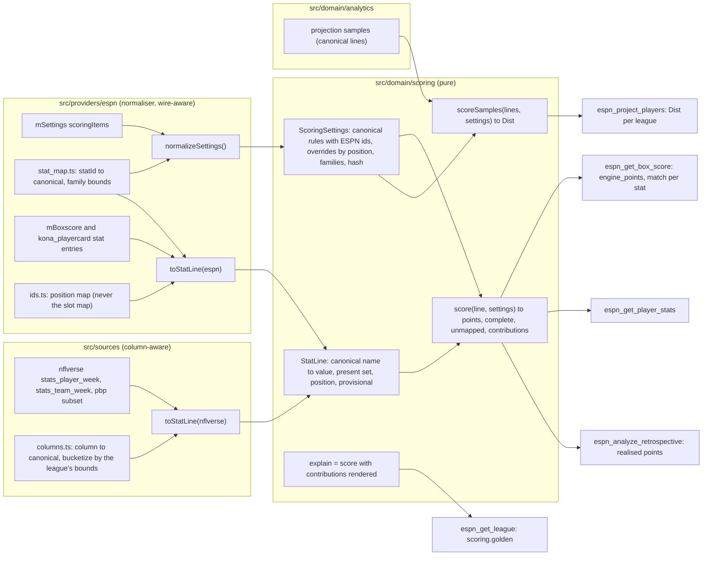

# 08 — Scoring engine (format-aware, pure, self-checking against ESPN's `appliedTotal`)

**Author:** `product-planner` · **Date:** 2026-09-30 · **Brief:** `docs/scratch/briefs/product-planner.md`
**Inputs (cited, not restated):** plan 01 §0.2–§0.3 (the engine is a shared-core candidate; `stat_map.ts` stays platform-owned), §1.1 (module map), §5.2 (settings cache row), §9 (seam: `getScoringSettings()`), §9.1 (placement, memo, golden fixture paths); plan 05 §2 (`domain/scoring` assertions), §3.1 (fixture views), §7 (100 %-coverage module); plan 07 (tools that call the engine: A1, A5, B2, E1, E13, E15); `docs/research/05-strategy-and-analytics.md` §7 (**the spec this plan implements**), §3.1 (the nflverse → ESPN id method and the 2024/2025 totals used as regression targets), §3.2, §4.1, §8.2 #10/#15, §9.1 #10; `03-espn-api.md` §B.1 (`scoringItems[]` shape, `pointsOverrides` keyed by position id), §B.2 (the two id spaces; the stat-id table; 103/104 disputed), §B.4–§B.5 (`appliedStats`, `appliedTotal`, `stats[]` splits), §B.7 (`statsOfficial`), §G.1 #7/#9; `04-data-sources.md` §B.1.1 (weekly and ROS splits), §B.1.6 (`statsOfficial` by count), §B.2 (`stats_player_week`, `stats_team_week`), §C (crosswalk); the sibling's engine plan `yahoo-fantasy-football-mcp@67144b1 docs/plan/08` (**sib 08** — its E1–E7 decisions, the canonical hub, the type contract, the property list and the edge-case catalogue are reused; what changes is everything ESPN's numeric, pre-bucketed ids make simpler, and what `appliedStats` makes stricter).

**Legend** as in plan 01: **[V-05 §x]** etc. cite the research; **[A-n]** assumed (§11); **[U]** unverified, settled by the first golden run against a recorded `mBoxscore` week.

**What ESPN changes, in one paragraph.** Yahoo's engine had to *parse names* to discover bracket families and bonuses, coerce string scalars, and guess two flags (sib 08 E3, E4). ESPN's `scoringItems[]` are numeric ids with fixed meanings (03 §B.2), every bracket tier is its own id, per-position overrides are an explicit map, and every roster entry carries `appliedStats{statId: pts}` next to `appliedTotal` (03 §B.5). So this engine is the same pure module with the same canonical hub (sib 08 E2 — plan 01 §0.3's extraction candidate), but its ESPN table is **keyed by id, not by pattern**, its golden test is **per stat** (plan 01 §9.1), and the only genuinely hard work is deriving ESPN's bucketed ids from nflverse's raw columns for players ESPN did not score (backtests, non-rostered players) — 05 §7 "the work is deriving those ids".

---

## 0. Decisions at a glance

| # | Decision | Why | Alternative considered | What would change it |
|---|---|---|---|---|
| E1 | **The engine is a pure module `src/domain/scoring/` — `score`, `scoreSamples`, `explain` — with no I/O and no wire types** | plan 01 §1.1 boundary; plan 05 §7 makes it a 100 %-coverage module; one engine scores ESPN lines, nflverse lines and projection samples | scoring inside the provider | nothing |
| E2 | **Canonical stat names are the hub** (sib 08 E2 verbatim): every ESPN `statId` and every nflverse column maps *to* a canonical name; rules are keyed by canonical name **and** carry the ESPN id as opaque `platform_id` | one projection store serves any league; the module is the plan 01 §0.3 extraction candidate and P14 keeps it honest; unmapped ids stay visible | score directly on ESPN ids | nothing — a direct-id engine would be a second engine when `fantasy-core` is extracted |
| E3 | **ESPN's table is a checked-in id → canonical table with fixed bracket bounds (`stat_map.ts`, provider-owned); the normaliser builds each family from the ids *present in `S`* and asserts they partition their range** | 03 §B.2: ids have fixed meanings across leagues (probe league items are consistent with the map); 05 §7: "the engine keys the table by the ids present in `S`, never by a fixed list" | Yahoo-style name parsing | an id whose meaning is observed to differ between leagues (none known) → the table gains a per-league override |
| E4 | **No rounding mode and no negative floor are guessed: the engine computes exact values, compares per stat within 0.005 and per total within 0.01, and the first golden run pins ESPN's rule in `rounding.ts` with a fixture** | 05 §7 "no rounding mode is guessed"; `appliedTotal` is a float (`100.8`) and `appliedStats` are per-stat floats [V-03 §B.4]; whether ESPN rounds per stat, per total, or not at all is [U-05 §9.1 #10] | assume 2-dp per stat | the golden fixture; never a tolerance change |
| E5 | **Projections flow through the engine as sampled canonical stat lines (`scoreSamples`), never as scaled means** | 05 §7 families table: yardage-game bonuses and bracket tiers make `E[points]` non-linear (sib 08 E5); ESPN's own `appliedTotal` on a projection is a *mean under `S`*, kept as the labelled comparator | score the mean line | nothing |
| E6 | **The golden test is a gate per player-week, and a mismatch degrades locally: the affected player carries `match: false` and `engine_complete: false`; a league-wide refusal to score happens only when > 10 % of rostered player-weeks in the checked week mismatch (a settings change, not a stat correction)** | 05 §7 "a mismatch names the stat id; it is a bug … never a tolerance to widen"; but a whole-product stop for one 0.5-point correction is the wrong failure for a single-user tool (sib ADV OBJ-17, adopted before the attack) | block everything on any mismatch (sib 08 E6 as first written) | nothing |
| E7 | **Normalised settings are memoised by `settings_hash`; projections are stored canonically and scored per league on demand; `points_cache` is the only prunable scoring table** | plan 01 §9.1; sib 08 E7 | pre-scored projections per league | nothing |
| E8 | **The ESPN line is the golden source and the projection comparator; the nflverse line is the analytics and backtest source — and the two translators must agree on every shared player-week within one yard** | 05 §3.1 caveat: nflverse derives stats from play-by-play and can differ by a yard or a fumble attribution from ESPN's box score; a cross-check test makes that difference a measured number, not a surprise | trust one source | a systematic disagreement on a stat (e.g. fumble attribution) → the nflverse translator learns the ESPN convention for that stat, pinned by a fixture |
| E9 | **103/104 (INT-return TD vs fumble-return TD) ship as `disputed` — both mapped, neither trusted — until a recorded week in which a D/ST scored exactly one of them settles the order; the swap is a named mutation test** | 03 §B.2: the two dominant wrappers disagree; 05 §7 says the golden test decides | pick the Python wrapper's order | the fixture |

---

## 1. Where the engine sits



Reading the arrows: nothing in `src/domain/scoring` knows that `53` is ESPN's reception id — the id travels inside `ScoringSettings.rules[].platform_id` as opaque data so `explain` can name it in a mismatch report. The two `toStatLine` translators are the only places that know ESPN's `stats{statId}` keys and nflverse's column names (plan 01 §1 "the domain never imports a wire type"). `ids.ts` supplies the **position** id for gating and overrides — `defaultPositionId` decoded with the position map (1 QB, 2 RB, 3 WR, 4 TE, 5 K, 16 D/ST, 15 TQB, 14 HC), never the slot map [V-03 §B.2 trap].

---

## 2. Types (the contract the tools and tests share)

```ts
// src/domain/scoring/types.ts — shape-compatible with sib 08 §2 (P14 guards the round trip)
export type Canonical = string;                    // "pass_yd", "rec", "fg_40_49", "dst_pa_7_13", … (§3.1 registry)
export type PositionId = number & { __brand: "PositionId" }; // ESPN position id (plan 01 §9: branded, never a bare int)
export type PositionClass = "O" | "K" | "DST" | "HC" | "IDP";

export interface ScoringRule {
  canonical: Canonical | null;                     // null = the ESPN id is not in the registry (unmapped, logged once)
  platform_id: string;                             // ESPN statId as a string, e.g. "53"
  abbr: string;                                    // ESPN's abbreviation from the registry (display only)
  points: number;                                  // scoringItems[].points
  overrides: Record<string, number>;               // pointsOverrides keyed by position id string, e.g. { "16": 5 }
  is_reverse: boolean;                             // isReverseItem — display metadata until the golden test says otherwise [U]
  applies_to: PositionClass[];                     // from the registry (a D/ST tier never scores an O line)
  disputed: boolean;                               // E9: 103/104
}
export interface BracketFamily {
  family: "fg_distance" | "fg_attempt" | "fg_miss" | "dst_points_allowed" | "dst_yards_allowed" | "yardage_bonus" | "long_td_bonus" | "per_n_yards" | "margin";
  position_class: PositionClass;
  scalar: Canonical;                               // the raw scalar the family brackets, e.g. "dst_pa_raw", "kick_distance", "pass_yd"
  members: { canonical: Canonical; platform_id: string; lower: number; upper: number | null }[]; // from the fixed bound table, filtered to the ids present in S, sorted
  exclusive: boolean;                              // true for distance / PA / YA tiers (exactly one indicator per game); false for bonuses (cumulative thresholds)
  complete_range: boolean;                         // the members present in S partition the scalar's range with no gap or overlap
}
export interface ScoringSettings {
  platform: "espn";
  rules: ScoringRule[];                            // one per scoringItems[] entry
  families: BracketFamily[];
  matchup: { tie_rule: string; playoff_tie_rule: string; home_bonus: number; playoff_home_bonus: number }; // applied after player scoring, by the matchup layer
  rounding: { mode: "exact" | "per_stat_2dp" | "per_total_2dp" | string; verified: boolean };            // E4
  settings_hash: string;                           // sha256 of canonical JSON of rules + families (order-independent), excluding `verified`
}
export interface StatLine {
  values: Record<Canonical, number>;               // only stats that were present
  present: Set<Canonical>;                         // distinguishes 0 from "not reported"
  position: PositionId;                            // the player's defaultPositionId (overrides key on it)
  position_class: PositionClass;                   // derived from position
  provisional: boolean;                            // any game of the period has statsOfficial=false (04 §B.1.6)
  source: "espn" | "nflverse" | "projection:v1-ensemble" | "projection:v2-opportunity" | string;
  split?: { source_id: 0 | 1; split_type: 0 | 1 | 2; season: number; week: number | null }; // ESPN lines only
}
export interface ScoreResult {
  points: number;                                  // after the verified rounding rule; exact until verified
  points_exact: number;
  complete: boolean;                               // false if provisional AND any rule's stat is absent, or a long-TD/per-N family could not be derived from the source
  unmapped: string[];                              // ESPN ids in settings with canonical=null (reported once per settings_hash)
  ignored: Canonical[];                            // stats in the line not in the settings
  underivable: Canonical[];                        // families the source cannot produce (nflverse weekly has no per-play TD length)
  contributions: { canonical: Canonical; platform_id: string; value: number; points_per: number; override_used: boolean; points: number; kind: "linear" | "bracket" | "bonus" }[];
}
```

`score(line, settings): ScoreResult`; `scoreSamples(lines: StatLine[], settings): { dist: Dist; mean_of_exact: number; bonus_probability: Record<Canonical, number>; bracket_probability: Record<string, number[]> }`; `explain = score` with `contributions` rendered. `verify(line, settings, applied: { total: number; by_stat: Record<string, number> }): { match: boolean; mismatch_stat_ids: string[]; delta_total: number }` is the golden comparator (§6) — it lives beside `score`, is pure, and is what plan 07 A5/B2 call to fill `match`.

---

## 3. Mapping strategy

### 3.1 The canonical registry and the ESPN table (`src/providers/espn/stat_map.ts`, keyed by id)

One checked-in table, seeded from 03 §B.2 (S-PY and S-JS agree on every spot-checked id except 103/104): per ESPN `statId` → canonical name, abbreviation, position classes it applies to, family and bracket bounds where it is a tier, and the nflverse expression (§3.2). The condensed registry (ids from 03 §B.2; canonical names are the sibling's where the stat exists on both platforms, so the hub is one vocabulary):

| Canonical | ESPN id(s) | Class | Family / note |
|---|---|---|---|
| `pass_att`, `pass_cmp`, `pass_yd`, `pass_td`, `pass_int` | 0, 1, 3, 4, 20 | O | linear; the reference league scores 4 at **5** and 20 at **−2** [V-05 §0] |
| `pass_2pt`, `rush_2pt`, `rec_2pt`, `two_pt_total` | 19, 26, 44, 62 | O | linear; `two_pt_total` (62) is a *separate* id — a league using 62 must not also be scored under 19/26/44 (the registry marks 62 as the union; the normaliser warns when both appear) |
| `pass_yd_300`, `pass_yd_400` | 17, 18 | O | `yardage_bonus` on `pass_yd`: [300, 399], [400, ∞) |
| `pass_td_40`, `pass_td_50` | 15, 16 | O | `long_td_bonus` — per-play TD length; **underivable from nflverse weekly** (05 §7) |
| `rush_att`, `rush_yd`, `rush_td` | 23, 24, 25 | O | linear |
| `rush_yd_100`, `rush_yd_200`; `rush_td_40`, `rush_td_50` | 37, 38; 35, 36 | O | `yardage_bonus` [100, 199], [200, ∞); `long_td_bonus` |
| `targets`, `rec`, `rec_yd`, `rec_td` | 58, 53, 42, 43 | O | linear; **53 is the PPR item** (0.5 here); 41 (`RECS`) is a stat, not the scoring item — mapped as `rec_stat`, applies only if a league scores it |
| `rec_yd_100`, `rec_yd_200`; `rec_td_40`, `rec_td_50` | 56, 57; 45, 46 | O | as above |
| `fum`, `fum_lost`, `fum_rec_td_off`, `sacked`, `turnovers` | 68, 72, 63, 64, 73 | O | linear; **never assume 72 vs 68** — `S` decides; the reference league scores 72 at −2 |
| `kr_td`, `pr_td`, `ret_td_total` | 101, 102, 105 | O, DST | linear (offensive players' return TDs under 101/102; 105 is the union) |
| `per_n_pass_yd`, `per_n_rush_yd`, `per_n_rec_yd`, `per_n_rec` | 5–14, 27–34, 47–52, 54–55 | O | `per_n_yards`: presumed `floor(yards / N)` [U-05 §9.1 #10]; most leagues use 3/24/42 × a fraction instead; a league that scores these is `verified: false` until its golden run |
| `pass_ypg`, `rush_ypg`, `rec_ypg` | 22, 40, 61 | O | per-game averages (S-PY TODO duplicates); mapped, applies only if scored |
| `pass_1d`, `rush_1d`, `rec_1d`, `gp` | 211, 212, 213, 210 | O | linear |
| `fg_0_39`, `fg_40_49`, `fg_50_59`, `fg_60p`, `fg_50p_legacy` | 80, 77, 198, 201, 74 | K | `fg_distance` (exclusive) with bounds [0,39], [40,49], [50,59], [60,∞); **74 = legacy 50+ incl. 60+** — a league using 74 must not also use 198/201 (the normaliser asserts a partition); `fg_made_total` = 83 |
| `fga_*` 81, 78, 199, 202, 75, 84; `fgm_*` (missed) 82, 79, 200, 203, 76, 85 | K | `fg_attempt`, `fg_miss` families with the same bounds; `attempted = made + missed` per bucket |
| `pat_made`, `pat_att`, `pat_miss` | 86, 87, 88 | K | linear |
| `fg_yd`, `fg_yd_made`, `fg_yd_att` | 214, 215, 216 | K | linear |
| `dst_pa_raw` (120); `dst_pa_0`, `dst_pa_1_6`, `dst_pa_7_13`, `dst_pa_14_17`, `dst_pa_18_21`, `dst_pa_22_27`, `dst_pa_28_34`, `dst_pa_35_45`, `dst_pa_46p` | 120; 89, 90, 91, 92, 121, 122, 123, 124, 125 | DST | `dst_points_allowed` (exclusive) with the bounds in the names |
| `dst_ya_raw` (127); `dst_ya_lt100`, `dst_ya_100_199`, `dst_ya_200_299`, `dst_ya_300_349`, `dst_ya_350_399`, `dst_ya_400_449`, `dst_ya_450_499`, `dst_ya_500_549`, `dst_ya_550p` | 127; 128–136 | DST | `dst_yards_allowed` (exclusive) |
| `dst_blk_td`, `dst_ret_td` (combined), `dst_int`, `dst_fr`, `dst_blk`, `dst_safety`, `dst_sack`, `dst_ff`, `dst_kr_yd`, `dst_pr_yd`, `dst_tk_ast`, `dst_tk_solo`, `dst_tk`, `dst_pd` | 93, 94, 95, 96, 97, 98, 99, 106, 114, 115, 107, 108, 109, 113 | DST | linear |
| `dst_int_td`, `dst_fr_td` | **103 / 104 — disputed** | DST | E9: both ids map, `disputed: true`; the golden test settles the order |
| `two_pt_ret`, `one_pt_safety` | 205/206, 207–209 | DST/O | linear; rare |
| `hc_win`, `hc_loss`, `hc_tie`, `hc_pts`; `margin_*` | 155–158; 161–172 | HC | team-result items; from the NFL result; only for leagues rostering HC or scoring margins |

Rules: an id in `S` absent from the registry → `canonical: null`, `unmapped[]`, logged once per `settings_hash`, exposed as `espn_get_league.scoring.unmapped_stat_ids[]` (plan 07 A1) and reported by `onboard`; an id in the registry absent from `S` contributes nothing. Two rules mapping to one canonical name in one position class is a normaliser error (a registry bug — fail loudly). The `applies_to` classes come from the registry, not from the league: a D/ST tier id in an offensive player's line contributes 0 and is listed in `ignored[]`.

### 3.2 nflverse → canonical (`src/sources/nflverse/columns.ts`; the loader's schema assertion is the verification, plan 01 §5.5)

| Canonical | nflverse expression [A-1 on exact column names — asserted at load] | Fallback / derivation |
|---|---|---|
| `pass_yd`, `pass_td`, `pass_int`, `pass_att`, `pass_cmp` | `passing_yards`, `passing_tds`, `passing_interceptions`, `attempts`, `completions` | — |
| `rush_att`, `rush_yd`, `rush_td` | `carries`, `rushing_yards`, `rushing_tds` | — |
| `targets`, `rec`, `rec_yd`, `rec_td` | `targets`, `receptions`, `receiving_yards`, `receiving_tds` | — |
| `pass_2pt`, `rush_2pt`, `rec_2pt` | `passing_2pt_conversions`, `rushing_2pt_conversions`, `receiving_2pt_conversions` (kept separate — ESPN has separate ids) | — |
| `fum_lost` | `sack_fumbles_lost + rushing_fumbles_lost + receiving_fumbles_lost` [V-05 §3.1] | — |
| `fum` | `sack_fumbles + rushing_fumbles + receiving_fumbles` | — |
| `kr_td`, `pr_td` | `special_teams_tds` split by pbp `play_type` (kickoff / punt) | player-level `special_teams_tds` → `ret_td_total` when pbp is absent (`present` false for the split ids) |
| `pass_yd_300` … `rec_yd_200` | indicator from the raw yardage against the *league's* bounds (`bracketize`) | — |
| `pass_td_40` … `rec_td_50` | **underivable from weekly**; from pbp `yards_gained` on TD plays when the pbp subset carries `td_player_id` and `yards_gained` (plan 01 §5.2 `ds_pbp` projection list) | `underivable[]`, `complete: false` for leagues scoring them |
| `per_n_*` | `floor(raw / N)` [U] | flagged `verified: false` |
| `fg_0_39` … `fg_60p`, `fga_*`, `fgm_*` | pbp `kick_distance` binned to the league's bounds (`bracketize`); `fg_made_*` weekly columns where nflverse's bins coincide | — |
| `pat_made`, `pat_att`, `pat_miss` | `pat_made`, `pat_att`, `pat_missed` | — |
| `dst_pa_raw` → `dst_pa_*` | `stats_team_week` (team = defence): opponent points, then `bracketize` — **definition [U-6]**: (a) the opponent's final score, or (b) net of points scored on returns against the offence (pick-six, fumble return, punt/kick return TDs); both derivations are implemented, the golden test on a week with a return TD against the offence selects one, pinned by a fixture | — |
| `dst_ya_raw` → `dst_ya_*` | opponent total yards → `bracketize` | — |
| `dst_sack`, `dst_int`, `dst_fr`, `dst_safety`, `dst_blk`, `dst_ff`, `dst_int_td`/`dst_fr_td`, `dst_blk_td`, `dst_kr_yd`, `dst_pr_yd` | `stats_team_week` `def_sacks`, `def_interceptions`, `def_fumbles_recovered`, `def_safeties`, blocked kicks / return TDs / return yards from pbp | — |
| `hc_*`, `margin_*` | `games.csv` result | — |

`toStatLine(nflverse)` is the analytics and backtest path (plan 07 E1's own input; 05 §8.4 backtests); `toStatLine(espn)` is the golden and comparator path. **Cross-check (E8):** a test scores every shared player-week of the fixture set through both translators and asserts `|Δ| ≤ 0.01` on stats both report, and lists the stats where the raw values differ by more than one yard or one event — the record of ESPN-vs-nflverse conventions (fumble attribution is the expected offender, 05 §3.1).

### 3.3 ESPN line → canonical (`toStatLine(espn)`)

- Input: one `stats[]` entry selected by `(statSourceId, statSplitTypeId, seasonId, scoringPeriodId)` [V-03 §B.2] — `(0,1,Y,w)` weekly actual, `(1,1,Y,w)` weekly projection, `(0,0,Y,0)` season actual, `(1,0,Y,0)` rest-of-season projection (04 §B.1.1), `(1,2,Y,0)` frozen preseason (labelled, never ROS). An unknown `statSourceId` or `statSplitTypeId` **fails the entry** (plan 01 §7 — meaning-changing enum drift).
- `stats{statId: raw}` → `values` by the registry; ids not in the registry → `ignored[]` (and counted for `eff status`'s additive-drift list). `appliedStats{statId: pts}` and `appliedTotal` are **carried beside the line, never into it** — `verify` reads them; `score` never does.
- `position` = `player.defaultPositionId` through the **position** map; `position_class` from the registry (`1–4 → O`, `5 → K`, `16 → DST`, `14 → HC`, `15 → O` (TQB scores as an offensive player with override key `"15"`), IDP ids → `IDP`).
- `provisional` from `proTeamSchedules_wl` (`statsOfficial` false for any game of the period, 04 §B.1.6); `present` = the keys ESPN sent. Numbers are numbers on the wire (no string coercion — the Yahoo defect does not exist here); a non-numeric value fails the entry as drift.

### 3.4 Position gating and `pointsOverrides`

```
pts(rule, position) = rule.overrides[String(position)] ?? rule.points
points(line, settings) = Σ_{rule ∈ rules, rule.applies_to ∋ line.position_class} pts(rule, line.position) × line.values[rule.canonical] (0 if absent)
```

- Overrides are keyed by **position id** (`"16"` D/ST, `"1","2","3","4","15"` offence, `"14"` HC — observed shape `{ statId: 89, points: 0, pointsOverrides: { "16": 5 } }` [V-03 §B.1]); the **slot** a player occupies never changes his scoring (a WR in FLEX scores as position 3) [V-05 §7].
- Gating by class is part of `score`, not of the translators, so a mis-typed line fails a property test rather than silently scoring (sib 08 §3.3).
- `isReverseItem`, `leagueRanking`, `leagueTotal` are display metadata with no effect on points until the golden test says otherwise [U-05 §9.1 #10]; `allowOutOfPositionScoring` and `scoringEnhancementType` likewise [U].

---

## 4. Families that need more than multiplication (05 §7 table, made mechanical)

### 4.1 Bracket families (`fg_distance`, `fg_attempt`, `fg_miss`, `dst_points_allowed`, `dst_yards_allowed`)

- **Derivation.** `normalizeSettings` filters the registry's family members to the ids present in `S`, sorts by `lower`, and asserts contiguity and no overlap over the scalar's range. A gap (a league that scores 0–39 and 50+ but not 40–49) is legal and recorded as `complete_range: false` — a kick in the gap scores 0 and `explain` says which tier is unscored; an **overlap** (74 legacy 50+ together with 198/201; 105 total-return-TD together with 101/102 on the same class) is a normaliser error naming both ids (never a double count).
- **Scoring an ESPN line.** ESPN already sends the indicator ids with their raw values (a kicker's line has `80: 1`, a D/ST line has `91: 1` and `120: 10`); the engine multiplies as usual **and** asserts exclusivity (`Σ members ≤ 1` per exclusive family per game); a D/ST line with the raw scalar present but every tier 0 on a final week is treated as "game not played" (`present` false for the family), never as "0 points allowed" (05 §7 adversarial: tier 89 = 5 pts in the example).
- **Scoring a derived line** (nflverse, projection samples): the translator emits the *scalar* (`dst_pa_raw = 17`, `kick_distance = 45`) and the engine's `bracketize(family, scalar)` sets the indicator — external lines never need to know the league's bins.
- **Expectation.** `E[family] = Σ_m P(scalar ∈ m) × pts_m` with `P` from `scoreSamples` or, for K/D-ST, from the 05 §5 K/D-ST distribution (a negative binomial around the opponent's implied total; sib §8).
- **Attempts and misses** are their own families with the same bounds; `attempted = made + missed` per bucket is asserted on ESPN lines (a violation is drift, not a score).

### 4.2 Yardage-game bonuses (`yardage_bonus`: 17/18, 37/38, 56/57)

Cumulative indicators, not exclusive: a 412-yard passing game scores **both** 17 and 18 when a league scores both [A-2 — verified by the first golden run containing a 400-yard game; ESPN's own line will show whether 17 is also set]. `E[bonus] = P(yards ≥ target) × pts` from samples — never `[E[yards] ≥ target] × pts` (sib 08 §4.2).

### 4.3 Long-TD bonuses and per-N-yard items

- `long_td_bonus` (15/16, 35/36, 45/46) needs per-play TD length. From ESPN the ids arrive scored; from nflverse *weekly* they are **underivable** — `underivable[]` names them and `complete: false` is set **only for leagues that score them** (the reference league does not [V-05 §0]); the pbp subset (plan 01 §5.2 `ds_pbp`) closes the gap in Phase 2 by carrying `yards_gained` and `td_player_id`.
- `per_n_yards` (5–14, 27–34, 47–52, 54–55) is presumed `floor(raw / N)` [U-05 §9.1 #10]; a league scoring them is `rounding.verified: false` until its golden run. The reference league encodes yardage as 3/24/42 × a fraction, so v1 ships this branch property-tested and unverified by design, and `espn_get_league` says so.

### 4.4 Turnovers, 2-pt, returns, defence, team-result items

Plain multipliers. `fum_lost` (72) vs `fum` (68): `S` decides; the nflverse translator supplies both. 2-pt: three ids (19/26/44) or the union (62) — the normaliser warns if a league has both. Return TDs: 101/102 (offence and D/ST), 105 (union), 93 (blocked-kick TD), 94 (combined defensive return TD), 103/104 (E9). Team-result items (155–172) are computed from `games.csv` for the pro team and never for a player line. The D/ST override on offensive-looking items (`89` with `points: 0` and `overrides["16"]: 5`) is the §3.4 rule, nothing special.

### 4.5 Matchup-level items

`homeTeamBonus`, `playoffHomeTeamBonus`, `matchupTieRule` (`SLOT_POINTS` [U semantics]) apply after player scoring, in the matchup layer that sums starters (`totalPoints`, `pointsByScoringPeriod`); they are outside `score` and inside the golden test's matchup-level assertion (§6 step 1).

### 4.6 Negative totals and rounding (E4)

- ESPN exposes no "negative points" flag; a player-week can be negative (−2 INT, −2 fumble) and `appliedTotal` carries it. No floor is applied.
- `appliedTotal` is a float; whether ESPN rounds per stat, per total, or not at all is discovered by the first golden run: the test computes `Σ_stat round(pts_stat, 2)`, `round(Σ pts_stat, 2)` and the exact sum, and records which one equals `appliedTotal` to 1e-9 across ≥ 3 fixture weeks; that rule is pinned in `rounding.ts` with the fixture and `rounding.verified` flips to `true`. Until then `points = points_exact` and comparisons use the E4 tolerances.
- Exact arithmetic on decimal modifiers (`0.04 × 312`) can produce binary-float noise; `points_exact` is compared at 2 dp, never stored rounded; decimal-scaled integers (× 1000) are the implementation [A-3].

### 4.7 Missing and unknown categories

- Item in `S`, stat absent from the line: `0`, and `complete = false` **only if** `line.provisional` (04 §B.1.6); on a final week absence is a true zero (bye, DNP).
- Stat in the line, absent from `S`: `ignored[]` (never logged per call). Id in `S`, absent from the registry: `unmapped[]` (logged once per `settings_hash`). A projection line missing an id the settings score: `0` with `complete: true` (a projection is complete by construction).
- ESPN sends numbers as numbers; a string where a number is expected is drift (fails the entry), not a coercion case.

---

## 5. Recomputing any player's points and projections under the exact settings

| Need | Call | Used by (plan 07) |
|---|---|---|
| Points for an ESPN actual line and the golden `match` | `verify(toStatLine(espn, split (0,1)), settings, { total: appliedTotal, by_stat: appliedStats })` | A5 (`engine_points`, `match`, `mismatch_stat_ids`), B2, E13 (realised), the golden test |
| Points for an ESPN projected line (ESPN's own mean re-scored — must equal ESPN's `appliedTotal` on the projection entry) | `verify(toStatLine(espn, split (1,1)), …)` | A5/A1 golden step 1 (validates the item map on lines with many non-zero stats) |
| Points for an nflverse line (a non-rostered player, a past season, a backtest) | `score(toStatLine(nflverse, row), settings)` | E1 v1 (trailing lines), D1 (`points_league`), 05 §8.4 backtests, E13 regret for dropped players |
| Re-score under a variant | `score(line, applyOverrides(settings, overrides))` | E15 (later); the 05 §3.2 format regression (§6 step 3) |
| A projection's distribution under this league | `scoreSamples(samples, settings)` → `Dist` | E1, E2–E9 (every `Dist`) |
| Which rules produced the points | `explain` (= `contributions[]`) | A5/B2 mismatch diagnostics, `onboard`'s report |

A projection is stored **once** per `(gsis_id, season, week, model_version)` as `{ expectation: Record<Canonical, number>, samples: StatLine[n_sims] }` (canonical names only) and scored per league at read time (E7). ESPN's own projection is stored beside it as `espn_projection(player_id, season, week, split, applied_total, stats_raw, snapshot_at)` by the `snapshot projections` job (plan 06 §1.4) — the prospective backtest corpus (04 §B.1.1 step 2). `Dist` quantiles come from the scored samples; `mean_of_exact` equals the sample mean within Monte-Carlo error (property P13).

---

## 6. Validation — the self-check against ESPN (05 §7 "the reference implementation is one request away")

1. **Golden fixtures (CI, zero credentials).** Paths fixed by plan 01 §9.1: `fixtures/espn/recorded/mSettings.json` (anonymised) + `fixtures/espn/recorded/mBoxscore-week-<N>.json` for **≥ 3 recorded final weeks** (`statsOfficial: true`; plan 05 §3.1 records `mBoxscore` per week from a real league — the public probe league keyless in Phase 1a, the reference league in 1b; every rostered player of every team). **The golden never reads a derived scoring field** (ADV OBJ-21): a path guard keeps this test, `verify`'s tests and everything in §6 inside `fixtures/espn/recorded/**`, whose scoring fields must hash to a recorded original; the Skills' league `fixtures/espn/fx-10h/**` is re-scored by the engine under the reference `S` and marked `derived: true`, and `match: true` there is plumbing, never engine evidence — so the golden can never compare the engine with itself (ADV OBJ-01). `tests/domain/scoring/golden.test.ts` asserts, for every roster entry: `|engine − appliedTotal| ≤ 0.01`, **per stat** `|engine_stat − appliedStats[statId]| ≤ 0.005`, `complete = true` on final weeks, and the starters' sum equals `home/away.totalPoints` for the period (`pointsByScoringPeriod[N]`); the same on the **projected** entries (`statSourceId 1`) of the current week's fixture — the item map is validated on lines with many non-zero stats. Expected outputs are frozen under `fixtures/golden/` with a manifest hash (plan 05 §3.1 step 4) so an engine change that silently alters a score fails even if the ESPN fixture is unchanged.
2. **Live self-check, on demand.** `espn_get_box_score.match` (plan 07 A5) on any week; `onboard` runs it on 3 rostered players × the last 2 final weeks (plan 09 §3.1); `eff smoke` (plan 05 §5) scores one completed week per stat; the nightly `snapshot roster` job scores the just-finalised week and writes `checks[].scoring_mismatch` (plan 06 §1.4 — T-08).
3. **Mismatch procedure (E6).** On `match: false` for a player-week on a final week: (a) that player's `engine_complete: false` and a `warnings[]` line on every analytics result that uses his points, with the realised value taken from ESPN's `appliedTotal` for that player (the golden source wins for *realised* points; the engine still scores projections); (b) `explain` for that player-week goes to the stderr log with `settings_hash` and the per-rule diff; (c) `espn_get_status.checks[]` gets `scoring_mismatch` with `{ week, players, share }`; (d) **only when `share > 10 %`** of the checked week's rostered player-weeks: the league's settings cache is marked dirty (plan 01 §5.2 invalidation), `espn_get_league.scoring.golden.status = "mismatch"`, and every analytics tool refuses with `VALIDATION` "scoring does not reproduce ESPN — run `onboard`" until a human explains it; (e) the fix is a registry row, a bound, or a fixture — never a tolerance change. Diagnostics classify each mismatch: `unmapped_id` (an id in `unmapped[]` carries points in `appliedStats`), `override_missed` (the per-position override differs), `bracket_bounds` (a family's members sum to 0 or > 1, or the scalar sits in a gap), `disputed_103_104` (the swap fixes it — E9 settled), `rounding` (per-stat matches, total differs by ≤ 0.02 — E4 settled), `translator` (a stat present in `appliedStats` absent from `stats`).
4. **Mutation tests** (05 §7 step 2): perturb one item's `points` by δ → the total moves by exactly `δ × stat`; remove a tier row → only games in that tier change; **swap 103/104** → the golden test fails on a D/ST return-TD week (the [U] order is settled by which orientation passes); set `overrides["16"]` to 0 on item 89 → only D/ST lines change.
5. **Format regression** (05 §7 step 3): re-score the 2025 and 2024 nflverse QB lines under `{4, 5, 6}` pass-TD variants and assert 05 §3.2's season totals (QB1 364.6 / 389.6 / 414.6 for 2025; the VOR rows) — a regression test on the nflverse translator and the crosswalk, run on the committed nflverse excerpt (plan 05 §3.2, ≤ 300 KB) for the players it contains and on the full file in the scheduled job; **the source file's sha256 is pinned beside the committed excerpt**, so a revised nflverse file (nflverse revises its files) fails the test on the hash — the right reason — rather than as a scoring regression (ADV OBJ-19(e)).
6. **What a passing golden proves and what it does not.** It proves the engine reproduces ESPN for the settings of the league whose weeks were **recorded** — in Phase 1a the public probe league's `S` (10-team H2H, FAAB, non-PPR, 4-pt passing TD — 03 §B.1), in Phase 1b the reference league's (half-PPR, 5-pt TD, −2/−2, ESPN-default yardage, K distance items, D/ST tiers). It does not exercise long-TD bonuses, per-N items, HC/margin items, IDP, the 2-pt union (62), or `fg_50p_legacy` (74) unless a second fixture league with those settings is recorded (plan 10 lists it — open decision D8); those branches are property-tested for internal consistency and flagged `verified: false` per family in `espn_get_league.scoring` until then. **Under plan 10 D0-not-accepted the engine is validated only on the probe league's `S`** (ADV OBJ-01): the 5-pt passing-TD override value is exercised only by the `normalizeSettings` unit test on the hand-written reference `mSettings`; the half-PPR item 53, the −2 turnover items and every family absent from the probe league's `S` stay `verified: false`.

**Test cases with numbers (reference `S`; 05 §7's table, carried verbatim so the fixture and the plan agree):**

| # | Line | Points |
|---|---|---|
| 1 | QB: 300 pass yds, 3 pass TD, 1 INT, 20 rush yds, 1 fumble lost | 12 + 15 − 2 + 2 − 2 = **25.0** (ESPN default `S` gives 24.0; INT −1 gives 26.0) |
| 2 | RB half-PPR: 80 rush yds, 1 rush TD, 4 rec, 30 rec yds | 8 + 6 + 2 + 3 = **19.0** |
| 3 | WR: 7 rec, 110 rec yds, 1 rec TD, 1 2-pt rec | 3.5 + 11 + 6 + 2 = **22.5**; with item 56 at +3 → 25.5 |
| 4 | K (items 80/77/198 made = 3/4/5, 79 missed 40–49 = −1, 86 PAT = 1): FG 52, 38 made; 45 missed; 3 PAT | 5 + 3 − 1 + 3 = **10.0** |
| 5 | D/ST (items 92 = 1, 131 = 0, 99 sack = 1, 95 INT = 2, 96 FR = 2, 94 return TD = 6): 17 pts allowed, 310 yds, 3 sacks, 1 INT, 1 FR, 0 TD | 1 + 0 + 3 + 2 + 2 = **8.0**; the same line with 0 points allowed (tier 89 = 5) → 12.0 |
| 6 | Any position, empty line | **0.0**, `complete` per `statsOfficial` |
| 7 | Line with statId 999 = 4 | unchanged total; `unmapped`/`ignored` as applicable; one log line |
| 8 | QB line with `defaultPositionId 15` (TQB) and an item whose `overrides["15"]` differs | uses the override |

---

## 7. Property-test invariants (`tests/property/scoring.test.ts`, fast-check; plan 05 T2)

| # | Property | Generator |
|---|---|---|
| P1 | **Linearity** outside brackets/bonuses: `score(a·x + b·y) = a·score(x) + b·score(y)` for lines restricted to linear rules | random settings (points in [−10, 10], 0–3 dp), random lines |
| P2 | **Homogeneity in a modifier**: perturb one item's `points` by δ → total moves by exactly `δ × value` | random rule, δ ∈ [−5, 5] |
| P3 | **Override precedence**: perturb `overrides[pos]` → only lines with that position move; perturb `points` → only lines *without* an override for their position move | random positions |
| P4 | **Bracket exclusivity**: `bracketize` sets exactly one member for any scalar inside a complete range and none inside a recorded gap; removing one member changes only lines whose scalar falls in it | random contiguous families with and without gaps |
| P5 | **Bonus monotonicity**: `score` is non-decreasing in a stat that carries only positive bonuses; `E[bonus]` from samples equals `P(stat ≥ target) × pts` within MC error | random targets/points |
| P6 | **Class gating**: a stat counted under `O` never counts under `DST` and vice versa; a line whose class is outside a rule's `applies_to` contributes 0 for that rule | lines with both O and DST stats |
| P7 | **Unmapped / ignored / underivable**: an unknown ESPN id in `S` changes no score and appears in `unmapped[]` once per hash; an unknown canonical in a line appears in `ignored[]`; a long-TD id in `S` with an nflverse line sets `underivable[]` and `complete: false` | random extra ids |
| P8 | **Normaliser idempotence and hash stability**: `normalize(normalize(s)) = normalize(s)`; reordering `scoringItems[]` or the keys of `pointsOverrides` does not change `settings_hash`; changing any `points` or override does | permutations |
| P9 | **Rounding bounded**: with `mode: exact`, `points = points_exact`; with any verified mode, `|points − points_exact| ≤ 0.01 × rules.length` and the mode is idempotent | — |
| P10 | **Complete flag**: `complete = false` ⇔ (`provisional ∧ ∃ scored rule whose canonical ∉ present`) ∨ `underivable ≠ ∅`; never false for a non-provisional ESPN line | random `present` sets |
| P11 | **No NaN/Infinity** ever leaves `score`; a non-numeric ESPN value fails the entry as drift before `score` is reached | adversarial wire values |
| P12 | **Determinism**: same inputs → byte-identical `ScoreResult`; `scoreSamples` with a fixed seed is reproducible (run with the per-call CPU deadline disabled, so a `partial` result can never make byte-equality flake — R2 nit 1) | — |
| P13 | **Sample-mean consistency**: `scoreSamples(...).dist.mean ≈ mean_of_exact` within `3σ/√n` | random projection samples |
| P14 | **Platform round trip** (the `fantasy-core` guard): a canonical line scored under an ESPN `ScoringSettings` and under a Yahoo `ScoringSettings` built from the same canonical rule set gives identical points — the ESPN normaliser here, the sibling's Yahoo normaliser as a fixture-frozen JSON of its output (no shared code today, plan 01 D3) | the two normalisers over one canonical rule table |
| P15 | **Translator agreement** (E8): for every fixture player-week both sources report, `|score(toStatLine(espn)) − score(toStatLine(nflverse))| ≤ 0.01` on the shared stats, and every raw difference > 1 yard or > 1 event is listed by name | the fixture set |
| P16 | **Verify soundness**: `verify` returns `match: true` iff every per-stat delta ≤ 0.005 and the total delta ≤ 0.01; a single perturbed applied stat is named in `mismatch_stat_ids` | perturbations of `appliedStats` |

---

## 8. Edge-case catalogue (each a named fixture in `fixtures/engine-edge/` and a test — hand-built engine unit-test inputs outside the golden's path guard, never golden evidence: plan 05 §3's fixture law)

| Case | Expected behaviour | Source |
|---|---|---|
| Empty stat line, final week | `points = 0`, `complete = true`, no contributions | 05 §7 #6 |
| Empty stat line, provisional week | `points = 0`, `complete = false` | 04 §B.1.6 |
| Unknown stat id in the line (999) | ignored; listed; no throw; one log line | 05 §7 #7 |
| Id in `S` with no registry row | `unmapped[]`, logged once per hash, scores 0, surfaced by A1 and `onboard` | 05 §7 |
| K with a 0-value distance tier (`fg_0_39 = 0`) | contributes 0; `present` true | 05 §7 |
| K with `kick_distance` on a boundary (exactly 40) | bin [40, 49] — bounds inclusive, from the registry | §4.1 |
| K in a league using 74 (legacy 50+) and also 198/201 | normaliser error naming both ids | §4.1 |
| K with only PATs | `pat_made` scores; every FG family `present` false; `complete` per `statsOfficial` | 05 §7 adversarial |
| D/ST with 0 points allowed | tier 89 = 1 → 5 pts in the reference `S`; never "absent" | 05 §7 #5 |
| D/ST with 46+ allowed | tier 125 = 1; the raw 120 carries 46+ | 05 §7 adversarial |
| D/ST whose game has not started, provisional | family `present` false, `complete = false` | §4.1 |
| D/ST line with two exclusive tiers set (bad upstream data) | drift (`INTERNAL` naming the family); never a score | §4.1 |
| D/ST return TD in a week with exactly one of 103/104 | the golden orientation passes; the swap fails (E9 settled) | E9 |
| Offensive player with a return TD | counts under 101/102 (or 105 if the league uses the union) only; D/ST ids untouched | §4.4 |
| 400-yard passing game in a league scoring 17 and 18 | both pay [A-2]; or 18 only if ESPN's line shows 17 unset — the fixture decides | §4.2 |
| Multi-target bonus (100+ and 200+ on `rush_yd`) | both pay when both thresholds are met | 05 §7 |
| 2-pt conversions in a league using 62 and one using 19/26/44 | one canonical value each; a league with both → normaliser warning | §3.1 |
| QB fumble lost on a sack | counts (nflverse `sack_fumbles_lost` in the sum); ESPN's 72 carries it | §3.2 |
| A line whose fumbles are all `sack_fumbles_lost` | 72 = n; 68 = n; `S` decides which scores | 05 §7 adversarial |
| Fractional modifiers (`0.04`, `0.1`, `0.5`) over three-digit yardage | `points_exact` compared at 2 dp; no cumulative float drift [A-3] | §4.6 |
| A TQB row (`defaultPositionId 15`) | class `O`; override key `"15"` used when present | 05 §7 #8 |
| A league whose `S` lacks item 53 (standard) | receptions contribute 0; `ignored[]` carries `rec` | 05 §7 adversarial |
| A league with `overrides` on item 4 (e.g. TQB 5-pt) | the override applies by position; the base applies to everyone else | 05 §7 adversarial |
| A provisional week (`statsOfficial false` for one game) | every line of players in that game `complete = false`; other lines complete | §4.7 |
| Bye-week player, final week | no line → 0, complete | §4.7 |
| Player in IR with a line (activated elsewhere mid-week) | scored like any line; the slot never matters | §3.4 |
| Settings change mid-season (commissioner edit) | new `settings_hash`; projections re-scored on read; the recommendation log keeps the hash it was scored under | E7 |
| Two rules mapping to one canonical in one class | normaliser error naming both ids | §3.1 |
| `scoringItems[]` order differs between two reads | irrelevant — rules are keyed; hash order-independent (P8) | §7 |
| An unknown `statSourceId` (e.g. 2) on an entry | the entry fails as drift; the player's other entries score | §3.3 |
| Split `(1,2)` requested as ROS | refused — labelled preseason; ROS is `(1,0)` | 04 §B.1.1 |

---

## 9. Caching and invalidation (plan 01 §5.2 "League settings" row, made specific)

- **Memo:** `normalizeSettings` output is cached in memory by `settings_hash` and persisted in `league_settings(settings_hash, normalized_json, fetched_at, verified_flags)`; the parsed `mSettings` stays in `espn_cache` for re-normalisation after a registry fix. (`league_settings` is named in plan 01 §9.2 since R1 — T-07.)
- **Invalidation triggers:** the settings TTL (24 h, plan 01 A-6); `status.standingsUpdateDate` / `waiverLastExecutionDate` moving (plan 01 §5.2); the E6 > 10 % rule; `eff refresh espn:settings`. On invalidation the provider re-fetches, re-normalises, and — if the hash changed — emits one stderr `info` line and `espn_get_status.checks[]` row `settings_changed` so the next analytics call re-scores and `onboard` can say "the commissioner changed the scoring".
- **Projection store:** `projection(gsis_id, season, week, model_version, expectation, samples_blob, created_at)`; `espn_projection(...)` snapshots (§5); an optional `points_cache(line_hash, settings_hash) → ScoreResult` (bounded LRU, pruned by `store prune`).
- **Never pruned:** `recommendation_log` rows, the `league_settings` rows they reference, `espn_projection` snapshots (the backtest corpus) and `write_journal` (plan 06 §1.3's never-prune list — T-07, resolved).

---

## 10. Behind the seam (plan 01 §9, §0.3)

`FantasyPlatform.getScoringSettings()` returns `ScoringSettings` with `platform: "espn"` and ESPN ids inside `platform_id`/`overrides`; the domain never sees `scoringItems[]`. What moves to `fantasy-core` on plan 01 §0.3's trigger: `types.ts`, `score`/`scoreSamples`/`explain`/`verify`, `bracketize`, the canonical registry's *names and classes*, the property tests P1–P16 minus the ESPN fixtures. What never moves: `stat_map.ts` (the ESPN id table and bound table), `toStatLine(espn)`, `ids.ts`, `rounding.ts`'s ESPN rule. `columns.ts` (nflverse) moves with the `DataSource` loaders. The Yahoo normaliser's output for the shared canonical rule table is checked in as a JSON fixture so P14 runs here without importing the sibling — the quarterly drift diff (plan 06 J7) compares the two registries by name.

---

## 11. Assumptions and unverified, by name

| # | Assumption / unverified | Verify by |
|---|---|---|
| A-1 | Exact nflverse column names in §3.2 (`passing_interceptions`, `carries`, `sack_fumbles_lost`, `def_fumbles_recovered`, `kick_distance`, …) | the loader's schema assertion on the first `eff refresh nflverse` (plan 01 §5.5); one file |
| A-2 | Yardage-game bonuses are cumulative on ESPN (a 400-yard game sets both 17 and 18) | the first fixture week containing one; ESPN's own `stats{}` shows the indicators |
| A-3 | Decimal-scaled integer arithmetic avoids float drift at 2 dp for any realistic line | property P9/P11 with adversarial magnitudes |
| U (03 §G.1 #9; 05 §9.1 #10) | 103 vs 104 order | E9's mutation test on a recorded D/ST return-TD week |
| U (05 §9.1 #10) | `per_n_yards` semantics; `isReverseItem`, `allowOutOfPositionScoring`, `scoringEnhancementType`, `SLOT_POINTS`; ESPN's rounding of `appliedTotal` | the golden run (E4); a second fixture league for the per-N items (plan 10 D8) |
| U-6 (sib 08) | the D/ST "points allowed" definition for nflverse derivation (opponent score vs net of returns against the offence) | a golden week with a return TD against the offence; both derivations implemented |
| U (03 §G.1 #7) | the id format of weekly-actual `stats[]` entries (`"01401872951"` — game id?) — the translator selects entries by `(statSourceId, statSplitTypeId, scoringPeriodId)`, never by parsing the id | the first `kona_playercard` fixture |
| U (04 §G #1) | whether the embedded 2025 projections are the as-of-kickoff values (decides whether the retrospective backtest may use them) | 04 §B.1.1 step 1's agreement check against FFA's published ESPN MAE |
